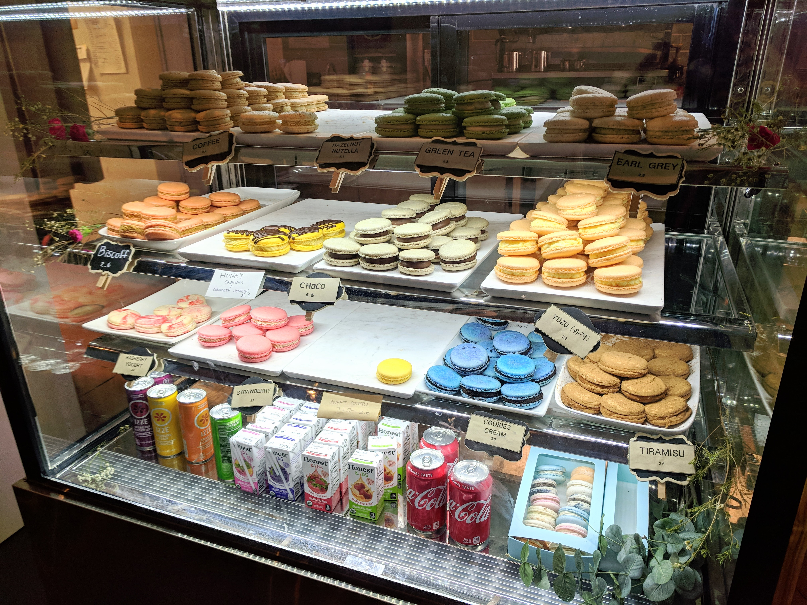

Happy Friday!! Today's Friday Favorites is a bit different because yesterday marked 6 months into my [30 Before 30 challenge](https://kaleighscruggs.com/30-before-30)! Here's an update on how it's going!

**1\. Go back to Europe** Still no plans yet. We're just now making summer travel plans and I don't think a proper Europe trip would fit into our schedules right now. Maybe for Thanksgiving??

**2\. Get another tattoo!** I haven't decided yet, do people ever really decide?

**3\. Go camping somewhere with some awesome views** This is part of our summer trip plans! I'll share more later! :)

**4\. Fully understand my 401k, stocks, and all that stuff they don’t teach you in school** There are actually a few classes I can take about 401k's at work, which I did take. So I kind of understand it a bit better, but definitely not at 100% yet. As for stocks, I've been using Robinhood and have bought, sold and have my eye on some stocks. I definitely haven't made any money yet.

**5\. Get a 6-Pack (of abs!!)** I'm trying my best. Not there yet.

**6\. Visit Red Hare Brewing** This summer I will finally go! I love their new Tangerine 50/50!

**7\. Spend a weekend in Asheville, NC** We just bought tickets to see the Milk Carton Kids in October there! We're super excited!

**8\. Get our home office furnished & cozy** Still nothing in there, but we hang out in there a lot and have a sweet setup of blankets and pillows on the floor. So that's pretty cozy to start with...

**9\. Make our backyard look super awesome** Thanks to our fire pit, we're able to burn more yard trash and get the yard looking nice and clean. Next up we want to add a fence!

**10\. Pay off all our credit cards** I did this...and then have gotten 2 more credit cards...I'm writing a post about this, so there's more to come!

**11\. Visit Golda Kombucha once they open in Atlanta** They just opened a couple of weeks ago, so a friend from the gym and I are planning on hitting it up soon!

[**12\. Have tea at Just Add Honey Tea Company**](https://kaleighscruggs.com/blog/just-add-honey-tea-company)

[**13. Get cookies at Luna’s Cookie Studio**](https://kaleighscruggs.com/blog/lunas-cookie-studio)

**14\. Go on or at least plan for another cruise** Still trying to figure when we'll do this, but I feel like it may be Alaska!

**15\. Compete in a Brazilian Jiu-Jitsu tournament** I'm either doing one at the end of June or one in August!

**16\. Get better at filming GoPro videos and editing** I'm trying! I just need to find more time to dedicate to this.

**17\. Take this blog seriously** Yeah...about that. I am, I just need to really show it!

**18\. Visit some more states I’ve never been to** Not sure when or where, but hopefully that will happen!

**19\. Post more videos on YouTube (either GoPro videos or vlog-style)** Working on it! I'll definitely be doing video of our trip this summer!

**20\. Move to a different project at work (I’ve been on the same one for 3 years)** It's happening!! In July I will move to a new team and project!

**21\. Be more consistent with my stand-up comedy** I'm starting to write new material!

**22\. Visit more tea rooms in Atlanta** I've been back to ZenTea, but I have ones I haven't been to on the list!

**23\. Be better at drinking water (I feel like I barely have any water!)** Slow....I get into random weeks where I'm all about water, and others where I don't really want it.

**24\. Try more breweries in Atlanta** All the breweries!

**25\. Try different types of food**

**26\. Visit Monday Night Brewing** Not yet..

**27\. Take an improv class** Hopefully this fall there will be a session on the weekend I can take...so far all the intro ones are on weeknights...which definitely don't work for me!

**28\. Update my wardrobe** Slowly, I am getting better clothes, and have been getting rid of clothes I haven't worn in over a year.

**29\. Learn how to take and edit phone photos like a boss** Working on it! I've been watching a lot of videos, and using more apps to play around with different ways to edit!

**30\. Figure out what I’m good at** yeaaa..

So now I've got 10/30 things crossed off of my list! Not exactly halfway the list at the halfway point, but better than nothing! I'll be posting more about each one I've crossed off, and of course about our awesome trip coming up.

Follow me on [Instagram](https://www.instagram.com/klgh.js/) & [Pinterest](https://www.pinterest.com/kaleighscruggs/)!

