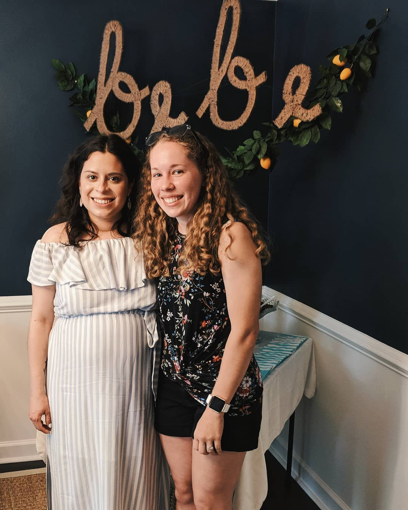
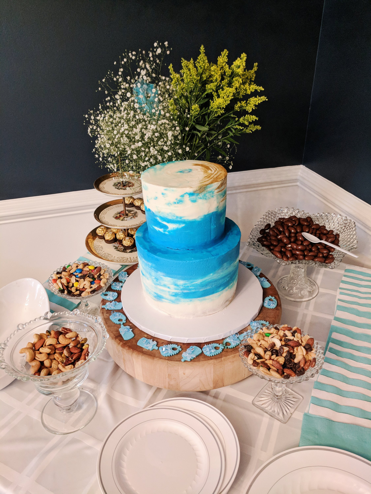
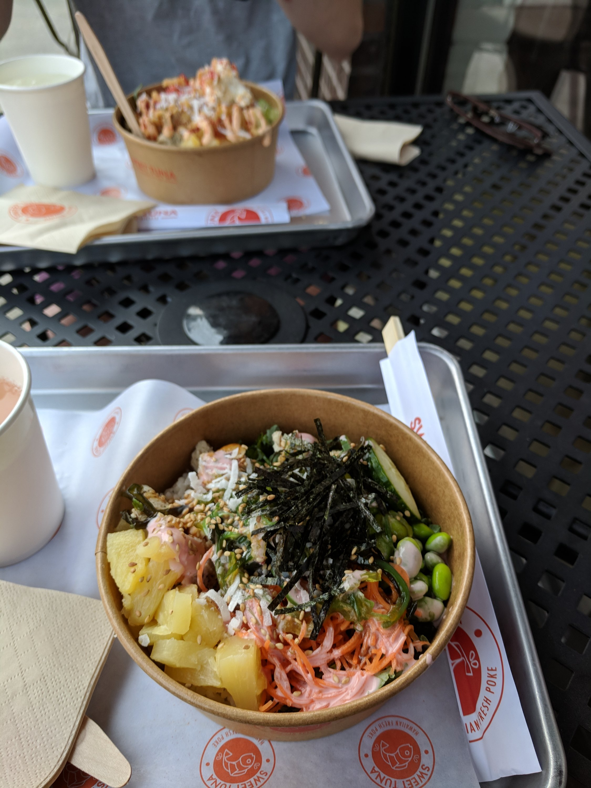
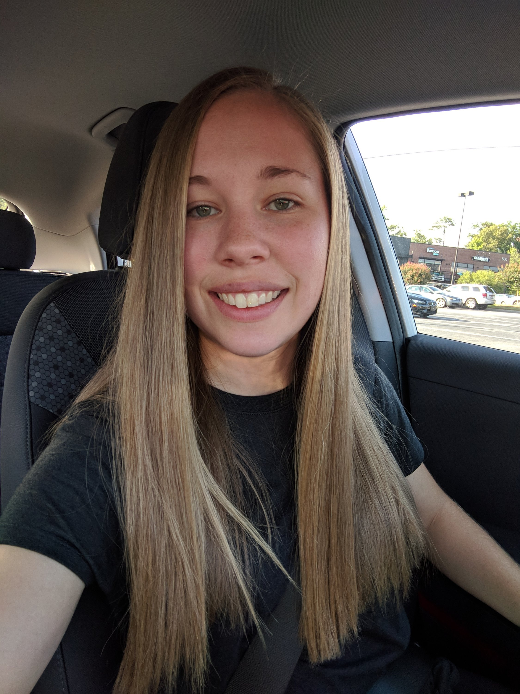
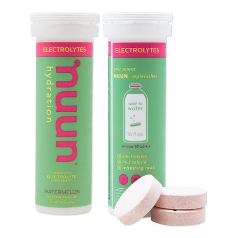
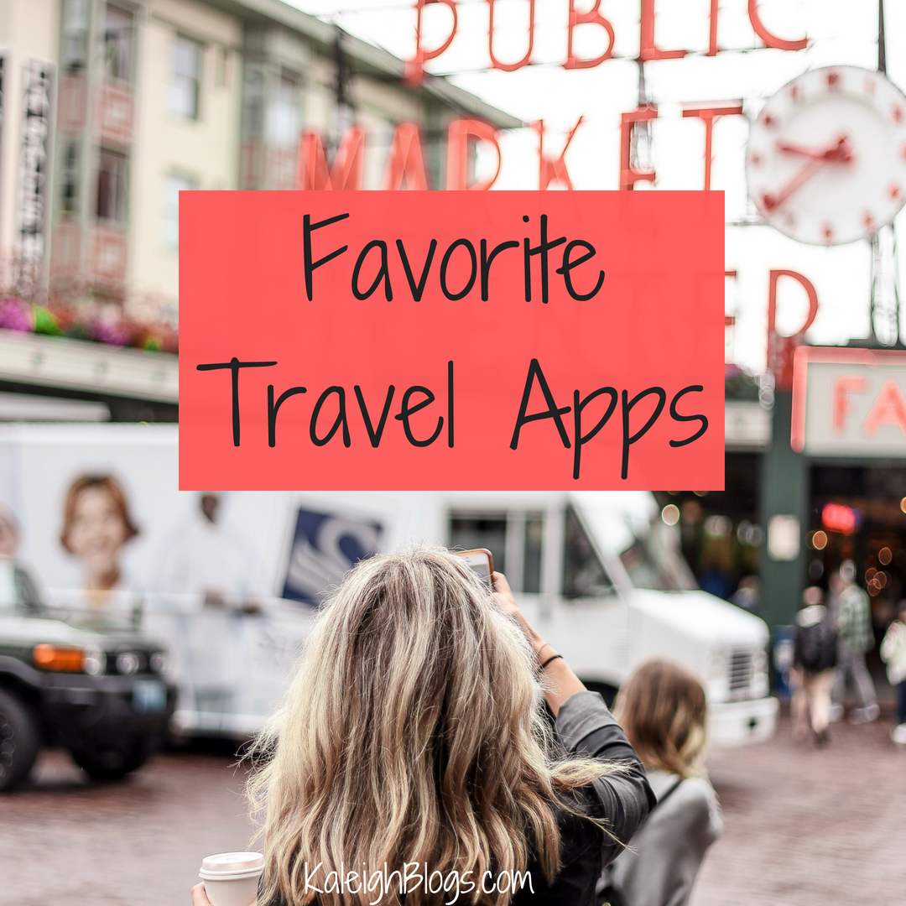

Happy Friday! This week has flown by for me! I felt like Monday started out slow, but then things quickly sped up. Here are some of my favorites from this week!

## Baby Shower

On Saturday afternoon I attended a baby shower for one of my longtime friends Annette! We've been besties since middle school (and I've known her husband since elementary school!). I can't believe by the end of August she'll have a little baby boy!

And check out the cake!!

## Sweet Tuna

Just because it's called "Sweet Tuna" doesn't mean it's all fish...because I _hate_ fish! Sweet Tuna is a new restaurant that serves poke, but they also have chicken and beef as well. I met up with my little bro Max on Monday to get some lunch there. I love it because everything is so clean and you don't feel gross after eating it. I'm always down for that!

## Straight Hair

Thursday I had a treatment called the ["great hair" treatment](https://www.candyshoppehairstudio.com/price-menu/). It's comparable to keratin but doesn't have any chemicals in it. It's not permanently straight, she just uses heat to seal in the treatment. I feel so weird with straight hair, I can't believe I used to straighten my hair every single day in high school!!

## nuun

I bought 2 of these nuun tubes from REI this week. I've been able to tell with working out in all the humidity I'm super thirsty and have had some headaches. I bought one with electrolytes, and another that also has caffeine. I haven't had the caffeine one yet, but I can say that this [watermelon](https://amzn.to/2ZVbwS2) one is really good!

## Favorite Travel Apps

Yesterday's blog post was all about my favorite travel apps. I worked super hard on this one because I wanted to make sure I listed all the ones I love and actually use. [Check the post out here](https://kaleighscruggs.com/blog/favorite-travel-apps) and let me know which apps you like to use when traveling as well!

I hope you all have a great weekend! Let me know what have been your favorite things from this week! See ya on [the gram](https://www.instagram.com/klgh.js/)!!
