[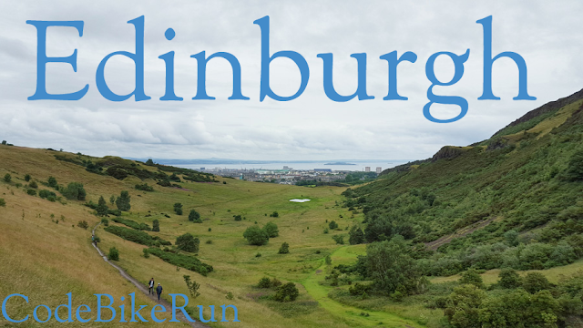](http://1.bp.blogspot.com/-NxbFNV43h5M/ViV42CvlFvI/AAAAAAAA5ak/fyElnbGp5BA/s1600/Edinburgh.png)

On Sunday, July 26, Shaun and I boarded a Virgin East Coast train from London Kings Cross to Edinburgh Waverley. The train left at 4pm and arrived at 8:20pm in Scotland. When we arrived, we left the station for the Princes Street exit. We were hungry and needed to check into our hotel. Luckily it was just down the street from the train station. We stayed at the [Edinburgh Central Waterloo Place Hotel](https://www.travelodge.co.uk/hotels/428/Edinburgh-Central-Waterloo-Place-hotel). Our room was on the -1 floor (weird!), and it was pretty big for a hotel in Europe.

[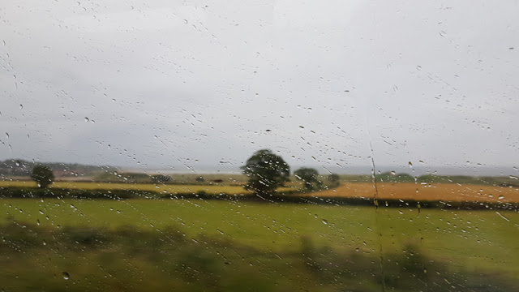](http://4.bp.blogspot.com/-ks1e5rx3oNA/ViVQvNBmUdI/AAAAAAAA5VU/2Ahs75iz6q0/s1600/edinburghtrain.jpg)

[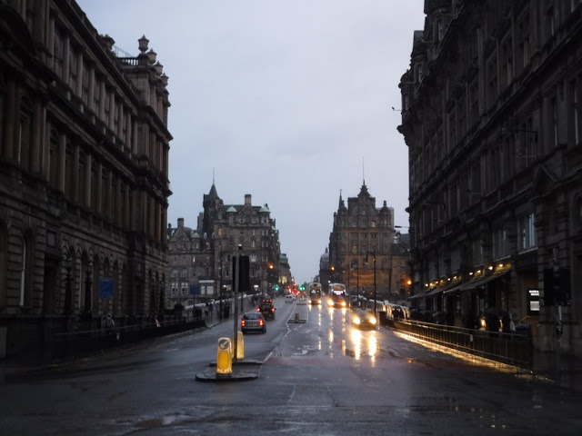](http://4.bp.blogspot.com/-yJQ29TWcEgA/ViVRYGYAVNI/AAAAAAAA5Vc/tw5KOSt4Gf8/s1600/edinburghstreet.jpg)

Once we dropped our bags off, we needed to find food fast. We had learned that places close for dinner pretty early or stop serving food. We got a recommendation from the guy at the front desk for a pizza place next door, but we wanted to try a pub first, The Guildford Arms. They weren't serving food, so we left and went to the pizza place. Shaun and I split a small pizza and then left to go back to The Guildford Arms.

[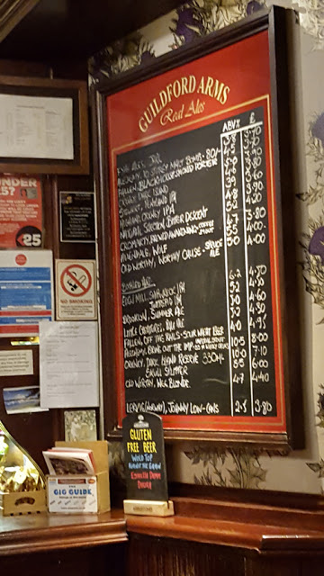](http://1.bp.blogspot.com/-ovqINziav5o/ViVRekoPY8I/AAAAAAAA5Vk/0f7JSupnhy4/s1600/Guildford1.jpg)

[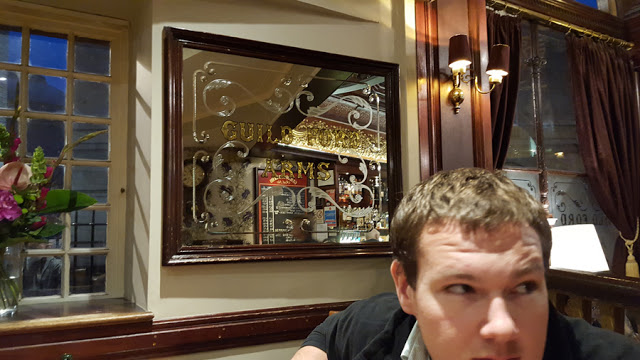](http://3.bp.blogspot.com/-qwIMYwBYRGo/ViVRez_kMpI/AAAAAAAA5Vo/fLzynC4k9jg/s1600/Guildford2.jpg)

We tried many beers before they closed for the night, and then we went back to the hotel.

The next day, it was supposed to rain all day. So we went to Edinburgh Castle in the morning. We walked through Princes Street Gardens to get there, which was very nice on a rainy morning. While we were waiting in line, I "pulled a Guinness" and ordered us tickets for the castle; we got out of line, picked up the tickets, and went in. So easy.

The castle was pretty busy for such a rainy and (unseasonably) cold day.

[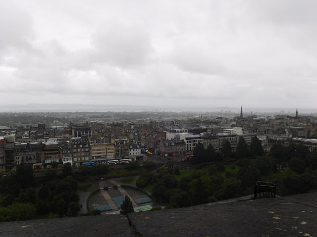](http://4.bp.blogspot.com/-8u3RDwmhd8s/ViVVt6txupI/AAAAAAAA5V4/fQKzCTtfJx8/s1600/castle1.jpg)

[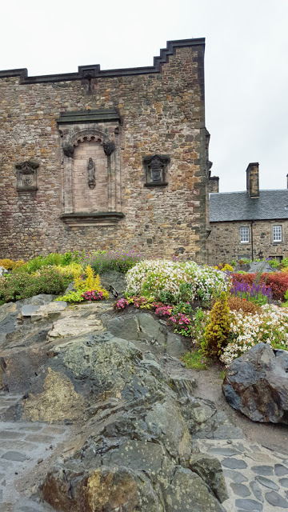](http://4.bp.blogspot.com/-8DCgfs5O-VA/ViVVuELJoAI/AAAAAAAA5V8/5ncED3BDmik/s1600/castle2.jpg)

[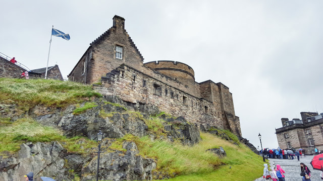](http://1.bp.blogspot.com/-Lh6QNxQgy50/ViVVuF7eu8I/AAAAAAAA5WA/DFMNGGuqPlQ/s1600/castle33.jpg)

After we were done with the castle, we were ready to eat. We first stopped at The Castle Arms, but it was pretty crowded, so we just got some drinks and then left.

[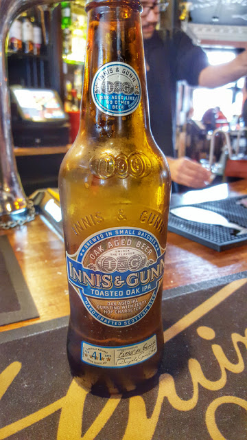](http://1.bp.blogspot.com/-VzpTpN81Jv4/ViVWANPezCI/AAAAAAAA5WY/aIb2S-3agVw/s1600/castlearms1.jpg)

We were having a tough time finding a place around the Royal Mile that wasn't crazily expensive or touristy. We decided to go down a 'close' and stumbled upon [The Devil's Advocate](https://devilsadvocateedinburgh.co.uk/). The Devil's Advocate was heaven! We immediately ordered drinks and tried to decide on food. Shaun got a burger, and I got a roast beef salad...it was pretty rare!

[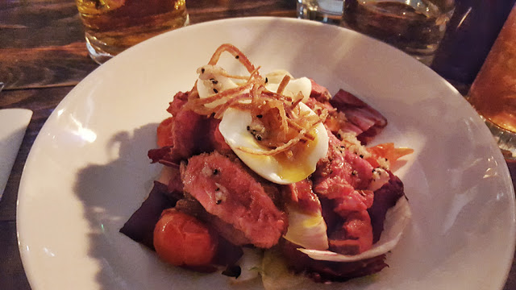](http://3.bp.blogspot.com/-xwQOBkT_jA0/ViVYUUPonLI/AAAAAAAA5XU/O4c-bV1CY6k/s1600/devil1.jpg)

[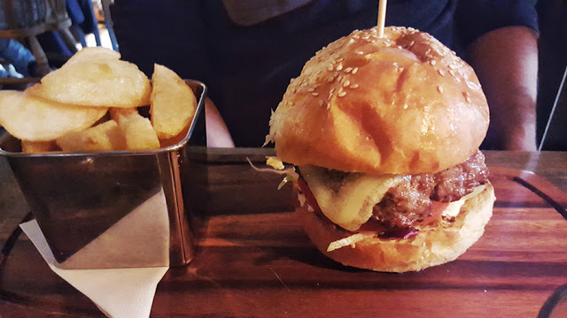](http://2.bp.blogspot.com/-2ho3bqjJtt8/ViVYUTBAVPI/AAAAAAAA5XM/EpfVs_GVf4w/s1600/devil2.jpg)

[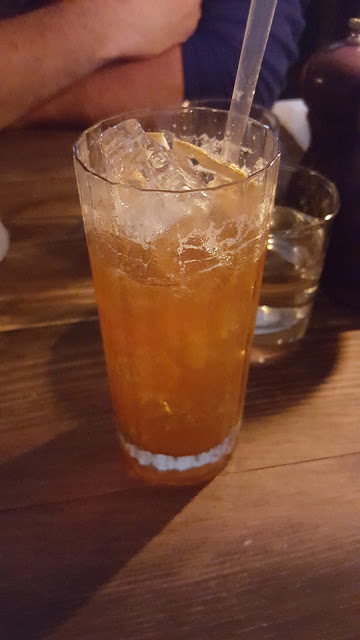](http://2.bp.blogspot.com/-7I6pG2jyY7M/ViVYUr-_G2I/AAAAAAAA5XQ/1Ky_FKk2ABM/s1600/devil3.jpg)

[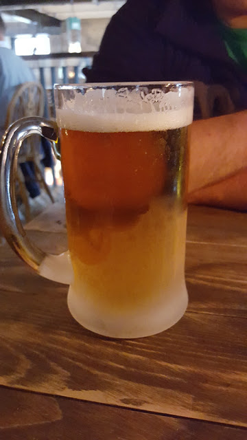](http://2.bp.blogspot.com/-FUEZadX2zsQ/ViVYUwNe2dI/AAAAAAAA5XY/TpVO-MfATYU/s1600/devil4.jpg)

[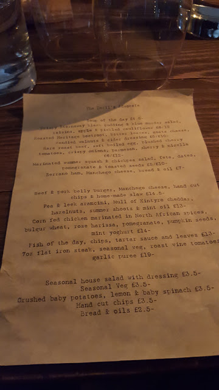](http://3.bp.blogspot.com/-tlwZLEkTRPI/ViVYU63ZPnI/AAAAAAAA5Xc/7wN-gIHb2Wc/s1600/devil6.jpg)

The drink I got had Earl Grey Tea in it. I saw it and had to order it! It was delicious! I wish I had taken a picture of the description to recreate it later, but oh well.

After we were stuffed, we went back onto the Royal Mile and walked into many shops. I bought some loose tea, and then we went back to the hotel. We wanted to go to the coast, so I spent some time figuring out the best way to get there. The bus routes were confusing, and I downloaded an app to pay for us to get on the bus. But of course, after I paid for 2 tickets, I realized that we could use the app for 1 person. We decided to just walk to Leith. It was a 45-minute walk, and once we were there...we didn't know exactly where to go. Eventually, we found our way to the dock area:

[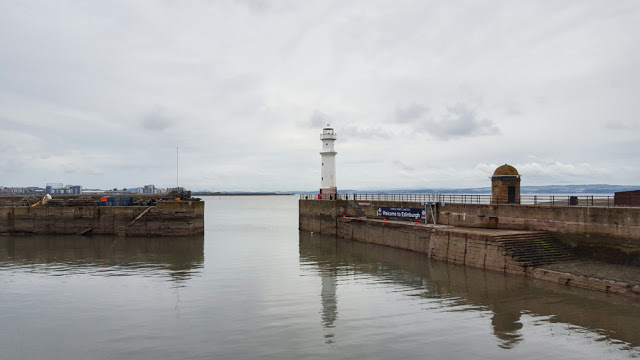](http://3.bp.blogspot.com/-zY8cD0VgbBQ/ViVvUMVWvsI/AAAAAAAA5YY/IGrXq2QFI9U/s1600/leith2.jpg)

It was beautiful, despite it being overcast, windy, and cold.

[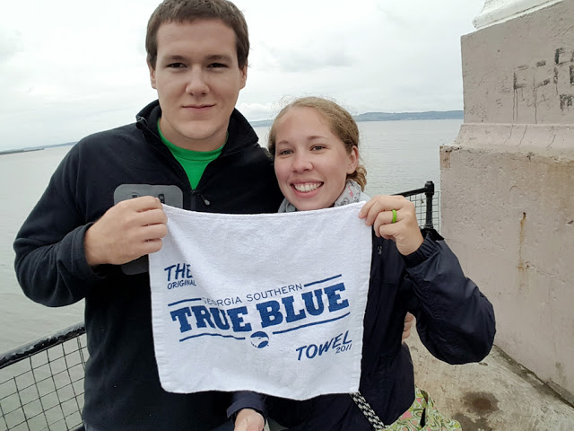](http://1.bp.blogspot.com/-OtNXT7gTR4E/ViVvmitkS3I/AAAAAAAA5Yo/6wzOqukjRwI/s1600/leith3.jpg)

[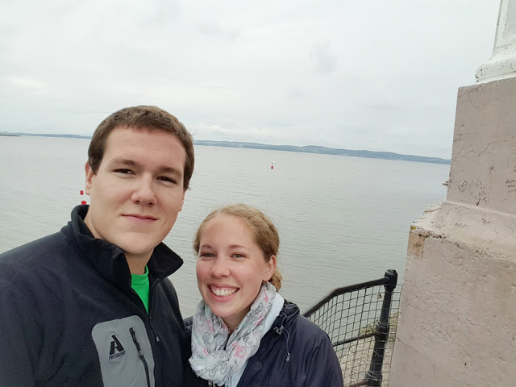](http://2.bp.blogspot.com/-83BgsobdSKk/ViVvm51SnZI/AAAAAAAA5Yk/gTsOQSxBKbU/s1600/leith4.jpg)

[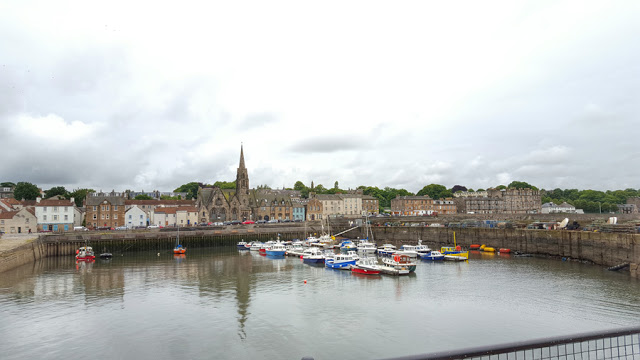](http://4.bp.blogspot.com/-bNpyj3s3YFg/ViVvm2PzJvI/AAAAAAAA5Yg/TUUZ2mvMq6c/s1600/leith5.jpg)

[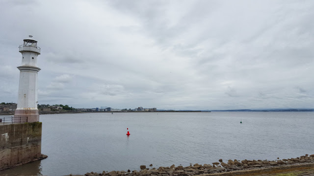](http://2.bp.blogspot.com/-pVNfa30x8fk/ViVvnBo4yOI/AAAAAAAA5Ys/TbnKU8_04JM/s1600/leith6.jpg)

Once we took a ton of pictures, we decided to bus it back to Edinburgh. We saw this cool church turned rock climbing gym:

[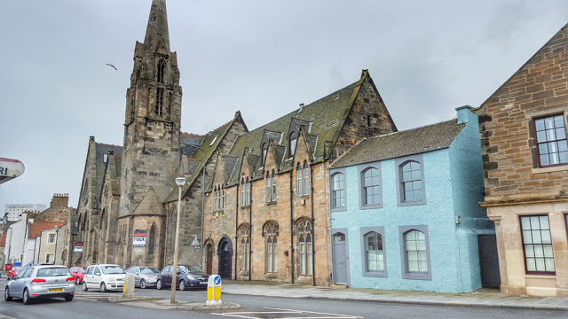](http://1.bp.blogspot.com/-iT969iEZsFo/ViVv6Y6csZI/AAAAAAAA5ZA/7Q2JEOCHbOg/s1600/leith1.jpg)

We got on a bus, but the driver said the bus we were on wasn't going to where we needed it (it was, the sign on the stop said so, and so did Google Maps). He dropped us at the next stop. I realized that if we walked down the street a little, we could get on a bus that would take us the same route. As we were like feet away from that stop, we see the bus just drive past it (even though people were waiting!). We were pretty pissed at this point. Finally, we just got on whichever bus came next. The driver told us when we would get close. Thank God! Once we got back to the area we wanted to be in, it was time for dinner. We went to [The Newsroom](http://www.newsroomedinburgh.co.uk/), which was right by our hotel, and covered in old newspapers.

[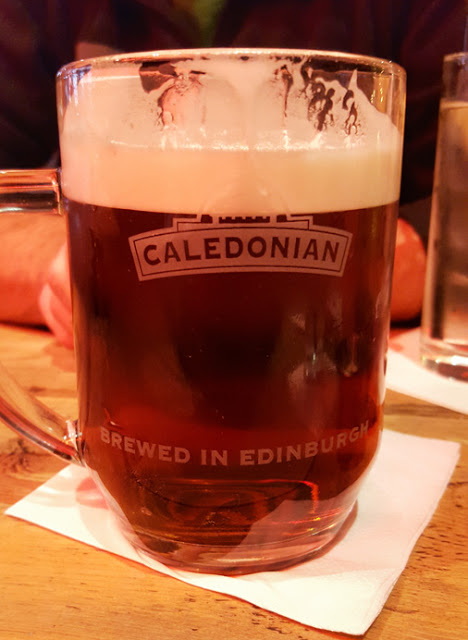](http://1.bp.blogspot.com/-HX3XUr4nIlw/ViVxXyXFXQI/AAAAAAAA5ZM/UqaiSlv9B-8/s1600/newsroom1.jpg)

After we ate, we headed back to the Guildford Arms before bed.

The next day, our last day in Edinburgh, we woke up early to pay for an extended time in our hotel room so we could hike up Arthur's Seat. As we were going up, I thought we were at the highest point...Arthur's Seat, but I read the map wrong. We were still in Holyrood Park but were kind of bummed and short on time. We decided we'd plan to come back to Edinburgh and go up the actual Arthur's Seat. We both figured it was a great excuse to have to come back.

[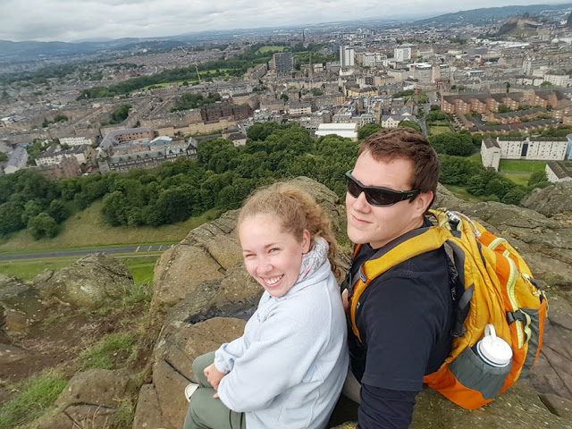](http://3.bp.blogspot.com/-WcsnVs5DROU/ViVz1mfUeSI/AAAAAAAA5Zg/pIaUFVCME5I/s1600/holyrood6.jpg)

[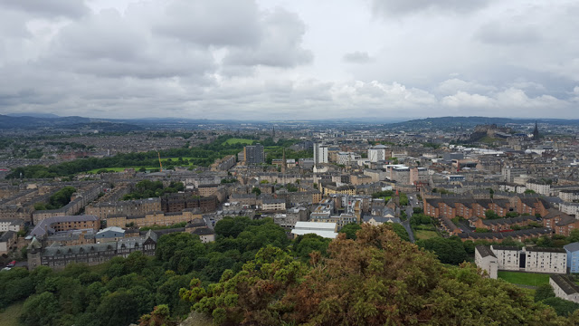](http://4.bp.blogspot.com/-JQfesD8AqFA/ViVz1nZmcWI/AAAAAAAA5Zc/axzZrVWk2E8/s1600/holyrood7.jpg)

[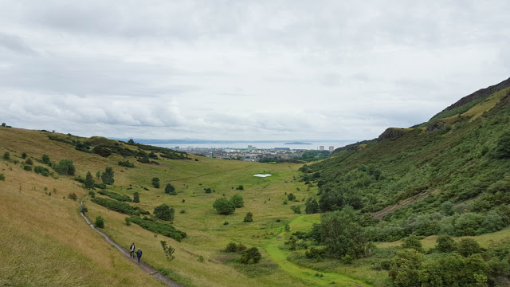](http://3.bp.blogspot.com/-umQfNkF8MPo/ViVz2HcG6gI/AAAAAAAA5Zk/EdTqw0mIE2Q/s1600/holyrood8.jpg)

[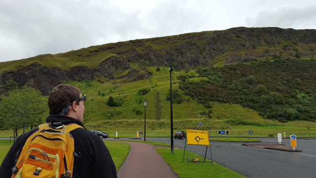](http://3.bp.blogspot.com/-1mH2JZCrGMs/ViVz1uhG-ZI/AAAAAAAA5ZY/8cKztLfSadM/s1600/holyrood10.jpg)

After we were done, we quickly went back to the hotel, showered, checked out, and left our bags there. We went to get breakfast at [The Holyrood 9A](https://www.theholyrood.co.uk/), and it was delicious. Next, we went to shops on the Royal Mile and bought things for some family. Then we went to [BrewDog](https://www.brewdog.com/). We had their beer in London and heard they were a pretty cool pub. We spent some time here and had snacks, then it was time to get our stuff from the hotel and catch the bus to the airport.

[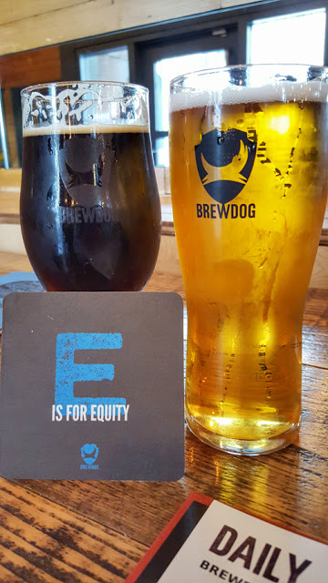](http://2.bp.blogspot.com/-kDhDnkCWtu8/ViV1BvOk0aI/AAAAAAAA5Z4/IbYT9tFMLZA/s1600/brewdog11.jpg)

[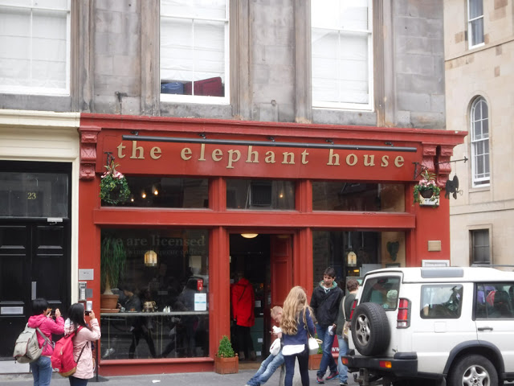](http://4.bp.blogspot.com/-FkjzFAfXR_o/ViV1BlLGtfI/AAAAAAAA5Z8/vOW6WInW0P8/s1600/elephant.jpg)

Once we got our bags, we still had time left, so we went back to the Guildford Arms for dinner before we left. Shaun got haggis, and I got sweet potato soup. Then we were off.

The bus ride was pretty short, and going through security at the Edinburgh airport took maybe a minute. We had a lot of time before finding out where our gate for the RyanAir flight to Dublin would be.

[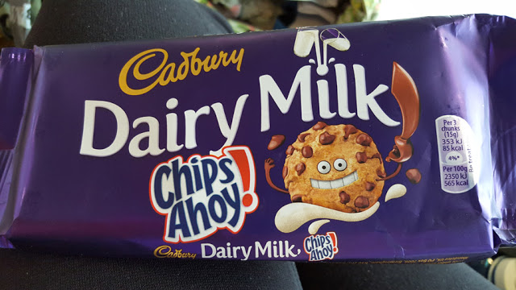](http://1.bp.blogspot.com/-JcBRZhR2pY0/ViV171ndZ-I/AAAAAAAA5aI/Y4WhIQveUgE/s1600/airport.jpg)

Once we got to the gate, we were delayed. Finally, we boarded the plane for the short flight. Arriving in Dublin was easy, and finding the place to wait for our shuttle to the Holiday Inn Express Dublin Airport was easy as well. Since we were so delayed, we finally got to the hotel around 10:45. We wanted to have one last Guinness in Ireland, so we called to find out how late the sister hotel bar was open. It was open until 11. We wouldn't have had time to walk over there! We were upset, but what are you gonna do?

The next morning, we got up and left for the airport again. I'm so glad we left when we did because we chased down the shuttle bus, and once we were at the airport, had to wait to check-in with United, then to go through security, then go to customs security, and then US border patrol (they do it backward in the Dublin airport going to the US). We literally got through about 15 minutes before our flight. Thankfully it was delayed a little, so we were finally able to get our last Irish Guinness and blow a lot of money at the airport shops on candy.

[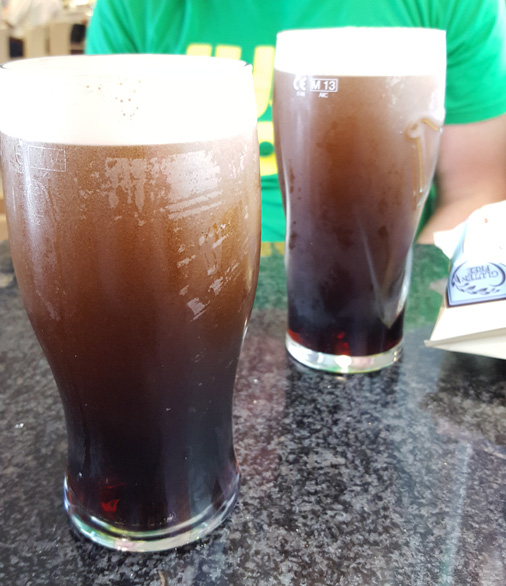](http://1.bp.blogspot.com/-zZGpHDZCDtM/ViV3yoiiicI/AAAAAAAA5aU/JqiAZx08Gws/s1600/lastg.jpg)

[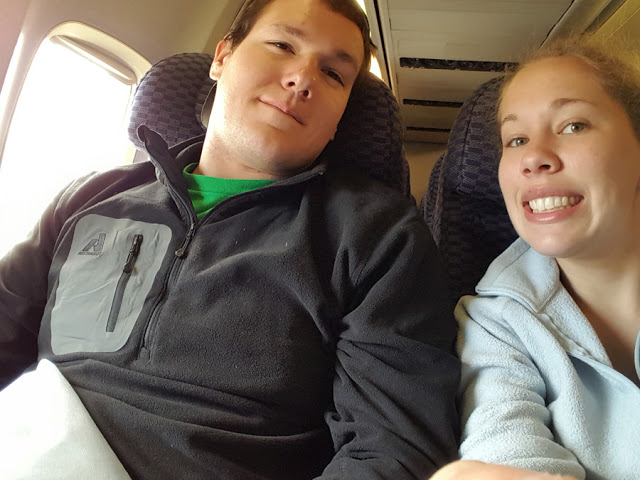](http://1.bp.blogspot.com/-F9A_N7t7aBY/ViV3yh6kRUI/AAAAAAAA5aY/mIYFXMrhONQ/s1600/leaving.jpg)
