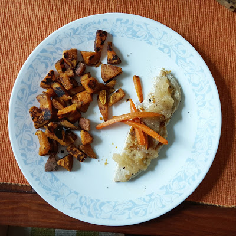

I can't believe the holiday season is upon us! It feels like just yesterday I was sweating my butt off in the lovely Georgia heat...oh Hotlanta!  Today's Friday Five link up with [Eat Pray Run DC](http://eatprayrundc.com/), [Mar on the Run](http://marontherun.com/), and [You Signed Up For What](http://www.yousignedupforwhat.com/) is all about staying healthy during the holidays. This is important to me as well as something I'm trying to do this holiday season. Unlike last year, I won't be recovering from surgery/unable to exercise/eating feelings! So here's my tips what I'm doing to stay healthy in the coming weeks: 

  

  

**Have A Plan**

Shaun and I did a body composition test this week. It was eye opening, and awesome because now we have a lot more insight on what our individual bodies need calorie wise, and what will make us lose/gain weight and muscle. We started back on the Virgin Diet, but aren't as strict this time (not cutting out corn & eggs completely). I've also been tracking everything again in [MyFitnessPal](http://www.myfitnesspal.com/klgh88) (let me know if you wanna be friends on there)!

  

  

  

**Eat Before Parties**

This one really works. If you're invited to a holiday party, eat a normal meal that will make you full beforehand. Showing up on a full stomach doesn't leave room for sweets and bad foods. 

  

  

  

**Get Outside!**

It's no longer hot and hard to breathe...remember when you wished it was colder so you could run easily? Now's the time. Even just taking your dog for a walk. Gets you moving instead of Netflix + Chilling. Sign up for a Turkey Trot or Jingle Jog. Earn that turkey, get a long sleeved t-shirt (and a medal if you're lucky), and then brag about how awesome you are to all the people sitting on the couch!

  

**Set Goals**

Okay, so if you are going to be around all the cookies, pies, and candy...set a goal. Instead of trying everything, really think about it. Ask what's in all the dessert and try to pick the healthiest one. Or allow yourself to try 1 item. It makes it a little easier. It's like stopping halfway while ripping a band-aid off.

  

**Distract Yourself**

Instead of sitting around a table of food and chatting with people, find something healthy to snack on, or maybe even something to hold so your hands aren't free to grab other food. Try to learn a new hobby or craft. Get addicted to a game on your phone?? Basically, don't let that temptation stare at you. Get busy with something else!

  

  

##  **\* \* \*** 

As a side note, I wanted to share 2 exciting blog-related things! 

  

1\. Check out my new "series", [**Wanderlust Wednesday**](http://blog.kaleighscruggs.com/search/label/Wanderlust%20Wednesday). You can see how I packed for a 12 day trip to Europe this summer in just a carry-on (plus my purse of course). 

  

2\. I recently discovered [**Passionfruit**](https://app.passionfruitads.com/marketplace/site/thefittea). It allows you to sell ads and other blog-related stuff. I've been doing free blogger swaps, which is the 'Friends' section on my sidebar. Basically I created an icon for my blog, and then send it to other bloggers and they send me theirs and I display it on the side! 

I'm doing this for **free**! If you want to add a 200x200 pixel ad to my site, let me know! 

Either you can do it through my [Passionfruit account](https://app.passionfruitads.com/marketplace/site/thefittea), or just [contact me](mailto:kaleigh@fitteablog.com) and we can get it set up! I'm all about connecting with bloggers and 'helping a sista out'. So lets share & care! 

  

<iframe allowfullscreen frameborder="0" height="269" src="//giphy.com/embed/WEiKBTaESHHhK?html5=true&amp;hideSocial=true" width="480"></iframe>

  

  

[Eat Pray Run DC](http://eatprayrundc.com/), [Mar on the Run](http://marontherun.com/), & [You Signed Up For What](http://www.yousignedupforwhat.com/)! 

  
  
**_What are your tips for staying healthy during the holidays?_**  
**_What is hard for you to avoid during the holidays?_**  
  
**_Do you have a healthy dessert that you like to make?_**  
  

**Connect with me!**  
 **[Twitter](http://twitter.com/kaleighcodes) | Instagram | [Pinterest](https://www.pinterest.com/kleach/) | [Bloglovin'](https://www.bloglovin.com/blogs/fittea-14492845)**
