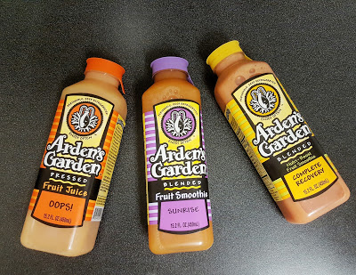

1\. TOMORROW IS HALLOWEEN!!!

I'm excited for Halloween if you can't tell...we're throwing a party tomorrow. There's still decorations I want to find (mainly a skeleton), and I need to make my [Blood Orange Sangria](https://www.pinterest.com/pin/351914158361897362/) and attempt a [Halloween Bundt Cake](https://www.pinterest.com/pin/351914158361897365/). Plus clean up our apartment, and shove a lot of random things into our bedroom and closet so they're not out during the party. We're not expecting it to get crazy or anything (not a ton of people have RSVP'd), but you never know. Oh and go to the store for some supplies....oh the list goes on.

2\. I love my new blog design!

I [bought a template on Etsy](https://www.etsy.com/shop/BloggerTemplate?ref=l2-shopheader-name), and love the clean features. I have been trying to get my blog social media up and running instead of using my personal Instagram/Twitter/Pinterest, etc. It's weird to have the 2 accounts, but I'm sure one day I will appreciate the separation.

3\. Getting back on track

After taking last week off from the gym since I was sick, I'm back at it this week. I'm also beginning to avoid gluten again and can totally tell the difference when I have and haven't had it. Last night I went to Whole Foods and wanted to get an Arden's Garden drink for work, and ended up buying 3. I couldn't decide!

4\. #OptOutside

I love [REI's announcement to #OptOutside](http://optoutside.rei.com/) on Black Friday! I hope that more stores follow this idea, and not make Black Friday such an insane day. Or at least stop it from bleeding into Thanksgiving day. Come on people!

5\. I'm a little sad October is over! My favorite month! And I can't believe it's almost November! How did that happen? I feel like it was just the holidays. Thanksgiving is in less than a month...and then Christmas will be here before we know it. Hobby Lobby and World Market already has a little bit of Christmas stuff out. Insanity!

[Eat Pray Run DC](http://eatprayrundc.com/) & [Mar on the Run](http://marontherun.com/)!

Connect with me!  
Facebook | [Twitter](http://twitter.com/thefittea) | [Instagram](http://instagram.com/thefittea/) | [Pinterest](https://www.pinterest.com/thefittea/)
