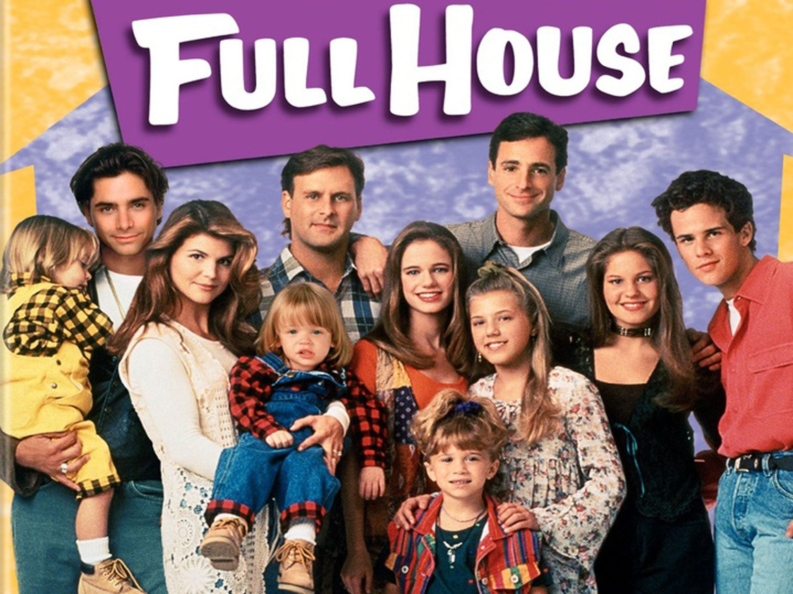
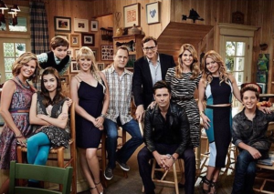

So, I don't know about you, but I cannot wait for [Fuller House](http://www.netflix.com/title/80051137) to come out on Netflix tomorrow! I grew up watching Full House. Even though I was born during the 2nd season, I remember watching Full House once I was able to watch tv. Then of course watching reruns after it was cancelled during the summers and at night.

Don't even get me started on Mary-Kate & Ashley. #1 fan right here.

<iframe allowfullscreen frameborder="0" height="328" src="//giphy.com/embed/G46TfDvCg9AtO" width="480"></iframe>

I will admit, I think the premise for the show is kinda...meh. Like DJ's husband dies and she's moving back into her childhood home with her 3 boys and everyone is still around to help (except for Michelle). And her last name is Fuller (which is actually Ashley Olsen's middle name, fun fact). I feel like they could have gone all Parenthood with it and it'd be fine. But whatevs. I am still gonna binge watch with the best of you.

_Will you be watching?_
