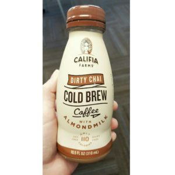

When I think back to what I loved in January nothing big really stands out...it seemed like such a fast month that I barely got used to it being 2016 already! So here are a few of my favorite things that I'm loving this year so far...

[**eos**](http://evolutionofsmooth.com/)  
I'm real late to the eos party, but lately I have been loving their stuff. I got my 1st lip balm a few months ago, and then earlier in January, my skin was just dying so I got the Cucumber hand cream and [Delicate Petals body lotion](https://evolutionofsmooth.com/hand-body-lotion/body-lotion/body-lotion-delicate-petals.html). All of these products are amazing and smell great. Plus I love the weird shapes. Definitely makes everything more fun. I know I've seen some lawsuit in the news, but I'm just refusing to read it right now.

**Lagunitas DayTime**  
When we went to the Lagunitas brewery in Chicago, I tried their DayTime beer, and I loved it. I haven't had it since, but I keep thinking about it. So I wanted to give it a shoutout!

**Dirty Chai**  
I have been seeing 'dirty chai' for a while now but never heard of anyone I know trying it so I can ask what it was like. I found this bottle at Sprouts the other day for $2.50, so I decided to give it a try. I also was interested because they used almond milk (my stomach says thank you). Um...this was REALLY good! I had no idea what to expect, but it had the spice of chai and the taste of coffee (plus the caffeine!) I drank half one day and the rest the next, but I loved it! I'll definately buy this again and try others from them!

**Teaaaaaaaa**

If you know me (and def if you work with me) you'll know that I love tea. Hot, iced, green, black, red, white, chai, matcha, whatever! After my trip to Chicago & Bloomington, I was jonesing for some tea because the tea situation there....sucked. I had okay tea on the train ride, but even at the hotel and at work in Bloomington I was super let down. Next time I'll have to bring my own! So once I got back I was trying to make up for lost tea-time! (ha!) I also organized my tea drawer. I mentioned this last week, but I just wanted to give it another shout out because I'm so excited.

**Chelsea Does**

I've already talked about this as well, but I really enjoyed watching this past month. If you want to get some straightforward info on these four topics, I highly suggest you watch!

aaaand that's it. I know I'm super interesting and everything!

_What were some things you enjoyed in January?_
