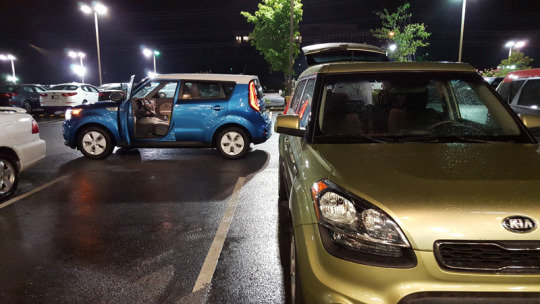
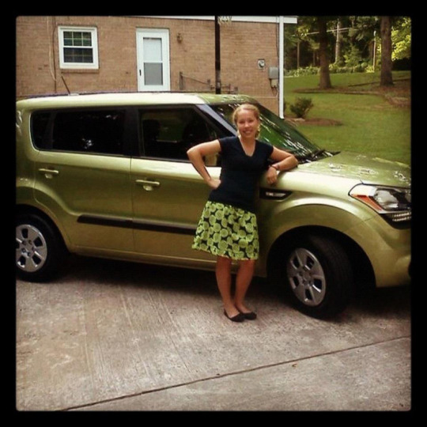
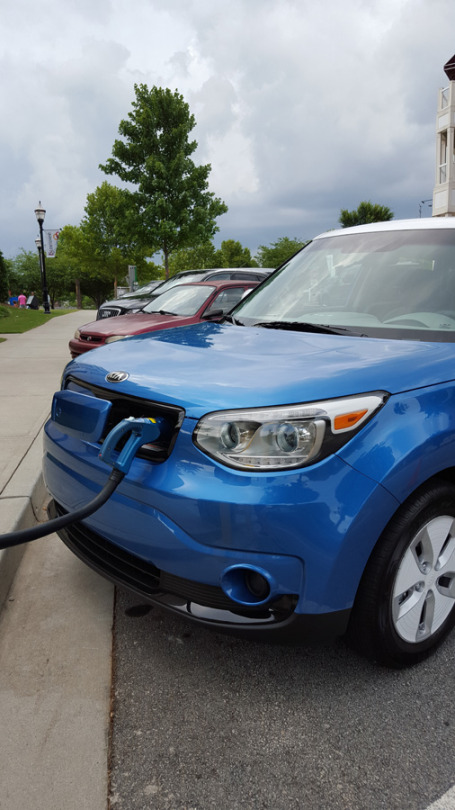
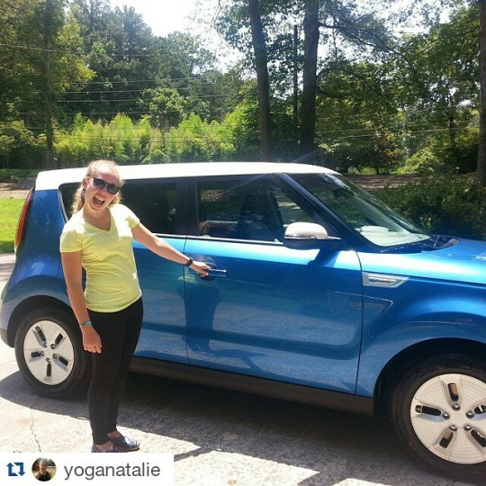
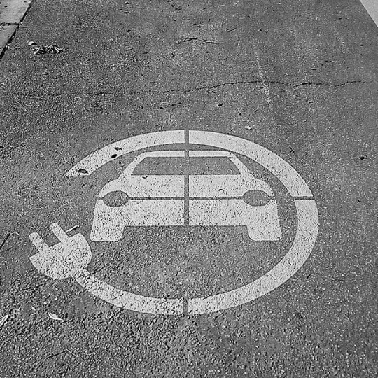

Three months ago, I took the plunge and traded my green Kia Soul in for a blue Kia Soul EV.

My 3 year lease was about up and I was starting to look at new cars. It seemed every trip we took in my car this year that the check engine light would come on, and turn off by the time I took it to be fixed. Pretty weird. Plus my beloved Sirius XM wasn't perfect and they wouldn't fix that either.

I was curious about the electric version of my car that had just started selling in Georgia. When they wouldn't look at my car at the dealership, I decided I would look at others. I asked to see the EV, and the salesman took me over to the only one they had. I was still not sold on the new 'look' of the Souls but really liked the upgrades compared to my 2013 and I was so intrigued by an electric car.  
I went home, did more research, only to find the Soul EV is one of the most affordable and efficient electric cars out there right now. After talking about it with my husband, we decided "why not try it". Sure, charging at home would be tricky since we're in an apartment, but we'd figure it out.

After finding a place that had the exact one I wanted, I signed a lease (all by myself may I add.. No cosigner here!) and handed over my alien green Yoda machine. Exciting and sad! Now, 3 months later I'm still loving it! I have entered a new community of people who charge their cars at GA Power (for free!!), and figure out what to do with my time as I charge.

I also am constantly checking [Plugshare](http://www.plugshare.com/) for new charging locations and planning where I go. Range anxiety is real though, I have even entered "turtle mode" once. But it goes away once you get more confident, realizing you might have to wait to charge, or being that person parked in the handicapped spot so that I can charge at home if I'm desperate (my charging cord luckily is just long enough to reach from our apartment to my car).

It's crazy though, so many people ask to see my car, under the hood, and have tons a questions about a 100% electric vehicle. But it's fun! For someone who loves technology and having the latest versions of things, it's awesome!

**_Do you drive an electric car?_**  
**Connect with me!**  
**[Twitter](http://www.twitter.com/kaleighcodes) | [Pinterest](http://pinterest.com/thefittea) | [Bloglovin](https://www.bloglovin.com/blogs/fittea-14492845) | Instagram**
