

Sweet baby Jesus. Packing for Europe. That's a trip in itself. Where to begin?

Once we booked our flight to and from Europe, that made our dreams a reality, and the harsh reality was that we wanted to go to many different places in our 12 days in Europe. We ended up choosing 5 cities in 12 days. That's a lot of moving around. Immediately I was thinking of how we'd look dragging rolling suitcases down streets, trying to figure out our way to the hotel, and being a target for thieves!

That didn't sound too hot to me. I like to blend in. When I studied in London, I remember seeing obvious tourists rolling their suitcases down uneven roads, drawing all kinds of attention to themselves. I didn't want that to be us.

Thanks to [Mother Pinterest](https://www.pinterest.com/kleach/), I began to create a vision of how we could pack light and not be gross, have broken backs, or obvious travelers.

I really liked this [post](https://thebudgetmindedtraveler.com/packing-list-for-europe/) by The Budget-Minded Traveler. She wrote about packing for an 8 day trip with a 30-liter backpack. I have a 30 liter Patagonia backpack, so I was curious if I could do the same.

Since I am such a great and experienced blogger, I didn't take any pictures of the packing process or anything specific I packed. You're....welcome?? If someone requests, I will document packing all the same stuff I brought...in pictures and an instructional video. Fair?

Let's get to it....here's what I packed for 12 days in Europe. If you have any questions or want to know what my husband brought, let me know!!

### Bags

**30L Patagonia Mate Backpack (discontinued, I believe)**

**[Kavu Rope Bag](http://amzn.to/1GRCFUm) & [Kavu Sidewinder Bag](http://amzn.to/1XiP2lT)**

[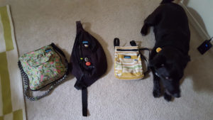](https://blog.kaleighscruggs.com/wp-content/uploads/2015/11/bags.jpg)

the green & black bags....left the yellow & the dog at home

**Shaun Packed:**

**REI Roadtripper Duffel - Large (packable)**

**Patagonia Fuego 32L Backpack (can't find this one either)**

[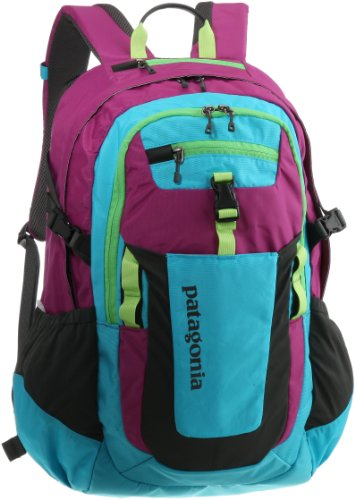](https://blog.kaleighscruggs.com/wp-content/uploads/2015/11/51uWUaOHu-2BL.jpg)

A note about the bag situation: I used my green Kavu and my Patagonia backpack as my personal and carry on items(shoved my black Kavu in my backpack for later), and Shaun used just his backpack as his carry on. The REI duffel bag folds down into a small circle, so we brought that if we ended up buying things and needed to check a bag or if Shaun wanted to use that as a carry-on. In the end, we didn't even need to bring it.

### Gadgets

**[4-Port USB Wall Charger/Travel Adaptors](http://www.amazon.com/gp/product/B00DW5AD16/ref=as_li_tl?ie=UTF8&camp=1789&creative=390957&creativeASIN=B00DW5AD16&linkCode=as2&tag=cod09d8-20&linkId=XA6YI7G36FBGSKGO)**

These allowed us to plug in up to 4 USB devices in 1 outlet and came with the 2 different adaptors we'd end up needing. This is a great guide to figure out what adapters you'll need on your trip.

[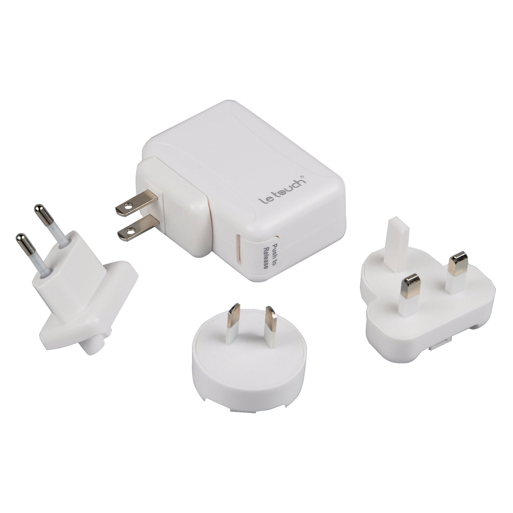](https://blog.kaleighscruggs.com/wp-content/uploads/2015/11/61907C-bYzL._SL1500_.jpg)

[**Selfie Stick**](http://amzn.to/1PE2bEX)

Don't worry, everyone has a selfie stick in all the touristy spots. It is also perfect when no one else is around to take your picture or think people are too sketch to hand them your camera/phone.

[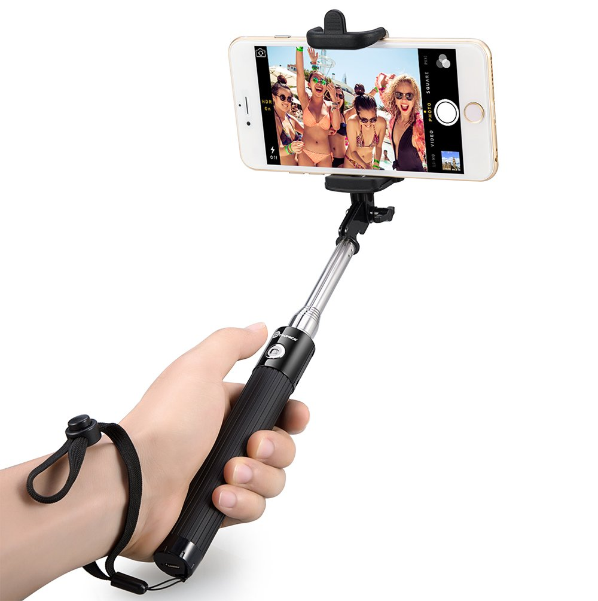](https://blog.kaleighscruggs.com/wp-content/uploads/2015/11/61ssV8chr0L._SL1005_.jpg)

[**AmazonBasics Portable Power Bank**](http://amzn.to/1PJDbew)

Lifesaver. I have the 5,600 mAh one. You can get these in bigger/smaller battery sizes. Mine could charge my phone from 5%-100% at least once, if not 1.5 times. I keep this in my purse. Why would you not have one of these!!

[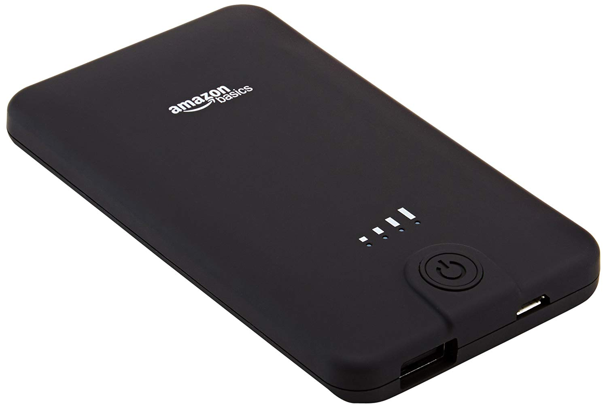](https://blog.kaleighscruggs.com/wp-content/uploads/2015/11/71IQUbS0IXL._SL1500_.jpg)

[**Fujifilm FinePix XP80**](http://amzn.to/1KrUmdA)

We bought this literally the day before we left. Shaun was originally not going to bring his phone since he wouldn't be getting service in Europe, so my phone would have been all we were using for pictures, directions, information, etc. This camera is awesome! Shaun mainly used it, but it's waterproof and shockproof, and the best part was that it has WiFi, so every night, I'd load the pictures onto my phone, and it was all backed up on Google Photos.

[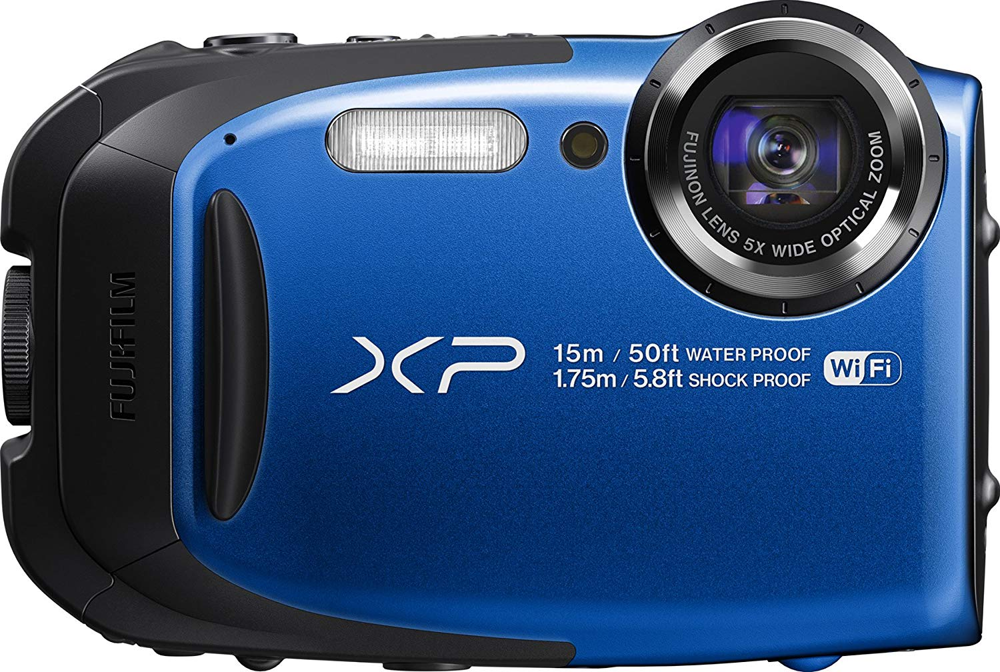](https://blog.kaleighscruggs.com/wp-content/uploads/2015/11/812Y-LBbA4L._SL1500_.jpg)

#### Other Fun Stuff:

headphones (plane rides)

4 USB charging cables (plus an extra for my purse)

sunglasses

flash drive with copies of our passports, license, debit/credit cards, insurance cards, plane/train tickets, and hotel reservations

notebook & pen packable umbrella

### Toiletries

Since I knew we'd be moving around a lot, I knew this part had to be easy.

You are allowed to bring a quart-sized bag with 3.4 ounces or less per item in your carry on. So I brought a travel size of face wash, lotion, deodorant, shampoo, and toothpaste. I researched and knew most of the places we'd stay would have soap, and my husband was packing soap in his bag.

[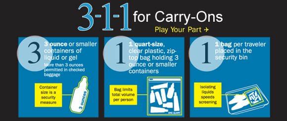](https://blog.kaleighscruggs.com/wp-content/uploads/2015/11/travel_liquid_311.jpg)

I put my Epi-Pens in a separate zip lock and then put both of these in a gallon ziplock. I did have an actual toiletries bag that I brought nail clippers, toothbrushes, hair ties, face wipes, and Wet Ones in.

[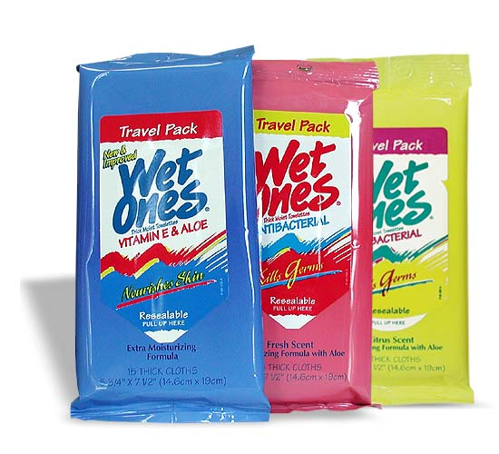](https://blog.kaleighscruggs.com/wp-content/uploads/2015/11/wet-ones.jpg)

### Clothes

**Packable Rain Jacket**

For some reason, I can't find any packable rain jackets that look like mine or my husband's, but here's one from Land's End, where I got mine 5+ years ago. This is a must-have item, in my opinion. Barely takes up any space yet incredibly helpful when it's rainy or windy.

[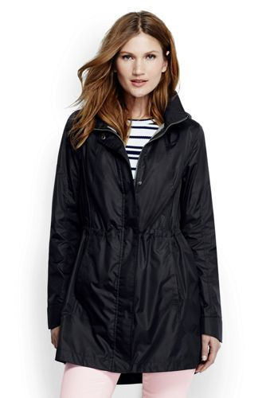](https://blog.kaleighscruggs.com/wp-content/uploads/2015/11/2e4a1bdd0638474464accf3755abb535.jpg)

**2 Button Downs**

Gotta look fresh, plus they are great for all temperatures and still looking nice.

**4 V-Neck Shirts**

I have a billion of these shirts from Target. So I brought 4. (I wore 1 for traveling, so technically 3 were packed).

**1 pair of shorts**

Please don't wear shorts with your butt hanging out! Make sure they have an inseam! Europeans don't dress like we do, so they don't want to see EVERYTHING your momma gave you.

**1 pair of pants**

These pants from Eddie Bauer are SO comfy. They look nice but have a bit of stretch and great pockets. I didn't want to wear jeans and look super American, so these are a must.

**1 pair of leggings**

For plane and train rides, and when it's chilly out.

**4 pairs of socks**

[**1 long sleeve base layer shirt**](http://amzn.to/1MoakLj)

This was perfect for Edinburgh, where it was unseasonably cold, windy, and rainy most of our time there. I wore this, a long-sleeve button-down, jacket, and scarf, and at times the packable rain jacket as well.

[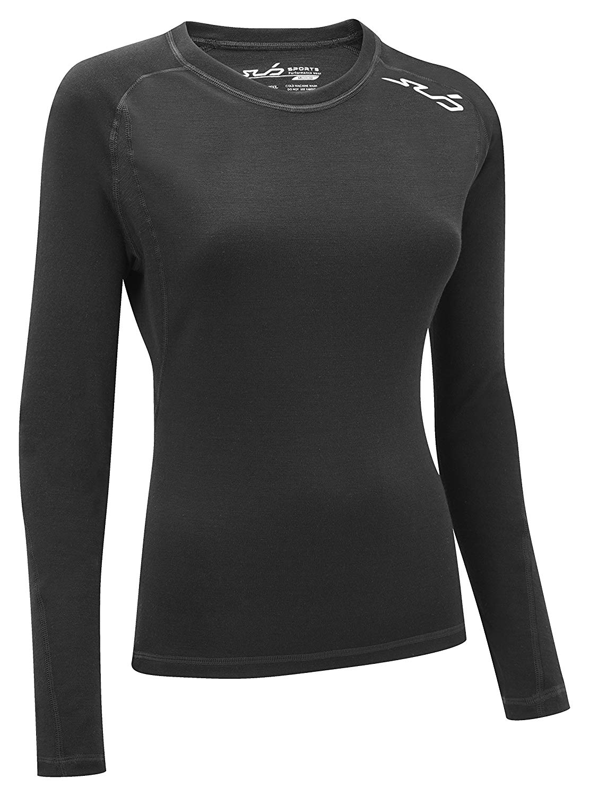](https://blog.kaleighscruggs.com/wp-content/uploads/2015/11/91RDlyzgdfL._SL1500_.jpg)

[**2 pairs of ExOfficio Women's Give-N-Go Bikini Briefs**](http://amzn.to/20A9u4q)

This underwear is the best ever. I had remembered seeing it at REI a long time ago as the only pair you'd need for a long trip. I investigated, and if you wash and dry it (the right way), they're good to go by morning. I tested them out a month before our trip, and they really dried overnight and were insanely comfy. The tag says you'll never buy other kinds of underwear again, and they're right! They blow all my VS Pink undies out of the water.

[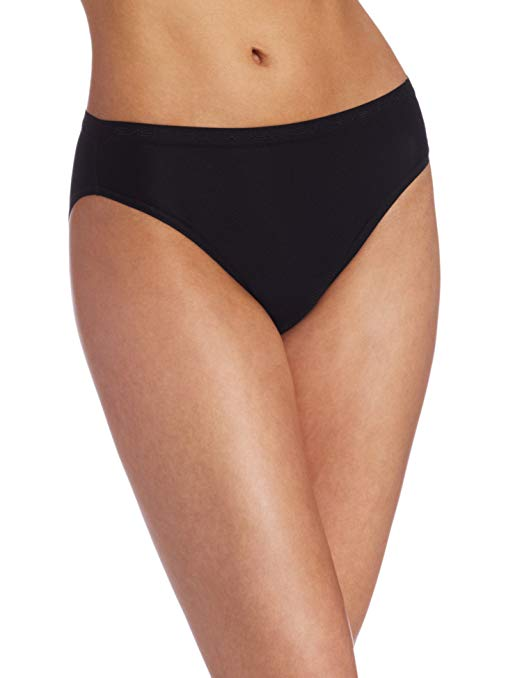](https://blog.kaleighscruggs.com/wp-content/uploads/2015/11/71HGh-yVHGL._SX522_.jpg)

**2 pairs of regular underwear**

Just in case.

**2 tank tops to wear under button-down shirts**

Also used to sleep in.

[**1 fleece jacket**](http://amzn.to/1PsBSQv)

My trusty Columbia. I also like them because the pockets zip up!

**1 light sweater**

Because it was summer.

**1 pair of Converse & 1 pair of Toms**

I really wanted to bring my Chacos, but knew I'd probably be cold and not wearing shorts most of the time. Having 2 pairs of shoes to alternate between was great, but I was tired of wearing them by the end of the trip—tons of walking.

[**Scarf!**](http://amzn.to/1Mocn1U)

Europe & scarves go together. They keep you warm, are easily shoved in your bag, and can dress up an outfit if you're not sure what attire you need to be dressed in.

If you did the math, you'd see I didn't have enough underwear, shirts, and socks to not wear them twice. The underwear was easily washable, so that wasn't a problem. About 5 days in, Shaun pulled out some paracord from his backpack and set it up in our hotel room to do laundry in the bathroom. We washed all of our shirts, socks, and underwear in the sink and hung them up to dry. So be prepared to do a little laundry!

**_Have you backpacked to another country?_**

**_Do you have any trips coming up?_**

**Connect with me!**

**[Twitter](https://twitter.com/kaleighscruggs) | Instagram | [Pinterest](https://www.pinterest.com/kleach/) | [Bloglovin.'](https://www.bloglovin.com/blogs/fittea-14492845)**
