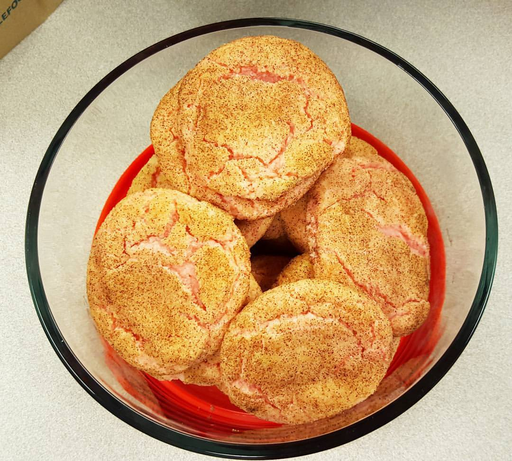
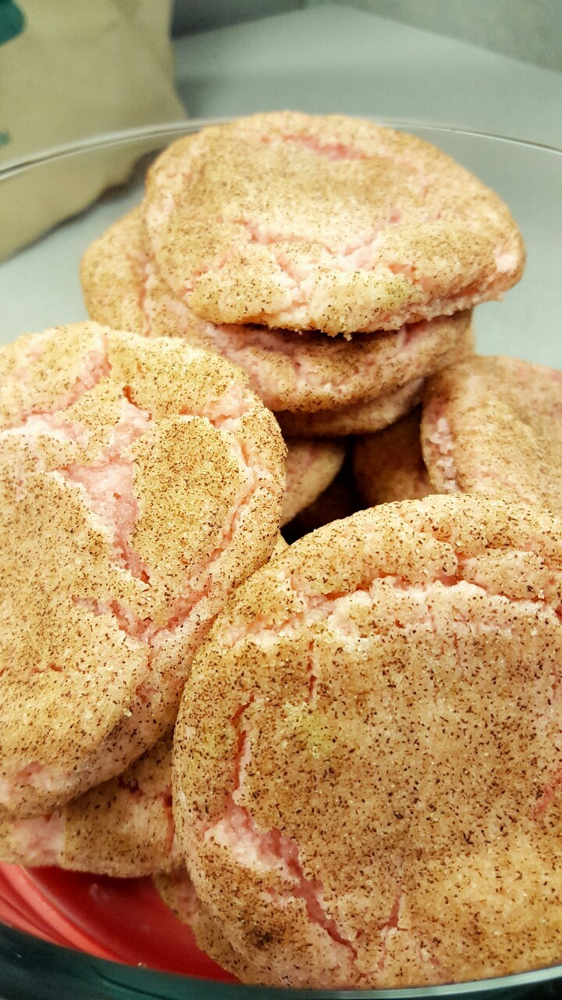

Today at work, we all are wearing pink, and bringing in pink food for breast cancer awareness. At first I had no idea what to make, but I knew I would be baking some sort of cookie or cake. I settled on cookies, and then decided on snickerdoodles because they're a light colored cookie and would be easy to add pink food coloring to.I found [Neon Food Color](http://www.amazon.com/gp/product/B004MNYB6U/ref=as_li_tl?ie=UTF8&camp=1789&creative=390957&creativeASIN=B004MNYB6U&linkCode=as2&tag=cod09d8-20&linkId=Q34JA7KT2JOP35WH)

**Pink Snickerdoodles for Breast Cancer Awareness**

**For the cookies:**

- 1/2 cup butter softened
- 1/2 cup butter-flavored shortening
- 1 1/2 cups sugar
- 2 eggs
- 1 tbsp vanilla
- 2 3/4 cups flour
- 1 1/2 tsp cream of tartar
- 1 tsp baking soda
- 1/8 tsp baking powder (I don't have anything that measures 1/8 so I fill up 1/4 tsp halfway)
- 1/4 tsp salt
- pink food coloring

**For the cinnamon sugar mix:**

- 4 tbsp sugar
- 4 tsp cinnamon

**Instructions**

1. Mix the butter, shortening and sugar
2. Next, add the eggs and vanilla
3. In a separate bowl, combine the flour, cream of tartar, baking soda, baking powder, and salt.
4. Gradually add flour mixture, stirring until well combined.
5. Once combined, add pink food coloring (skip if you want regular cookies). I added around 4 drops.
6. Refrigerate dough for 30 minutes, and preheat oven to 375 degrees.
7. Combine sugar and cinnamon in a small bowl.
8. Remove dough from the fridge and form into small balls.
9. Roll balls in sugar and cinnamon and place on an ungreased cookie sheet or silicone baking mat
10. Bake for 8 minutes.
11. Remove and let cool on sheet for two minutes before transferring to a cooling rack.

**Connect with me!**

**Facebook | [Twitter](http://twitter.com/kaleighcodes) | Instagram | [Pinterest](http://pinterest.com/thefittea)**
