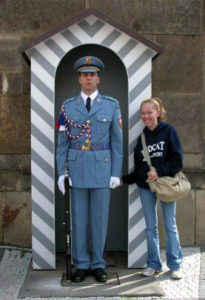
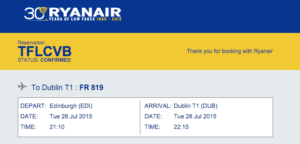
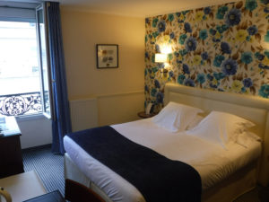
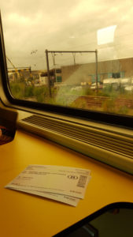

Planning a trip might sound like a daunting task if that's not your cup of tea. But for me, I LOVE THAT ISH. Trip planning is so fun for me. I love looking things up, and figuring out the best way for us to explore new places.  
We planned to travel Europe the summer of 2015, and even though I had been there twice before, both were sponsored/school related trips so a lot of logistics were already planned out for me. Studying abroad was pretty open for the most part, but I had a home base in London, which was so convenient. But planning an European adventure from scratch seemed like a huge task. It is, but here are my tips to make it easier!  
  
  

  

<table cellpadding="0" cellspacing="0" style="margin-left: auto; margin-right: auto; margin: auto; text-align: center;"><tbody><tr><td style="text-align: center;"></td></tr><tr><td style="text-align: center;">baby Kaleigh getting crazy  </td></tr></tbody></table>

#### Decide where you want to go 

Everywhere. Yes, but what is a must see or do? I wanted to go to London & Paris, Shaun wanted to go to Amsterdam and Brussels, and we both wanted to go to Ireland & Scotland. Sweet!  
  

#### **Decide _when_ you want to go** 

There are cheaper times to go certain places, but since Shaun's a teacher and already had the whole summer off, it was easier for us to decide on the summer. Look at your calendar and find a good chunk of time (at least a week) to start your search. **Use [Google Flights](https://www.google.com/flights/)**You can play with it and get ideas of when to go, how long, and where to fly in & out of. Flights from Atlanta to Dublin were the cheapest. So then I started to search for the best flight times (aka shorter layovers, leaving Atlanta before rush hour, arrival time in Dublin), and then went to United.com to buy the flights. (I can't imagine doing it without having a heart attack, so that's okay)  

_**Pro tip:**_ I was planning on opening a credit card with whatever airlines we decided on in order to get the $$$ off and start earning miles. I didn't realize until I was in too deep that my ticket purchase wasn't going on that new card. (It took about **2 weeks** for it to arrive). So I had to use my regular credit card. Not a huge deal (woo cash back!), but that took me by surprise. **Plan Your Cities**By this point all that was set in stone was Dublin. The website [Rome2Rio](http://www.rome2rio.com/) was awesome in figuring out the rest. It helped us visualize how we could get from one place to another, see how much planes/buses/trains/boats, cost, and decide on the order. It took a few weeks for us to finalize our plan: Dublin -> Brussels via RyanAir -> Paris via train -> London via train -> Edinburgh via train -> Dublin via RyanAir ( to catch the flight back home) **Make transportation reservations**To figure out the flights I used [**Google Flights**](https://www.google.com/flights/) and [**Skyscanner**](http://www.skyscanner.com/). For the trains, I used Rome2Rio and [The Man in Seat 61](http://www.seat61.com/index.html#.VktqNq6rSu4). I used that website when I was studying abroad. It was super helpful for us to figure out how to get from London to Amsterdam via trains, a ferry, and more trains.  

_Pro-tip_  Make reservations with a credit card. Also check to see if you'll be charged a foreign transaction fee. You won't be charged this on your debit card, but I have always felt like credit cards are safer in this situation. Plus depending on the type of credit card you have, you get travel insurance on tickets, hotels, etc. To decide on how long we were in each city was based on prices of transportation as well as the things we wanted to do. Dublin - 2 nights Brussels -1 night Paris - 2 nights London - 3 nights Edinburgh - 2 nights Dublin (again, to go home) -1 night **Travel Insurance**I can't say this enough. What if you get sick, miss a flight, lose your wallet, etc? You don't have to get it, but it helped us out when our cruise got cancelled earlier this year! **Pat yourself on the back**By this point, you've already spent some serious dough on your trip. Next up is the real work. Deciding on where to stay.  

I went to my library and checked out a TON of books on all the cities we'd be visiting. I like to look at travel books to get all the interesting info about parts of the city that are safe, how to get from the airport to your hotel, must try foods and drinks....all that good stuff. (of course Pinterest is great too, but I'm a book person) **Google Maps** aka Best Friend Forever. Start 'starring' places you want to go. Star where your train or plane arrives. see if there's a common area where everything is. That's where you'd want to find a hotel. Of course, some areas may be more expensive/safer than others, so take that into consideration as well. When I was looking for a hotel in Paris, I was searching for ones with a view of the Eiffel Tower. I knew that would be more expensive, but I figured if we're going to be in Paris, I want to see the Eiffel Tower from my hotel room. I was able to find [just that](http://www.hotel-paris-bosquet.com/). **TripAdvisor** is a GREAT resource for traveling. Travelers post reviews and photos of their room, view, and other hotel areas. That's how I found our hotel with this view (without breaking the bank).  

Another tip, is to **check out the universities** in the area. In Dublin, we stayed at [Trinity College](http://www.tripadvisor.com/Hotel_Review-g186605-d188004-Reviews-Trinity_College_Campus-Dublin_County_Dublin.html) in one of their dorms (since it was summer). It was super cheap and we were right in the middle of the city. We did have a communal bathroom to share with 3 other rooms, but it wasn't bad at all! Hotel search websites usually have a map view, so you can filter out your criteria and prices and see the locations compared to where you want to go. Once you have all your hotels and major transportation reserved, **look up how to get between those places** (and around in general) in each place. To get from the Dublin Airport to Trinity College, we used [Aircoach](http://www.aircoach.ie/). In Brussels we took a train, and in Edinburgh we were just across the street! To find out the best way, check out the airport's website, travel guides, or by simply Googling "how to get from the Dublin airport to city center".  

And there you have it, a trip to Europe is planned! I really hope this helps, so if you have any questions or comments....leave them below!

   

**Connect with me!**

 **[Twitter](http://twitter.com/kaleighcodes) | [Instagram](https://www.instagram.com/codebikerun/) | Pinterest | [Bloglovin'](https://www.bloglovin.com/blogs/codebikerun-12713491)**
