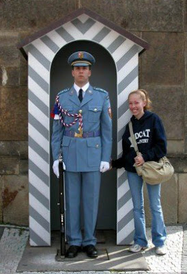
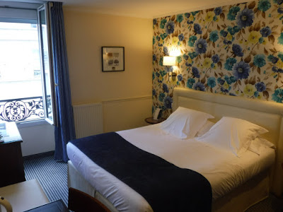

  
So you wanna go to Europe?! Here is how I planned our trip to Europe this past July!  
  
This was going to be my 1st trip to Europe that I 100% planned. My 1st ever trip abroad was in high school with my honor orchestra, so it was part of a planned tour. The 2nd time was when I studied abroad in London. All I had to worry about was my weekend excursions. I'm not saying that was stressful, but it was nice to have a home base in London where I kept my computer and only needed to bring a night or two's worth of clothes.  
  

baby Kaleigh getting crazy

  
  
First things first, **decide where you want to go**. Everywhere. Yes, of course. But now for real, what is a must see or do? I wanted to go to London & Paris, Shaun wanted to go to Amsterdam and Brussels. We both wanted to go to Ireland & Scotland. Sweet.  
  
Next, **decide _when_ you want to go**. Yes there are cheaper times to go certain places, but since Shaun's a teacher and already had the whole summer off, it was easier for us to decide on the summer.  
  
Use [**Google Flights**](https://www.google.com/flights/). It will give you ideas of when to go, how long, and where to fly in & out of. Flights from Atlanta to Dublin were the cheapest. So I found the best flight times (aka shorter layovers, leaving Atlanta before rush hour, arrival time in Dublin), and then went to United.com to buy the flights. I can't imagine doing it without having a heart attack, so that's okay.  

_**Pro tip**_. I was planning on opening a credit card with whatever airlines we decided on in order to get the $$$ off and start earning miles. I didn't realize until I was in too deep that my ticket purchase wasn't going on that new card. (It took about **2 weeks** for it to arrive). So I had to use my regular credit card. Not a huge deal (woo cash back!), but that took me by surprise.  
  
Next was to **really decide on where to go and the order to go in**. By this point all that was set in stone was Dublin. The website [Rome2Rio](http://www.rome2rio.com/) was awesome. It really helped us visualize how we could get from one place to another, see how much planes/buses/trains/boats, cost, and decide on the order.  
  
We decided on Dublin -> Brussels via RyanAir -> Paris via train -> London via train -> Edinburgh via train -> Dublin via RyanAir.  
  
Picking out that order was awesome. Halfway there!  
  
**Next I made the flight and train reservations**. To figure out the flights I used [**Google Flights**](https://www.google.com/flights/) and [**Skyscanner**](http://www.skyscanner.com/). For the trains, I used Rome2Rio and [The Man in Seat 61](http://www.seat61.com/index.html#.VktqNq6rSu4). I used that website when I was studying abroad. It was super helpful for us to figure out how to get from London to Amsterdam via trains, a ferry, and more trains.  
  

  
  
_Pro-tip_  Make reservations with a credit card. Also check to see if you'll be charged a foreign transaction fee. You won't be charged this on your debit card, but I have always felt like credit cards are safer in this situation. Also spending a lot of money helps you get miles and all that good stuff. Just don't forget to pay your credit card off!  
My United credit card didn't have a foreign transaction fee, so that was helpful once it arrived in the mail!  
  
To decide on how long we were in each city was based on prices of transportation as well as the things we wanted to do.  
Dublin - 2 nights  
Brussels -1 night  
Paris - 2 nights  
London - 3 nights  
Edinburgh - 2 nights  
Dublin (again, to go home) -1 night  
  
**Pat yourself on the back**. By this point, you've already spent some serious dough on your trip.  
  
Next up is the real work. Deciding on where to stay.  
  

  
  
I went to my library and checked out a TON of **books** on all the cities we'd be visiting. I like to look at travel books to get all the interesting info about parts of the city that are safe, how to get from the airport to your hotel, must try foods and drinks....all that good stuff.  
  
**Google Maps** is your friend. Start 'starring' places you want to go. Star where your train or plane arrives. see if there's a common area where everything is. That's where you'd want to find a hotel. Of course, some areas may be more expensive than others, so take that into consideration as well.  
  
For me when I was looking for a hotel in Paris, I was searching for ones with a view of the Eiffel Tower. I knew that would be more expensive, but I figured if we're going to be in Paris, I want to see the Eiffel Tower from my hotel room. I was able to find [just that](http://www.hotel-paris-bosquet.com/). **TripAdvisor** is a GREAT resource for traveling. Travelers post reviews and photos of their room, view, and other hotel areas. That's how I found our hotel with this view (without breaking the bank).  
  

  
Another tip, is to **check out the universities** in the area. In Dublin, we stayed at [Trinity College](http://www.tripadvisor.com/Hotel_Review-g186605-d188004-Reviews-Trinity_College_Campus-Dublin_County_Dublin.html) in one of their dorms (since it was summer). It was super cheap and we were right in the middle of the city. We did have a communal bathroom to share with 3 other rooms, but it wasn't bad at all!  
  
Once you have all your hotels and major transportation reserved, **look up how to get between those places** (and around in general) in each place. To get from the Dublin Airport to Trinity College, we used [Aircoach](http://www.aircoach.ie/). In Brussels we took a train, and in Edinburgh we were just across the street! To find out the best way, check out the airport's website, travel guides, or by simply Googling "how to get from the Dublin airport to city center".  
  

  

For packing tips and what to bring, check out last week's post!  
  

  

My next post will be about using your smartphone & my favorite travel apps!

  

If you have any questions, please let me know!

  
  

**Connect with me!**

 **[Twitter](http://twitter.com/kaleighcodes) | Instagram | [Pinterest](https://www.pinterest.com/kleach/) | [Bloglovin'](https://www.bloglovin.com/blogs/fittea-14492845)**
