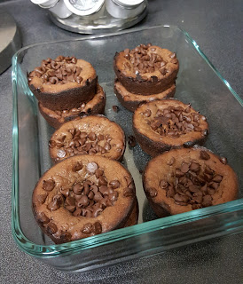
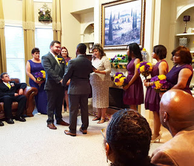
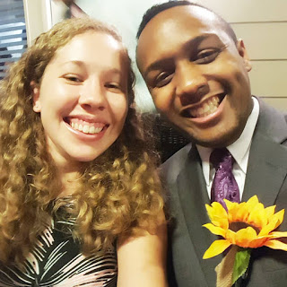

Happy Monday!

Here's a look back at this past week!

**Monday**  
After work I made my famed gluten-free peanut butter banana muffins. We had some bananas that were going to go bad, so I needed to save them! Some people make banana bread, I make something gluten-free!  
As soon as I finished, we went to the gym for Total Body Fitness. We had a good workout, and then went to pick up some Halloween decorations from Shaun's parents. Of course once we got home, we put up the decorations and had a small dinner.

**Tuesday**  
I finally went shopping to find a dress for the wedding we went to Saturday. I got a great deal on my dress at Kohls...it cost $4.80!! Talk about a steal! I also got a bunch of ties and shirts that matched so Shaun could pick one out. Now to return the ones he didn't pick...**Wednesday**  
The weather was so nice Wednesday, so Shaun and I went to the pool for probably one last pool day of the year. It was way too cold to swim, but Shaun got in because he's crazy. Afterwards, we ordered Chinese from our favorite place and watched some of our shows.  
**Thursday**  
On the way home from work, I stopped by Bath & Body Works to get some fall scented candles! We had Total Body Fitness and I stayed and did 2 classes.Mostly because I'm crazy. Of course it was a really tough circuit, but it was worth it of course! Afterwards, I quickly headed to charge my car before Shaun was finished with practice, and then we went to Chick-fil-a!

**Friday**  
I'm kinda bummed I didn't take any pictures, but we went to [Cherry Street Brewing](http://www.cherrystreetbrewing.com/) with Shaun's coworker and her boyfriend, and his brother and sister in law. It was about 30 minutes away, but we'll definitely go there again! We each got a flight of beer, and shared pretzels. It was fun, and they had a ton of beer to choose from! Love it!  
(I also found out I got 3rd in my age group at the 5k on October 3rd!)

**Saturday**  
My best friend Branden got married to my friend Ricky! It was moved last minute to Branden's parents house because of the threat of rain, but it ended up not raining! It was a beautiful wedding and great to see a bunch of old friends from college. We're getting old!!

**Sunday**  
Shaun and I planned our meals for the week and then went grocery shopping #Adulting.  
Moe's Monday, Taco Tuesday, Wings Wednesday....you get the idea...

How was your weekend?

Welcome to the blog!

Weekly Wrap with [HoHoRuns](http://hohoruns.blogspot.com/) & [MissSippiPiddlin](http://www.misssippipiddlin.com/)

**Connect with me!**

**Facebook | [Twitter](http://twitter.com/kaleighcodes) | Instagram | [Pinterest](http://pinterest.com/thefittea)**
