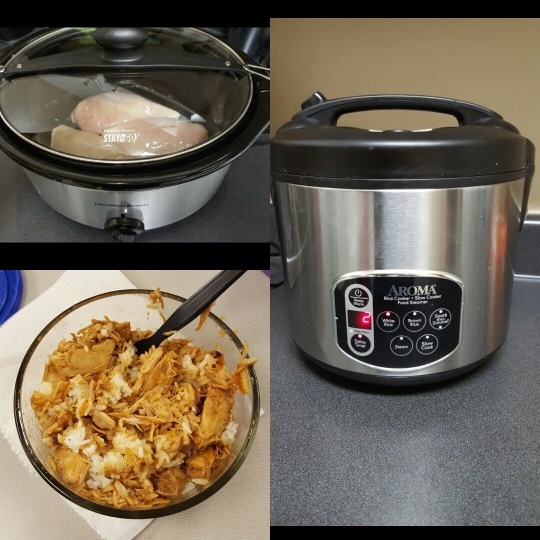
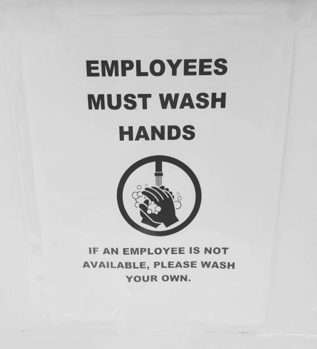
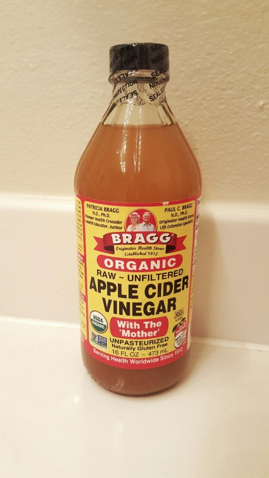
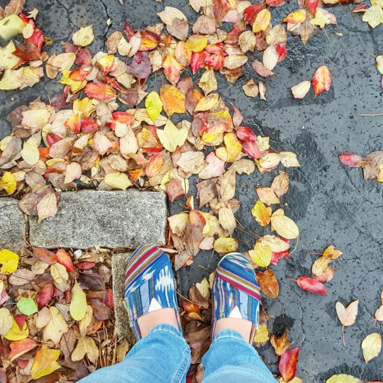

**Monday**  
I stopped by Trader Joe's and Publix on the way home to get a couple of things I needed to make some dinner while Shaun and I were both gone for a few hours. I found an orange chicken recipe on Pinterest. It was pretty easy, all I had to do was cook the chicken in the crock pot for 3 hours, add the sauce, and cook for an extra 30 minutes. I was able to cook the chicken and delay cook the rice so when we got home it'd be almost ready! I need to find more good crock pot meals for this wrestling season!  
  

**Tuesday**  
Shaun and I had plans to go to his parent's house for dinner so we needed a quick workout. I had him do the 2 crazy workouts I found last week on [Pinterest](http://pinterest.com/kleach) with me. I think at 1st glance he didn't think it'd be much, but he was in for a surprise! We got in a really great workout in under 30 minutes. Can't complain about that!  
**Wednesday**  
After work (and traffic time), we went to the growler place down the street since it was Shaun's last Wednesday before he starts wrestling to get a flight and growlers to take home. It was a lot of fun and I got a half growler of Pumpkin Jack..this amazing pumpkin cider. It's like juice! Dangerous I'm sure, but really good to have in this chilly rainy fall weather!  
  
This sign was in the bathroom of the growler place:  

**Thursday**  
I stopped by Ulta to get some styling stuff for my hair (I don't know what to call it!). I asked one of the ladies what I can put in my hair to really clean it since I've noticed there's a lot of build up from products in my hair. She suggested to try apple cider vinegar.  
  
So I went to Publix and got some, went home and looked up how to use it. I just did 4 tablespoons of the vinegar + 16 oz of water, and I added a few drops of lavender essential oil to make it smell a bit nicer. It was weird at first to pour it in my hair and try to keep it in there, but I got the hang of it and really scrubbed my scalp and then let it sit for a few minutes. Then I rinsed it out. I think it really worked, and my hair is not that frizzy either! Which, in this humid and damp weather, has been a bit of a mess to work with.  
  

**Friday**  

  

[Coldplay](http://coldplay.com/)'s new single came out at 2:45 AM EST (7:45 AM in London). So, like usual for Coldplay releases, I set my alarm, and got up in the middle of the night to get on my computer and listen to the BBC Radio 1 stream. This time was pretty cool because they released the single, and were doing a bunch of radio interviews. I even got into my car to listen to the one on SiriusXM! But that was also not so good because I didn't get back into bed until after 4am. Oh well...#Dedication

  

**Saturday**  
After working out in the morning, Shaun and I wanted to go to Three Taverns Craft Brewery in Decatur. It was really good, and I found a couple new beers that I like a lot. Then we went to Twain's down the street and I had a gingerbread cookie beer. Um, talk about Christmas in your mouth!  
  

**Sunday**  
I like being super chill on Sunday before the week really gets going. We cleaned up a little bit, did grocery shopping, but mostly just stayed inside. It was 49 degrees, windy, and rainy. The weather is the same again today, but tomorrow we're supposed to get a special appearance from the Sun!! After over a week of this crappy weather, I'm ready for something better!  
  

**_How was your weekend?_**  
**_Do you have any favorite fall drinks?_**  
**_What's your favorite crock pot recipe?_**   

  

  

  

Weekly Wrap with [HoHoRuns](http://hohoruns.blogspot.com/) & [MissSippiPiddlin](http://www.misssippipiddlin.com/)

  

Connect with me!  
 [Twitter](http://twitter.com/kaleighcodes) | Instagram | [Pinterest](https://www.pinterest.com/kleach/) | [Bloglovin'](https://www.bloglovin.com/blogs/fittea-14492845)
