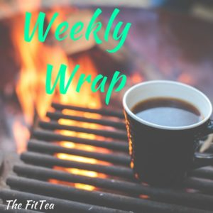
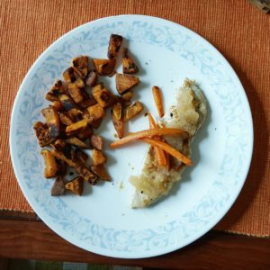
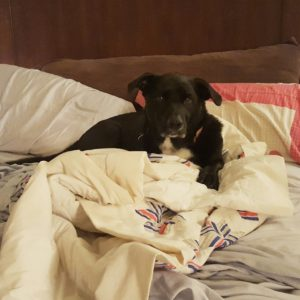
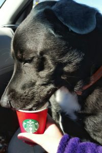
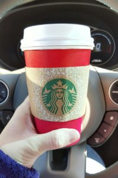

_Thinking of Paris_

  

  

  

  

**Monday**

Monday was a tad bit crazy, it was Shaun's 1st day of wrestling practice. I drove with him, and watched the first half hour of practice until it was time for me to go to Total Body Fitness(TBF). I only did 1 TBF, and then left to pick him back up and go to Moe's for dinner. We officially went back onto our diet Monday. We had hard boiled eggs for breakfast, and chicken for lunch with hummus and rice crackers for a snack. I think there was also some Quest bar action in there as well.

**Tuesday**

Tuesday we did hydrostatic fat testing at the gym. It was by the [Body Fat Test](http://www.bodyfattest.com/) truck. It was really cool, we got into this tiny tub of (warm) water and had to go all the way under and breathe out all your air. That's how they got your body fat. I'm not afraid to share that I have 25% body fat, but only need to lose 4.5lbs to be a healthy percentage. I actually _want_ to lose 7lbs. So the 4.5 is a good starting point.

**Wednesday**

It finally stopped raining and the sun was out! After work, I took Mac to the field to run around and stretch his little legs out! I also made him his own Instagram because I'm obsessed with so many corgi Instagram accounts. I didn't work out, but I was pretty close to my 10,000 steps goal on my FitBit. 

  

********

  

**Thursday**

I worked from home, and was able to go to Whole Foods for lunch. I got the 'Chicken Salad Snack', which is a container with chicken salad, crackers, grapes, and cheese. I didn't eat the cheese since it's not in my diet, but the rest was so good!

I almost missed the 1st class of TBF! I got there right as they were setting the clock. Luckily I was able to jump in and completed 2 classes! It was a great workout. For dinner we had hibachi chicken..so good.

********

  

**Friday**

I worked out as soon as I got home from work. I only did the elliptical because my knee was hurting all day and my calves were killing me from Thursday's workout. I got a 'Detoxified' juice from Whole Foods, and it was pretty good...but it has ginger in it...I just can't do ginger. 

**Saturday**

We were supposed to go to the mountains, but Shaun was sick, so we stayed home and I took care of him. I went to a bunch of stores getting all the things he needed and requested. I had Mac in the car with me when we went through the Starbucks drive-thru and they offered him a Puppuccino! He LOVED it. I took video of it as well. Mac was addicted, and when he finished, he was eyeing my London Fog and trying to sniff it like he wanted to try it too. I think I've created a monster!!

  

********

  

  

**Sunday**

Another semi-lazy day. We did get to go out and do some shopping and got some Chipolte. But then we went back home for Shaun to rest. No workouts this weekend, but I did eat healthy, and got 2 more of the Chicken Salad Snacks from Whole Foods. I ate one, and am saving the other for a random time this week.

  

  

Weekly Wrap with [HoHoRuns](http://hohoruns.blogspot.com/) & [MissSippiPiddlin](http://www.misssippipiddlin.com/)

  
  

**Connect with me!**

 **[Twitter](http://twitter.com/kaleighcodes) | Instagram | [Pinterest](https://www.pinterest.com/kleach/) | [Bloglovin'](https://www.bloglovin.com/blogs/fittea-14492845)**
