I love Gatsby. I love WordPress. I love Gatsby and WordPress together. Earlier this year I set up a couple of sites using existing WordPress sites that I managed and created all-new designs and front-end experiences for both. In this series, I’m going to walk you through the whole thing- we’ll set up a new site that uses WordPress as the headless CMS with Gatsby. I’ll start from the very beginning so if you don’t know anything about Gatsby or WordPress, this will hopefully get you up and running with ease. If not, let me know what I can help you with!

## Part 1 – The Foundation

Let’s say you’ve decided you want to build this sort of site either for yourself or a client. All new everything. A domain name, hosting, a fresh start. If you’re not starting out fresh, you can jump in wherever it makes sense.

## Assumptions

You’ve purchased a domain name (I like to use [NameCheap](https://www.namecheap.com/))

You have a place to host the WordPress Site (ideally wherever you purchased the domain name), and it’s already installed.

The website we’re creating will be [kaleigh.tech](https://kaleigh.tech/) and the WordPress site will be hosted at [wp.kaleigh.tech](https://wp.kaleigh.tech/). Wherever your WordPress site lives does not matter, it can be a subdomain or top level.

## WordPress Site

No matter if you have a lot of content or nothing at all, you’ll want to install 3 plugins to your WordPress site. We’re not going to hook them up right now since we don’t have anything to point them towards, but let's get it set up ahead of time.

### Install Plugins

[wp-trigger-netlify-build](https://github.com/iamtimsmith/wp-trigger-netlify-build)

[wp-graphql](https://github.com/wp-graphql/wp-graphql)

[wp-gatsby](https://github.com/gatsbyjs/wp-gatsby)

Install these three plugins, and you can go ahead and activate them.

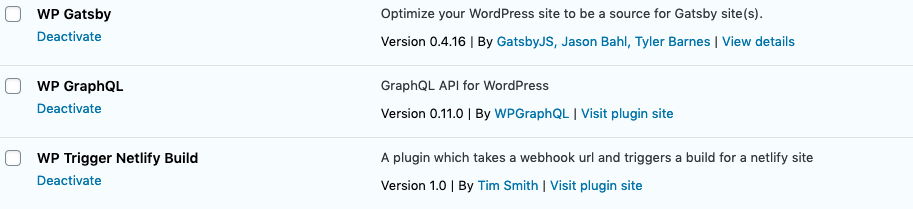

Since I’m creating this site for this tutorial, I filled in some dummy pages and posts on my WordPress site.

## Get Gatsby Up & Running (Locally)

Now let's switch gears and get Gatsby up and running! Gatsby has great docs, and if you haven’t checked them out yet, open a new tab and take a look at their [Step 0 page](https://www.gatsbyjs.org/tutorial/part-zero/) to make sure your environment is ready to go. Once you get to “[Using the Gatsby CLI](https://www.gatsbyjs.org/tutorial/part-zero/#using-the-gatsby-cli)”, come back here.

Let’s create our Gatsby site! There are many starters to choose from, but let's go with [gatsby-starter-default](https://github.com/gatsbyjs/gatsby-starter-default). I’m going to name my repo kaleigh-tech-tutorial, but you can name yours anything you want!

`gatsby new kaleigh-tech-tutorial [https://github.com/gatsbyjs/gatsby-starter-default](https://github.com/gatsbyjs/gatsby-starter-default)`

Once the site is installed, let’s jump into the directory and run the site to make sure it’s working.

`cd kaleigh-tech-tutorial`

`gatsby develop`

If all is well, you should see the following:

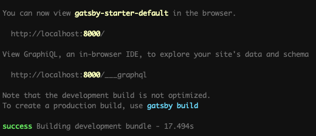

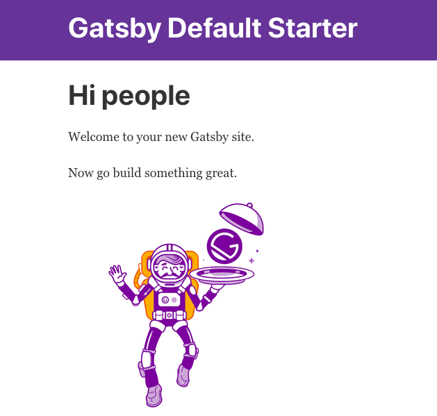

Woo, your local site is up and running!

Let’s make it LIVE! I personally like to use GitHub Desktop to manage my repos locally since I can see everything easily.

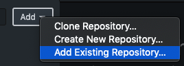

You can also go to [GitHub and create a new repo](https://github.com/new), and follow the steps there. My repo is now [here](https://github.com/klgh/kaleigh-tech-tutorial).

Let's check out how awesome Netlify is!

## Set Up Netlify

[Head over to Netlify](https://app.netlify.com/start) and if you don’t have an account, sign up (it’s free). If you do, sign in, and make sure GitHub is connected.

Since we’re using a GitHub repo, click on GitHub:

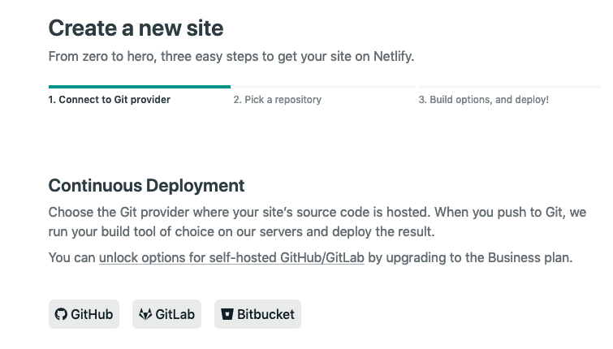

Find the repo you just created and click on it:

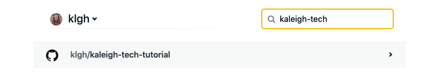

We’ll just go with the defaults:

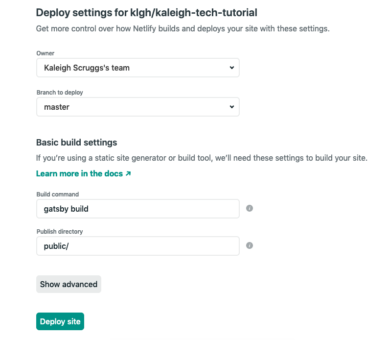

Now my site is building!

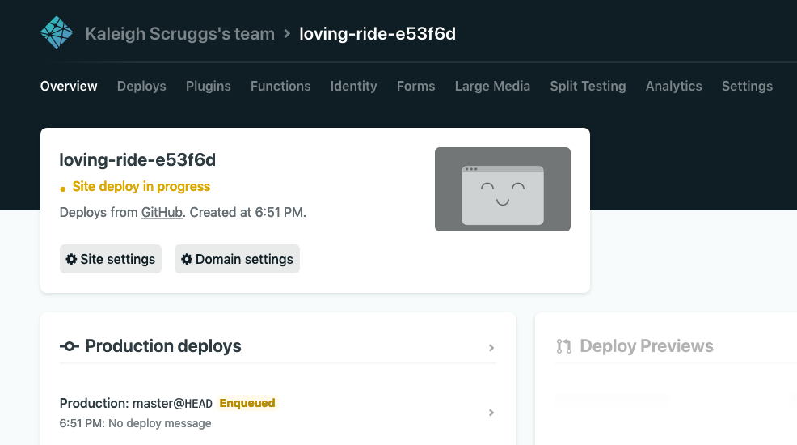

As you’ll see, you’ll have a different named repo. Don’t worry, you can change it (if you want) later. Sometimes the names are funny!

It shouldn’t take too long to build your site. Now you can check it out. My website is here:

Let’s change some things within Netlify. First, I’ll change my app’s name to the same one as my GitHub repo to keep things consistent.

## Netlify Build

At the top of the page on Netlify, click on Settings and then “Change Site Name.”

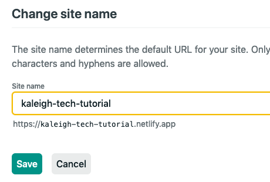

Now my site is running at [https://kaleigh-tech-tutorial.netlify.app/](https://kaleigh-tech-tutorial.netlify.app/)

A neat thing about Netlify is that you can add a badge to your README to display your site’s status. We can also add this to our WordPress site. Remember the Netlify plugin we installed?

On the same Settings page, scroll down to the Status Badge section:

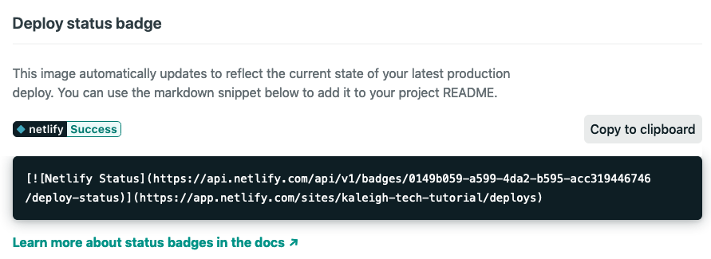

Click on “copy to clipboard” and head to your text editor so we can edit your README.

I pasted it on Line 11 of my README:

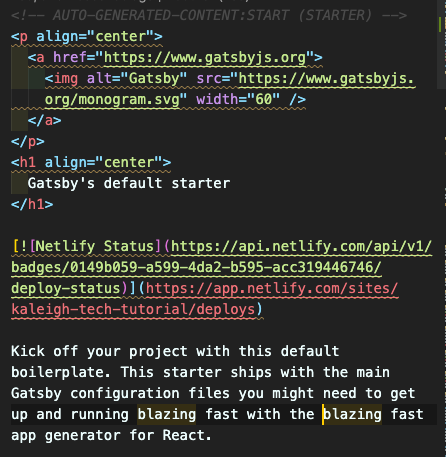

Now let’s head over to our WordPress Dashboard. On the left-hand side click on “Netlify Build”, it will be towards the bottom of the menu items.

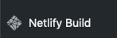

You’ll see we need to add 3 links.

The first one is our build hook. Back in Netlify, go to settings, then on the left click “Build & Deploy” and find Build Hooks. Create a new hook and use the link from that one to paste into WordPress.

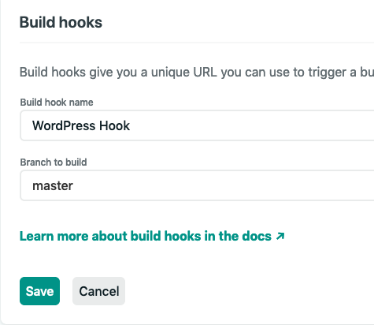

The second is the status image. That link should be the green text from my screenshot above: [https://api.netlify.com/api/v1/badges/0149b059-a599-4da2-b595-acc319446746/deploy-status](https://api.netlify.com/api/v1/badges/0149b059-a599-4da2-b595-acc319446746/deploy-status)

The third is the status link. That link will be the red text from the screenshot above: [https://app.netlify.com/sites/kaleigh-tech-tutorial/deploys](https://app.netlify.com/sites/kaleigh-tech-tutorial/deploys)

Now you should have all 3 links

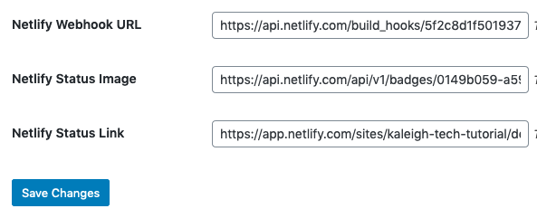

Click on Save Changes. This will allow you to create a new deploy when you update content on WordPress.

Ready for Part 2? - [Check it out!](/blog/create-a-blog-with-wordpress-and-gatsby-part-2)
