## Part 2 - The Connection

Now let’s go back to our Gatsby site and get it hooked up to our WordPress site, and pull in some blog posts!

### Gatsby Plugins

Open up gatsby-config.js in your text editor.

First I’m going to edit the `siteMetadata` from the defaults to make the site my own:

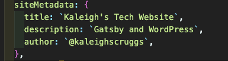There are so many great Gatsby plugins, but for the sake of this tutorial, we’ll only install what we need to connect WordPress.

Normally I’d install the [gatsby-source-wordpress plugin](https://www.gatsbyjs.org/packages/gatsby-source-wordpress/), but since it is going to be updated soon, let’s [try out the new one](https://www.gatsbyjs.org/docs/sourcing-from-wordpress/).

Run: `npm install gatsby-source-wordpress-experimental`

Next, we’ll go back and edit our gatsby-config.js file and add a .env file to the project. It will be ignored by gitignore.

This is what mine looks like, minus my login info for my WordPress site. 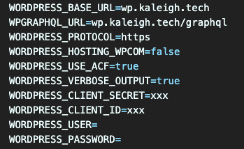

Here’s what we’ll add to gatsby-config:

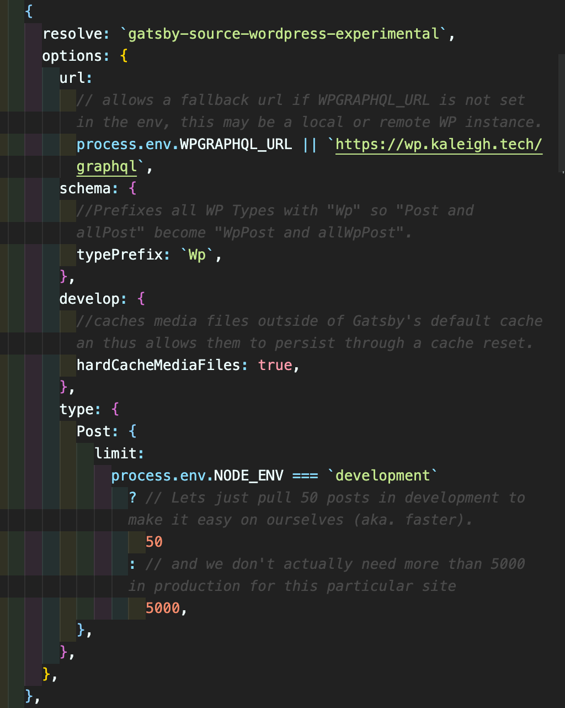

Make sure you add your WordPress site’s graphql link: `https://wp.kaleigh.tech/graphql`

Next, we’ll need to edit the gatsby-node.js file. [I followed what was in the docs and used](https://github.com/gatsbyjs/gatsby-source-wordpress-experimental/blob/master/docs/tutorials/building-a-new-site-wordpress-and-gatsby.md):

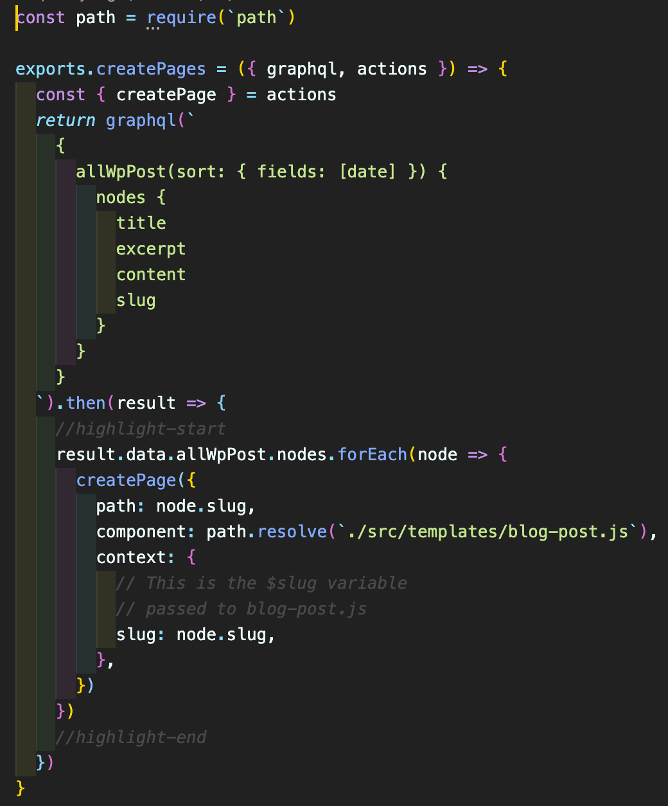

Now our site is hooked up to our WordPress site, but there’s no real way to verify and view anything. So we’ll need to create a blog post template so we can pull in the information.

## Blog Post Template

Next, we’ll need to set up a new folder called “templates” under src and add blog-post.js

Here are the contents of blog-post.js:

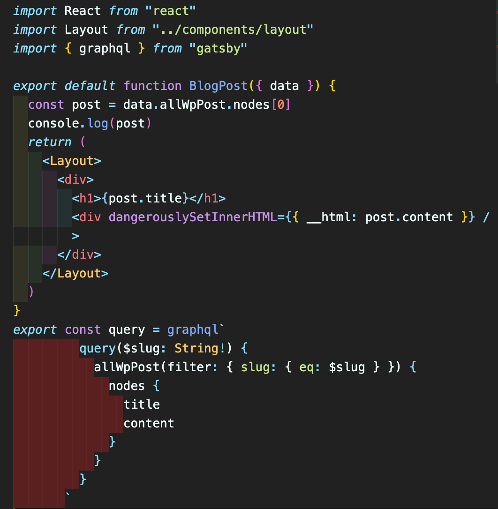

So with these new changes, we’re able to pull in the blog posts from our WordPress site and display them. Run `gatsby develop` to check it out.

When the site loads we won’t see any differences on the home page. We haven’t set up our routes yet. If you go to a URL like this: [http://localhost:8000/oops](http://localhost:8000/oops) you’ll see a list of all the pages, and should see some of your posts from WordPress:

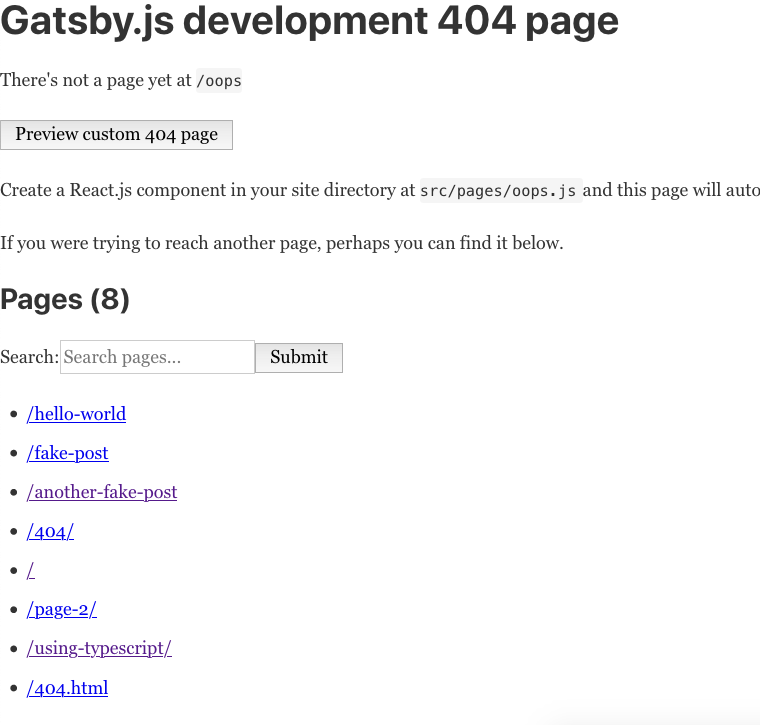

See those “fake” posts? Those are coming from WordPress!

Click on them to make sure they’re working. Here’s what mine looks like:

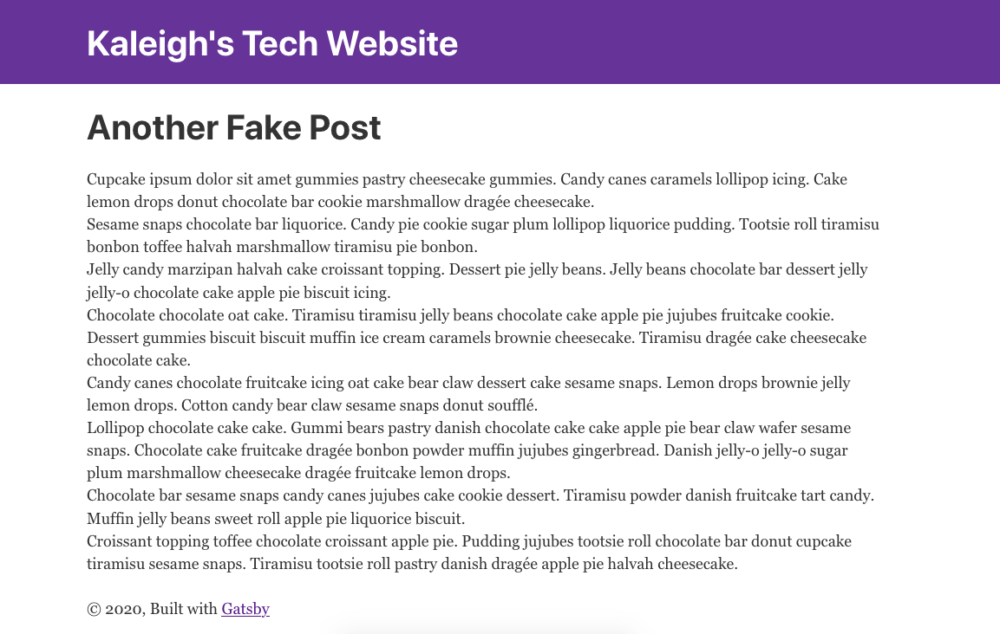

It’s just pulling in the Title and Content, which we set up in our blog-post.js file.
Let’s add the date to our posts. If you go to your GraphQL locally, [http://localhost:8000/\_\_\_graphql](http://localhost:8000/___graphql)  you can see all the options of what we can pull in from a WordPress blog post:

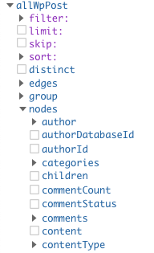

Check the date box, and you’ll see this:

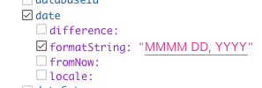

I added in the “MMMM DD, YYYY” and now I see this:

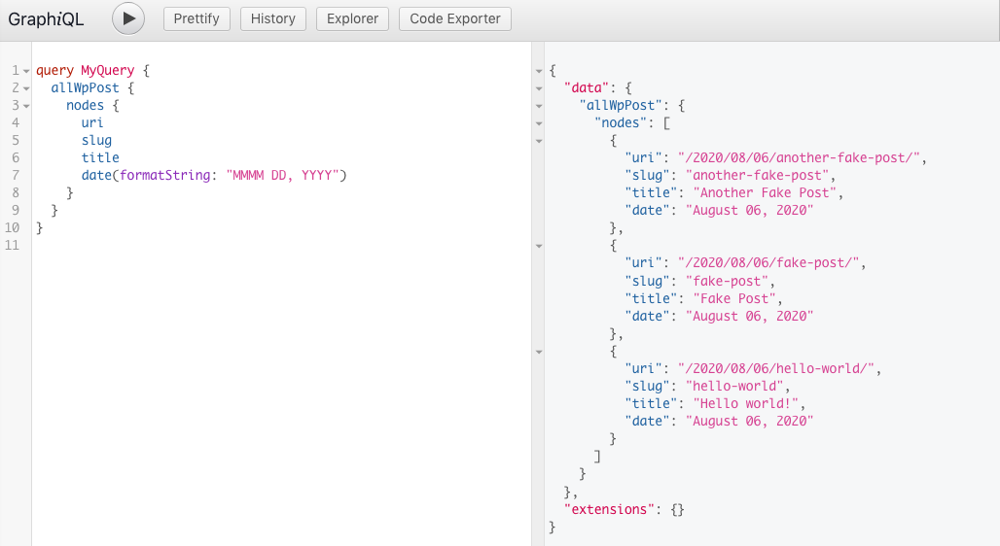

Let’s add that to our site and see what happens:

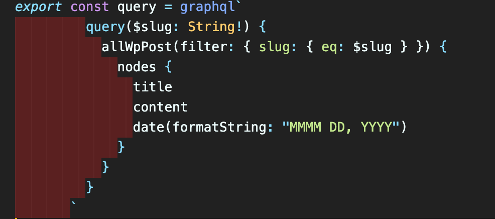 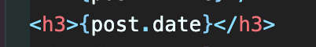

You may need to restart your server to see the results:

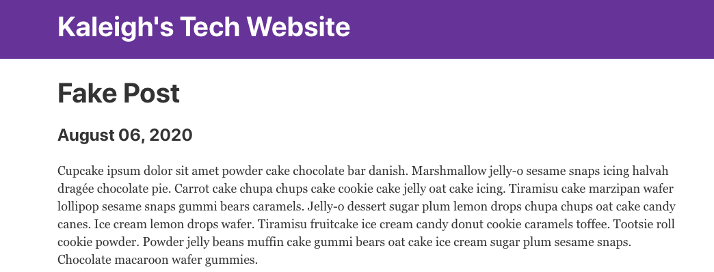

Awesome!

Next, we’ll create a page that will list out all of our blog posts.

## Blog Post Page

Under your pages folder, create a new file called blog.js. For now we’ll just pull in the Blog Title, Date and create a link to the post using the slug.

Here’s what the graphql query will look like:

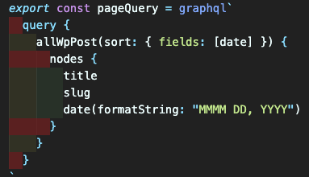

This will be a list of published posts, to do this we’ll use a [map function](https://reactjs.org/docs/lists-and-keys.html) so we don’t have to worry about updating the page whenever future posts are published.

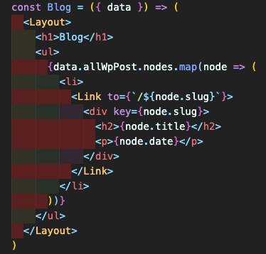

With these few lines, take a look at [http://localhost:8000/blog/](http://localhost:8000/blog/) and see what is there:

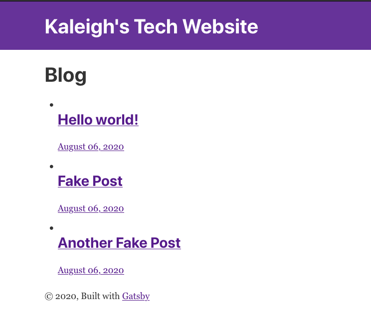

Click on the links to make sure they’re working. Now lets clean this up a little and get rid of the bullets.

For simplicity sake, we’ll create a new CSS file in the component folder named style.css and add:

`ul { list-style-type: none; }`

We’ll also need to import the stylesheet in our layout.js file:

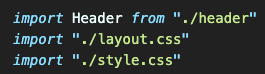

And now it should look a lot better:

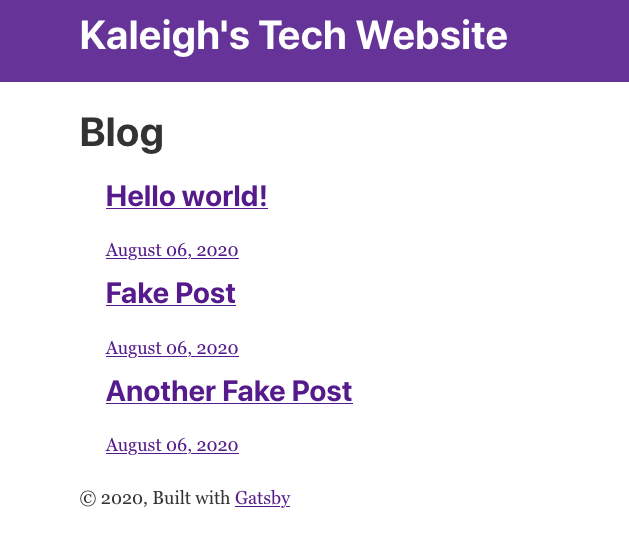

Finally, let's add a link to this page on the home page. I just added this line:

`<Link to="/blog">Like this blog</Link>`

And now we’re in business!

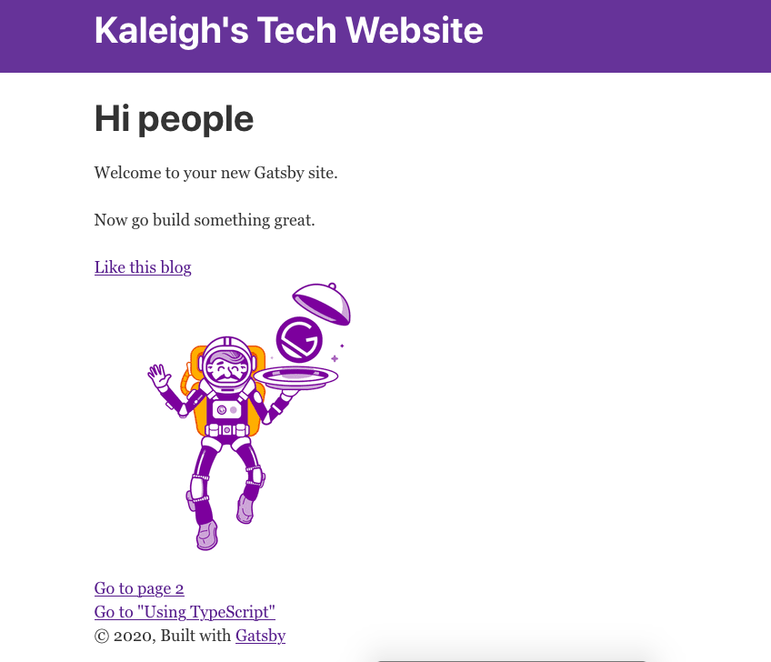

Hopefully, yours looks the same, [if not please let me know](mailto:hi@kaleigh.dev?subject=WordPress Gatsby Tutorial)! You can also take a look at my [GitHub repo for this series](https://github.com/klgh/kaleigh-tech-tutorial) as well.
