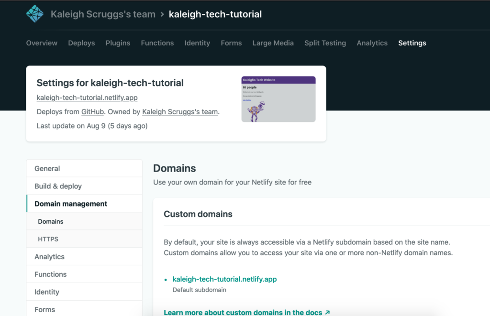
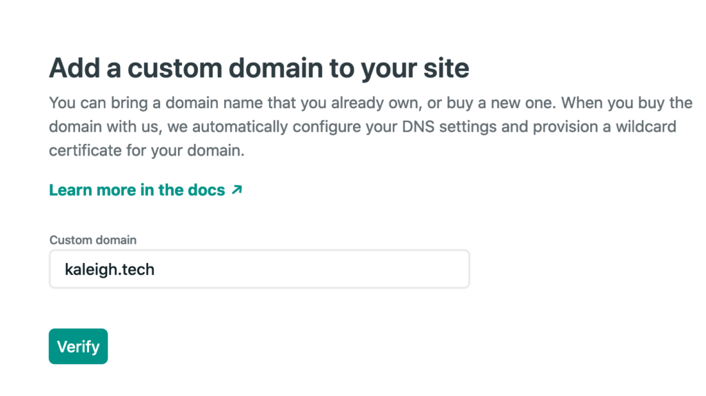
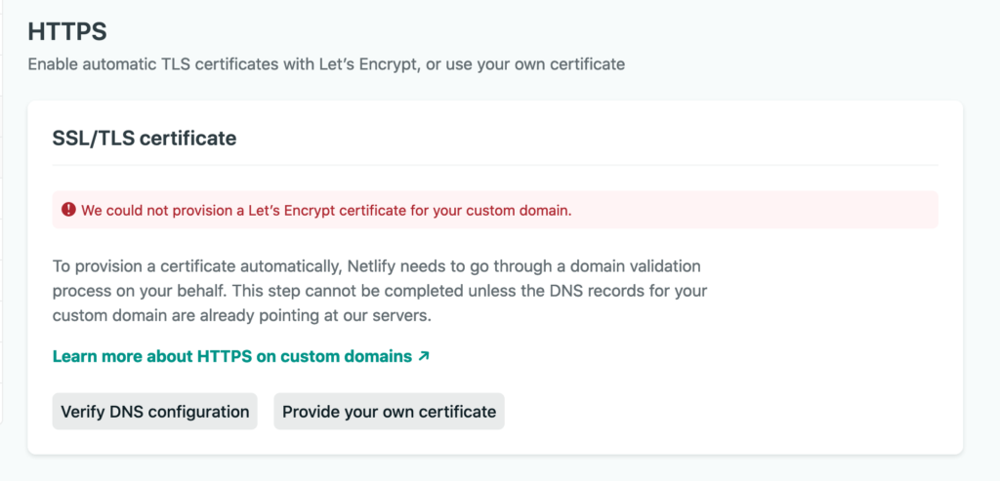
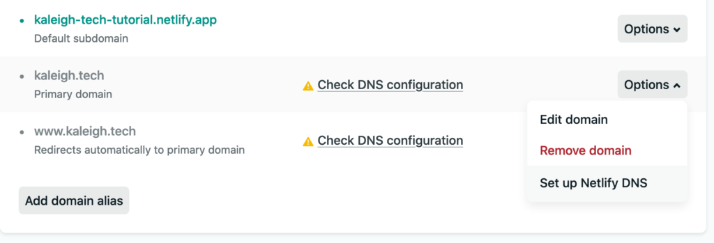
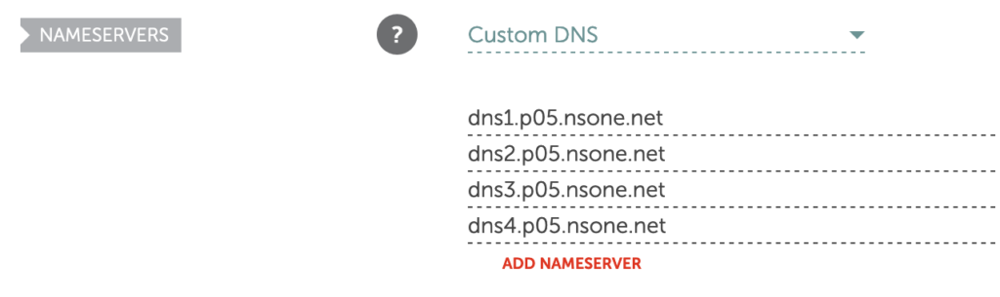
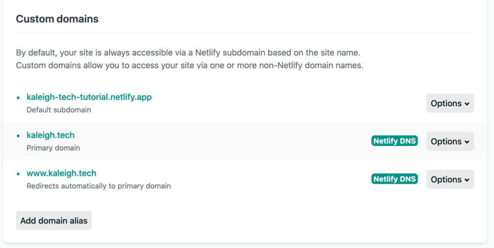
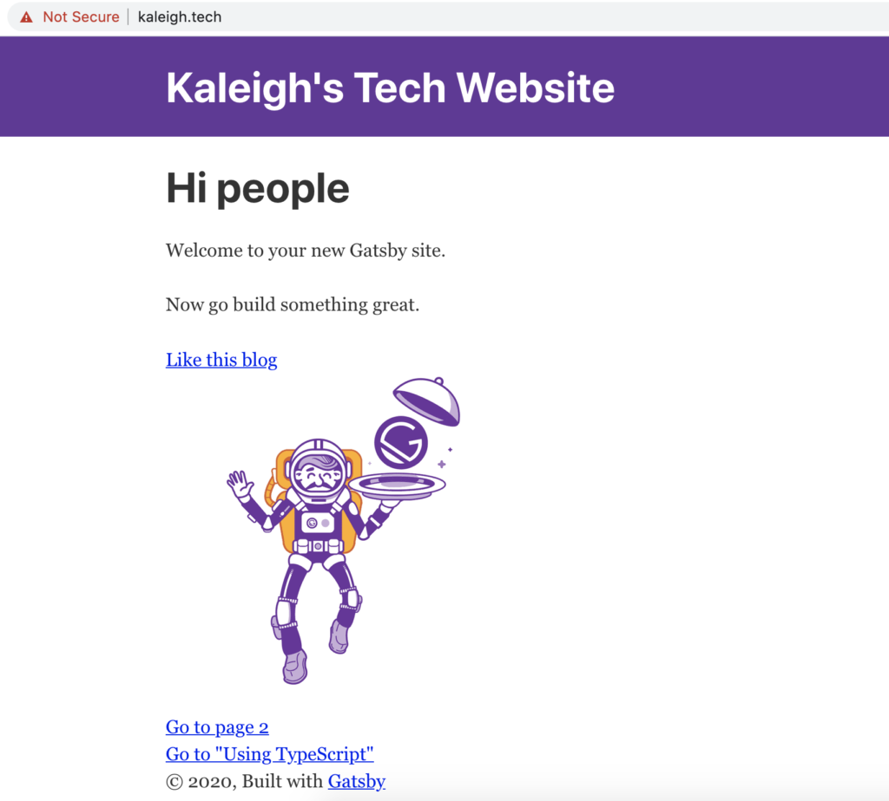
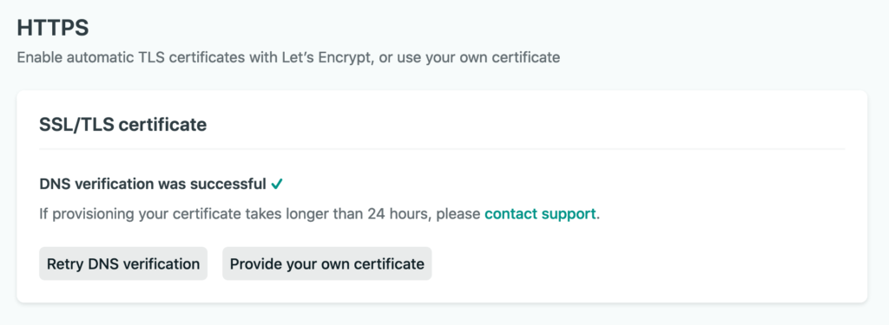

Alright! So you've made it through [part 1](https://kaleigh.dev/blog/wordpress-gatsby-part-1) and [part 2](https://kaleigh.dev/blog/wordpress-gatsby-part-2), now for the final chapter in the series!

# Part 3 - The Real Deal

Now that we've pulled in posts from our WordPress blog into our Gatsby app successfully, let's configure Netlify, so we look more official with our domain name. Instead of using `kaleigh-tech-tutorial.netlify.app` we'll be using `kaleigh.tech` as the domain name.

## Domain Management

Head over to Netlify and open up your site's settings and scroll down to "Domain Management."

Click on the button "Add Custom Domain", type in your domain name, and verify that you are indeed the owner.

Once it took me back to my settings, I saw this error...don't worry, we'll fix it:

Scroll back up to custom domains and click on your domain name's dropdown:

We need to set up the Netlify DNS, so click that option.

Click on Continue and then you'll be given a list of nameservers.

You'll have to go to wherever your domain was purchased to modify the domain names. Netlify has some [good docs](https://docs.netlify.com/domains-https/custom-domains/) in case you get stuck. [This article](https://david.darn.es/tutorial/2020/07/28/switching-to-netlify-dns/) is also helpful.

I have NameCheap, and it was easy to set mine:

Once you do this, you must wait until everything switches over. Sometimes it's quick, sometimes it's not. Mine ended up taking around 20 minutes. So go make some tea or coffee and come back!

If you see that...then you should see this:

Woo! It's all working! Worried about the HTTPS? Scroll down back on your Netlify Domain settings and click the button to verify the configs:

Now you should be good to go (in a few minutes). This part of the process takes some time, so the earlier you do this, the better if you're trying to deliver a website or show it off.

Hopefully, you've enjoyed my series creating a blog with WordPress and Gatsby! Let me know if you did by letting me know, sharing it with a friend, and sharing on [Twitter](https://twitter.com/kaleighscruggs/status/1292808208206225409), [Dev.to](https://dev.to/kaleigh/series/8220), [Medium](https://medium.com/@kaleighscruggs), or wherever else you like to share!
