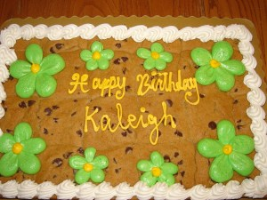

Today is my birthday! I’m 29. TWENTY-NINE! How does this happen? It feels like I just turned 25, and everyone thinks I’m still 12. What a fun time!

29 begins the dreaded countdown to 30. I have 365 days until 30. That is absolutely insane. BUT ANYWAYS, I’m 29 and feeling fine. (I’ve been waiting to say that!).

I thought it’d be fun (and very Pinteresty of me) to create a 30 before 30 list of things to accomplish during the next year. I’ve been wanting to start this blog, so I figured it will help keep me accountable and get into blogging. I’ll also try to film as much as I can as well since I’ve been having fun with filming and editing videos lately.

##30 Things To Do Before I’m 30

**1. Go back to Europe (and climb Arthur’s Seat in Edinburgh)**

**2. Get another tattoo!**

**3. Go camping somewhere with some awesome views**

**4. Fully understand my 401k, stocks, and all that stuff they don’t teach you in school**

**5. Get a 6-Pack (of abs!!)**

**6. Visit Red Hare Brewing**

**7. Spend a weekend in Asheville, NC**

**8. Get our home office furnished & cozy**

**9. Make our backyard look super awesome**

**10. Pay off all our credit cards (thanks to moving, breaking a lease, and life (I like to keep that 0 balance))**

**11. Visit Golda Kombucha once they open in Atlanta**

**12. Have tea at Just Add Honey Tea Company**

**13. Get cookies at Luna’s Cookie Studio**

**14. Go on or at least plan for another cruise**

**15. Compete in a Brazilian Jiu-Jitsu tournament**

**16. Get better at filming GoPro videos and editing**

**17. Take this blog seriously**

**18. Visit some more states I’ve never been to**

**19. Post more videos on YouTube (either GoPro videos or vlog-style)**

**20. Move to a different project at work (I’ve been on the same one for 3 years)**

**21. Be more consistent with my stand-up comedy**

**22. Visit more tea rooms in Atlanta**

**23. Be better at drinking water (I feel like I barely have any water!)**

**24. Try more breweries in Atlanta**

**25. Try different types of food (we live in an area where we could try tons of foods from different countries)**

**26. Visit Monday Night Brewing**

**27. Take an improv class**

**28. Update my wardrobe (I feel like I only like a few things, and don’t wear anything else)**

**29. Learn how to take and edit phone photos like a boss**

**30. Figure out what I’m good at**

After all of this is done and, to celebrate my 30th birthday, I want to have a sleepover with a sloth in Oregon. I’ve been looking forward to that since I discovered it was possible (while Insta-stalking people who have done this and I might have cried a little).

\*\*Once I created this list I realized it’s not all “jumping out of airplanes” and “bungee jump” type stuff, but it’s realistic stuff I want to do within the next year, and I believe I can do! So follow along if you’re interested. I’ll be using the hashtag #klgh30before30, and posting videos on YouTube!
