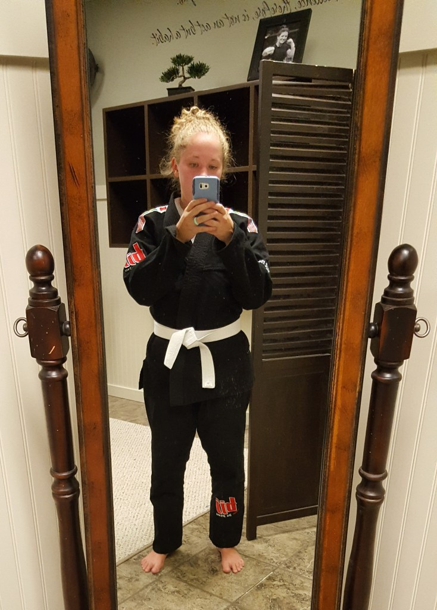
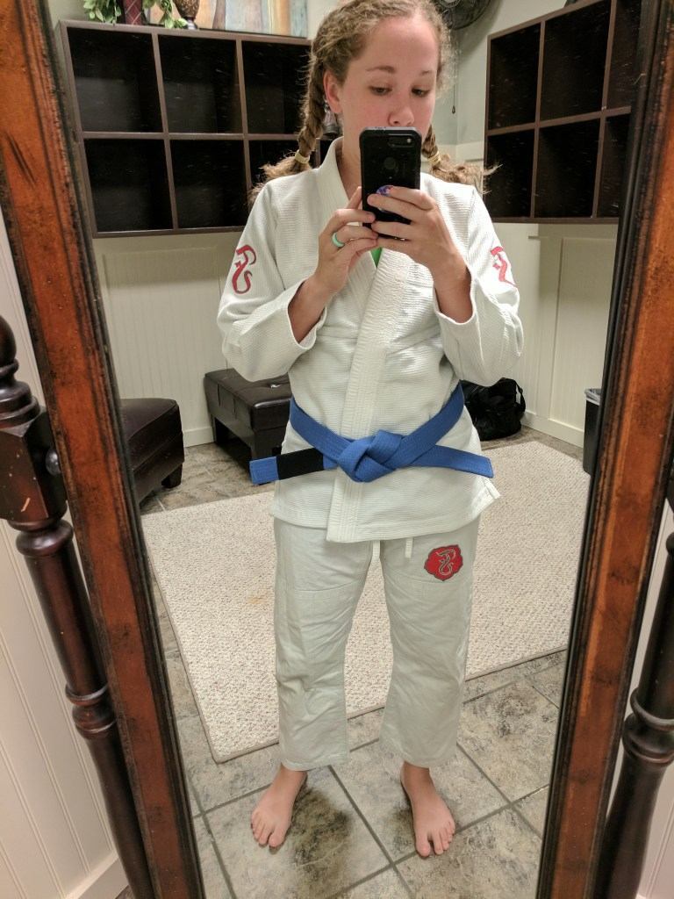
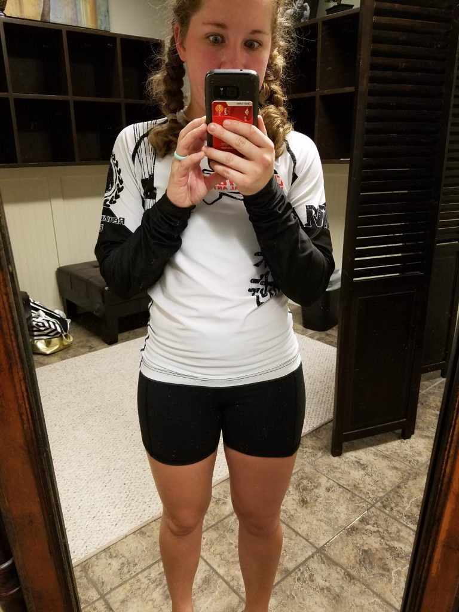
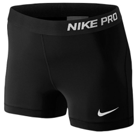
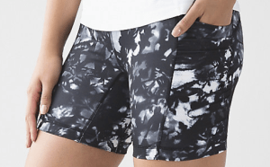
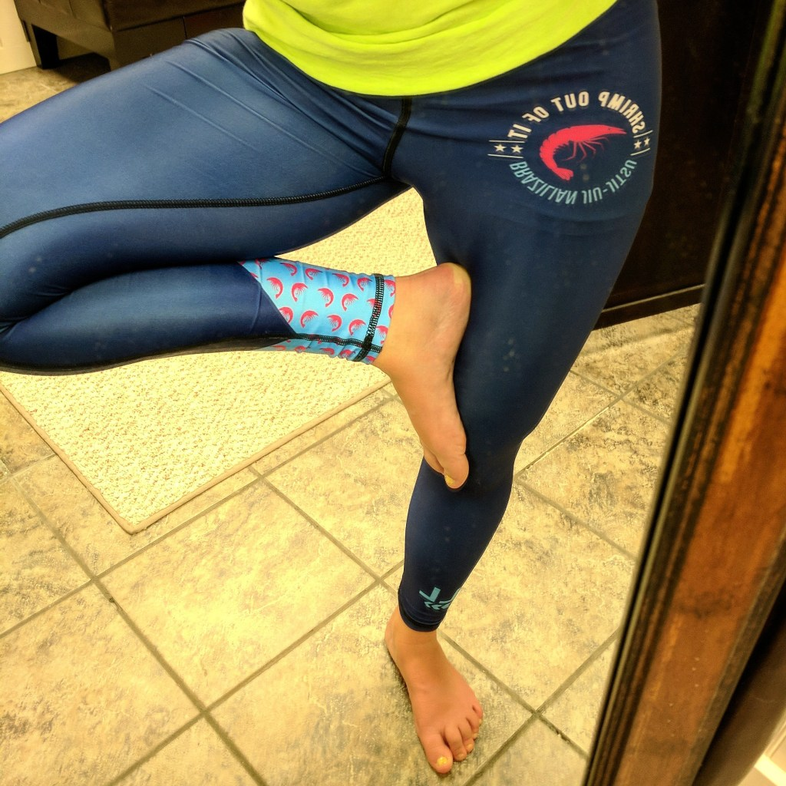
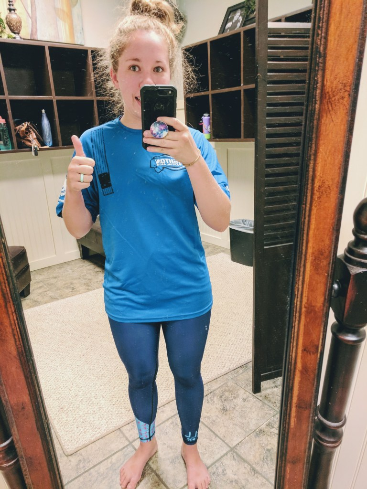
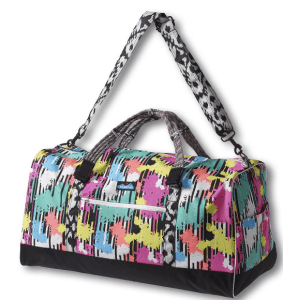
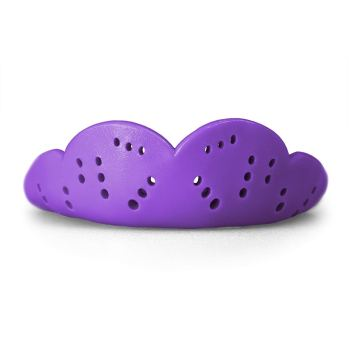

When I started jiu-jitsu, I had NO IDEA what to wear! For my first couple of classes, my husband told me to just wear a white shirt and form-fitting shorts with no pockets.
Cool beans.
But I needed more info.

There aren’t a ton of resources for women who do jiu-jitsu online. I found a few, like BJJ Grrl, and A Skirt on the Mat which definitely helped. But I wanted to share this info in one consolidated place since it’s not easy to find.

Now that I’ve trained for well over a year (how’d that happen?!?!), I feel like I can share jiu-jitsu gear information that may be helpful (or just give insight) to other women.

##Gi Jiu-Jitsu

excuse my RED face!

For Gi classes, I like to wear a pair of Nike Pro Compression shorts under my gi pants. For the top, of course, I wear a good sports bra and either a fitted tank top or dry fit shirt.

I have two gis now. One that I bought at my academy so I don’t really know the brand, and the other that a BJJ friend gave to me by Fenom. I really like the Fenom gi because it’s made for women, so it actually fits and just feels better to move around in. I highly recommend getting a women’s cut gi after wearing this one. It really is a game changer.

Don’t forget your belt!

I have talked to a few girls at my gym and we all wear different things underneath. Some just wear underwear under their gi, some wear long leggings and long sleeves. So it’s whatever you’re most comfortable with. Personally, I have witnessed my gi pants come untied MANY times and I wouldn’t want to be wearing only underwear underneath just in case!

##No-Gi Jiu-Jitsu

crazy eyes!

For no-gi, I started out wearing my Nike Pro compression shorts but had to adjust them a lot. I tried a pair of running capris but they didn’t have a drawstring and I was always pulling them up.

One day (on payday, HA) I went to Lululemon (\$\$\$\$\$\$) and found these shorts. Even though they are pretty expensive for shorts, they are well worth the price. Not only are they super comfortable, but they also have 4 pockets plus 1 hidden pocket inside a pocket, drawstring, and are long enough and high enough that I’m not scared of wardrobe malfunctions. Definitely worth it. Plus the pockets are discrete and flat so they won’t get in the way and are great to put my mouth guard in when I’m not wearing it.

I actually bought another pair of shorts from Lululemon, but I can’t remember the name of them. They are a bit shorter, but the waist is much higher and has a drawstring and pockets as well. If I find them online, I’ll update!

Recently I have liked wearing both long sleeves and long pants for no-gi. I found a pair of leggings on The Clymb a few months ago that I really like. They are waist control, so even though they don’t have a drawstring, they stay up well and I never worry about them moving.

When I attended a Girls in Gis event, I bought these awesome leggings, which have little shrimps on them (a BJJ move). They’re super cute and insanely comfortable. I met the girl who designed them and she was awesome and is based out of Savannah, GA.

Underneath both leggings, I wear breathable and comfortable underwear. I really love ExOfficio’s underwear because you don’t even realize you’re wearing it and they do great with lots of movement and high-intensity sports.

I love the shrimps!

Shirt wise, I wear my gym’s ranked belt shirt. When I was a white belt I had 2, a dry fit t-shirt and a long sleeve rashguard. I really loved the rashguard because it had an elastic band at the bottom so it didn’t ride up as easily. Now that I’m a blue belt I needed blue belt shirts, but they didn’t have the long sleeves in my size, so I just have a basic dry fit t-shirt for now. Now I wear my long sleeve white belt shirt underneath it so I have the best of both worlds.

I recently bought this awesome rashguard from Fuji. I got it on sale (you can use code WWR15 on Fuji gear compliments of Women Who Roll), and it’s another item made for women so it fits really well. I’ll wear it under my blue belt shirt, and even under my gi, and I don’t overheat or anything!

Last but definitely not least, do find a good sports bra. I really love the C9 sports bras from Target, so that’s my main go-to right now. Plus they always have new colors and patterns, but I heard that Victoria’s Secret’s sports bras are great as well.

##Always

After class, I ALWAYS change my clothes. The women’s locker room doesn’t have a shower, so I change my clothes and shower the second I get home. Gotta practice good hygiene! I even keep some baby wipes in my gym bag just in case and use hand sanitizer before I leave. It’s SO important to keep good hygiene when doing jiu-jitsu! You don’t want to get or spread anything from anyone.

Gym Bag. I use my Kavu Duffy bag. Just like with any Kavu bag, there are a ton of pockets and storage. Plus it stands out among the rest of the bags in the locker room.

Mouth guard & case. So far I’ve used 2 different mouth guards. The first one I used was a Shock Doctor Gel Max. It’s bulky but makes you feel protected. I used it for about 8 months and then Shaun bought the SISU Mouth Guard Max 2.4mmand after he used it once, I bought one for myself. You can talk easily in it (it’s like when you wore a retainer as an awkward kid) and can even drink water without taking it out. Since it’s so low profile, I leave it in the entire class, as opposed to the Shock Doctor, when I would wait until we rolled to wear it, and then would have to take it out to talk.

the SISU

http://amzn.to/2zrtGfOThis is the case we both use. I like it because I can clip it to my water bottle and not have to lose it or get it mixed up with someone else’s!

Water bottle. You will need it. Keep it full & icy. I love my Hydro Flask!

Hair ties. I keep a million extra hair ties in my bag, and an extra on my mouth guard case. Usually, I use 2 for when my hair is in a bun, or of course when I do braids.

Aaaaand there you have it. My lovely list of things you’ll need for jiu-jitsu! I hope this helps someone, or just gives insight on what you need for jiu-jitsu. I just know that when I was trying to figure out what I needed (specific to women), there weren’t a lot of resources online, so I’m definitely hoping someone will benefit from this.

Jiu Jitsu Gear for Women

If you have questions or comments, please let me know!

Follow me on: Instagram | Pinterest (I even have a jiu-jitsu board!)
