This past Saturday I was able to cross something off of my [30 Before 30](https://kaleighscruggs.com/blog/30-before-30/) list! My mom and I went to [Just Add Honey Tea Company](https://justaddhoney.net/) in the Sweet Auburn Curb Market. I had never heard of [Curb Market](https://municipalmarketatl.com/) before, but it was in downtown Atlanta, by Georgia State.

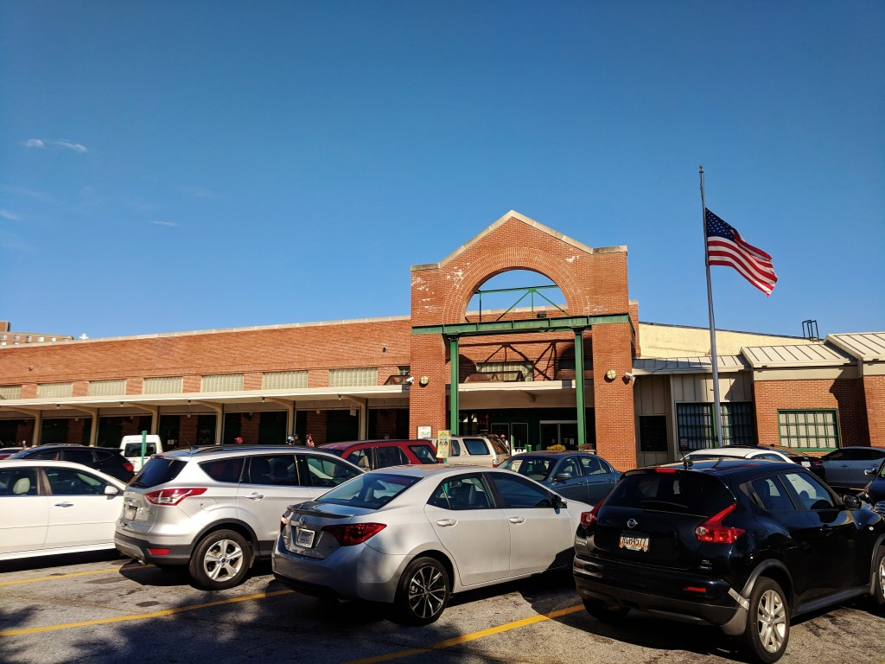

I bought the Groupon for the tasting a few months ago, and with it, we were able to try 3 teas, have a dessert, and take home an ounce of tea.

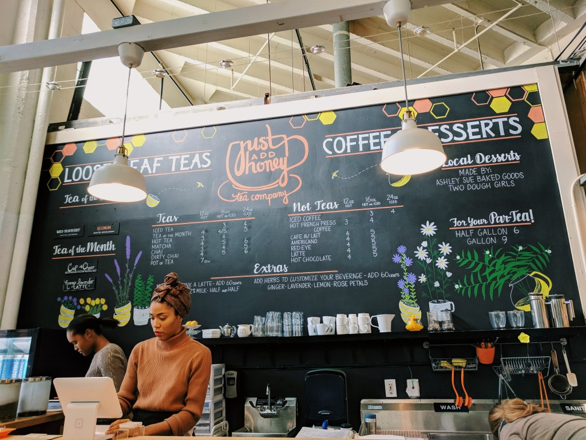

My mom and I checked in for our reservation and chose some seats where we could get a good view of what’s going on inside the market. They brought out the 1st tea which was a black tea called Keemum. We both had never heard of it, but it was really good. Since it was a black tea they also warmed up some almond milk for us.

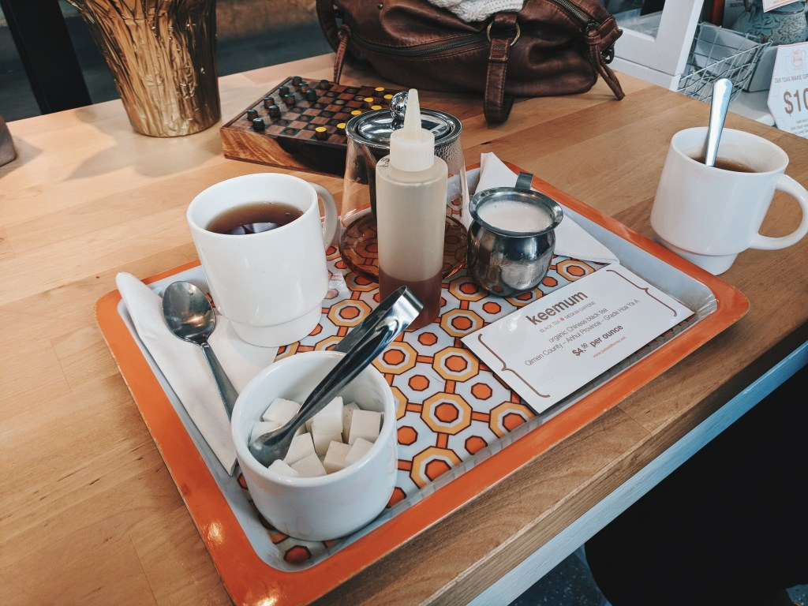

Up next was a lighter tea, called Mango Rose. It was a mix of green, white and oolong tea. It also had mango, rosebud, and cornflower petals. It was very light but also had a lot of flavors. I tried it without adding anything to it, and then added some lemon and a little honey. They also brought out 2 macaroons for us, one was pistachio and the other was apricot. We split them both so we could try them. I really loved the apricot macaroon!

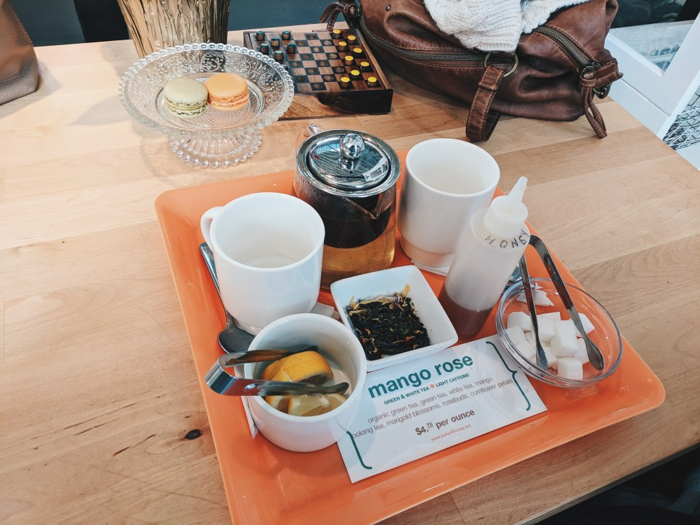

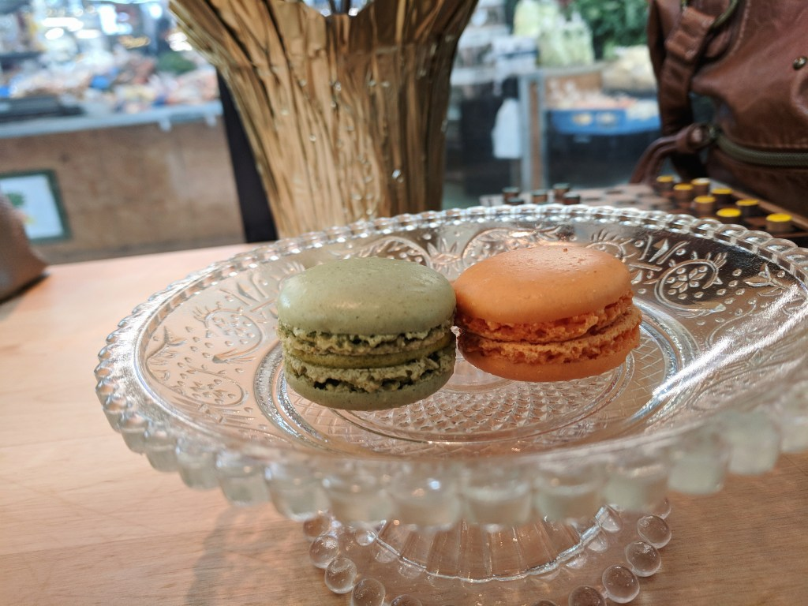

Up next was our final tea, and it was a chocolate mint rooibos (pronounced like roy-bus) tea. It was both mine and my mom’s favorite. We didn’t need to add anything to it to sweeten it. It was perfectly chocolatey.

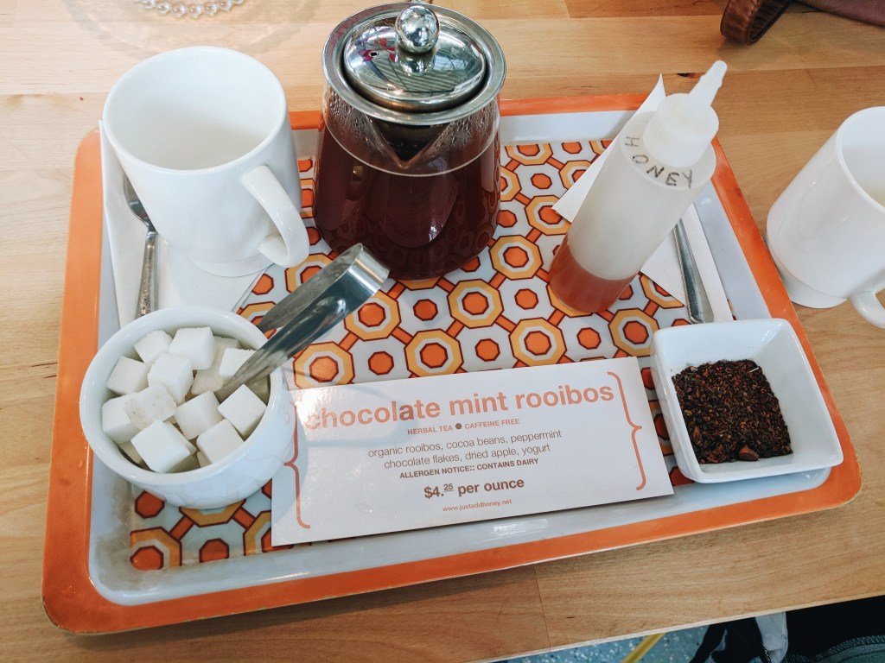

When they asked us which tea we wanted to bring home, it was a no-brainer that we wanted the chocolate mint!

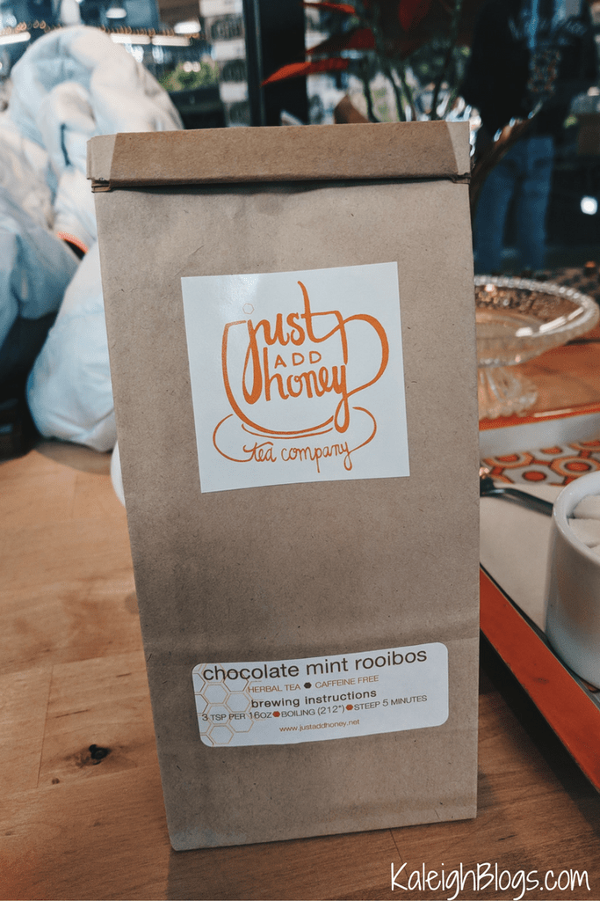

Once we finished up, we looked around the shop and I found this t-shirt I HAD TO HAVE. It’s so great:

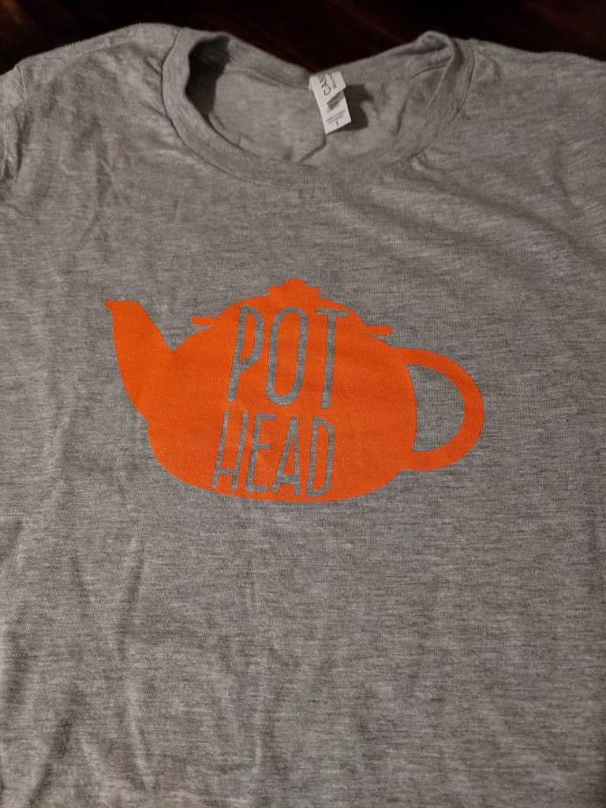

After we left, we walked around the market. Most shops were closed, but there was still a lot of the meat and produce stands open.

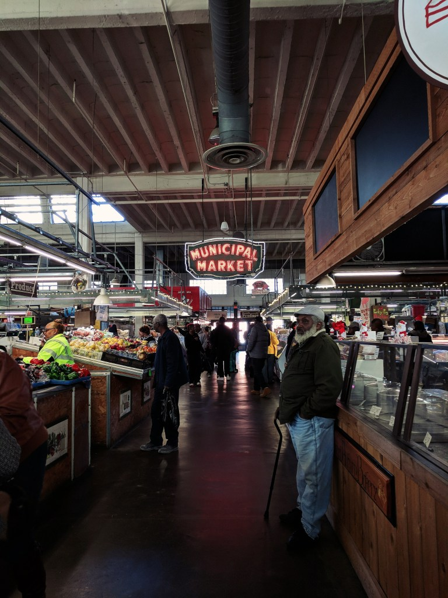

We came across [Arepa Mia](http://www.arepamiaatlanta.com/), which is a Venezuelan restaurant. The menu looked so good, so we got in line and ordered Pollo La Catira empanadas and tostones. Everything is gluten-free, but the empanadas did have cheese on it.

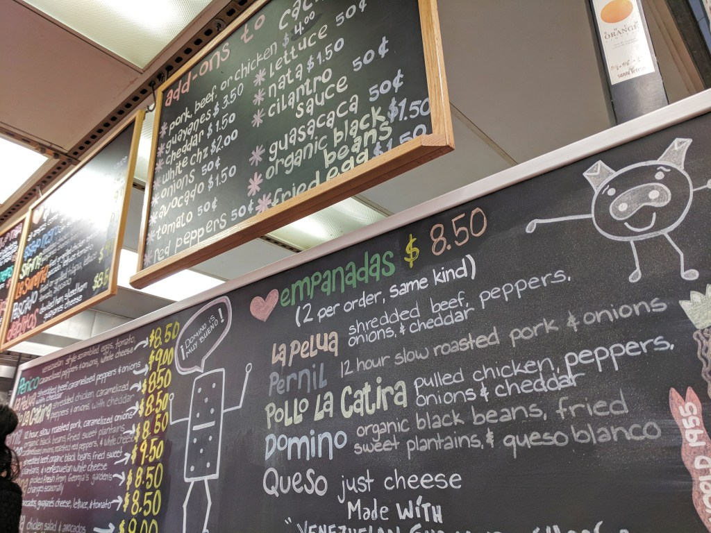

While we waited, we met some people who are Venezuelan visiting Atlanta from Lousiville, Kentucky. They told us about the different items on the menu, and we gave them suggestions of cool things to check out in Atlanta while they’re here. And then finally…our food was ready!

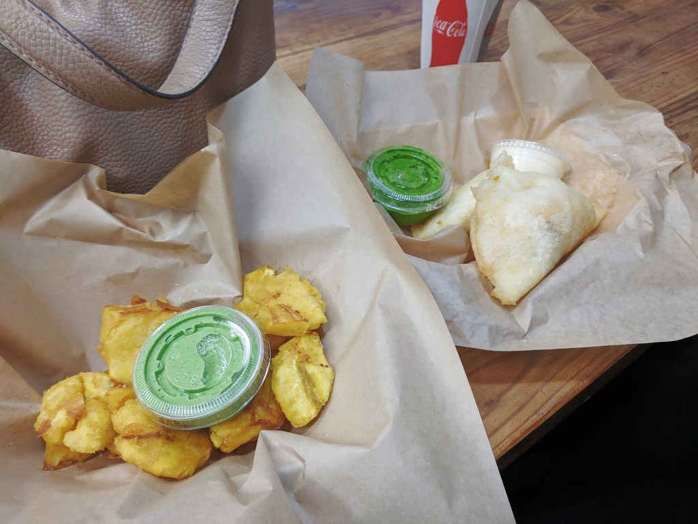
left is the tostones right is the empanadas

The food was great! The green cilantro sauce was amazing, and the cheese for the empanadas was just as good. Eating this made me realize, not only did I cross off #12 of my [30 Before 30](https://kaleighscruggs.com/blog/30-before-30/) list, but also this is helping cross off #25 which is to try different types of food! Of course, I will still keep trying new foods, but this is definitely a 2 in 1 day!

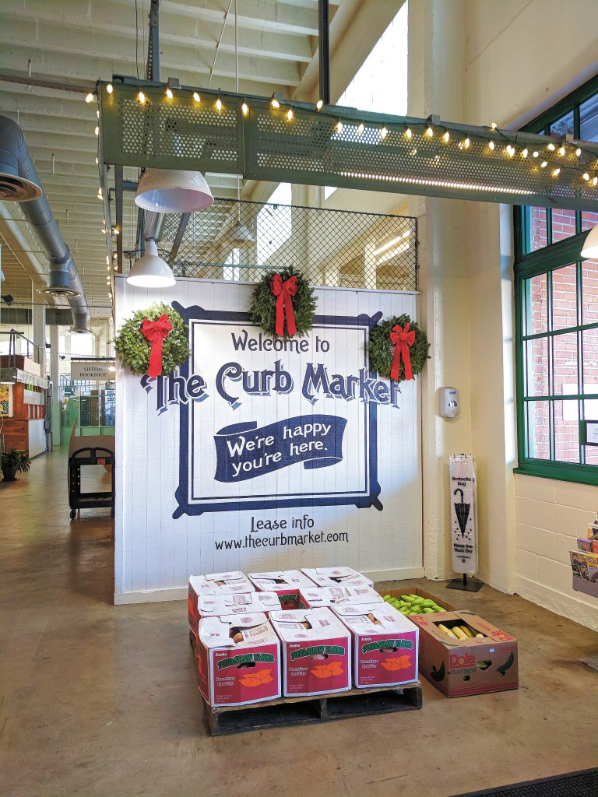

As always, thanks for reading! Be sure to follow me daily on [Instagram](https://www.instagram.com/klgh.js/).

Happy New Year!!
