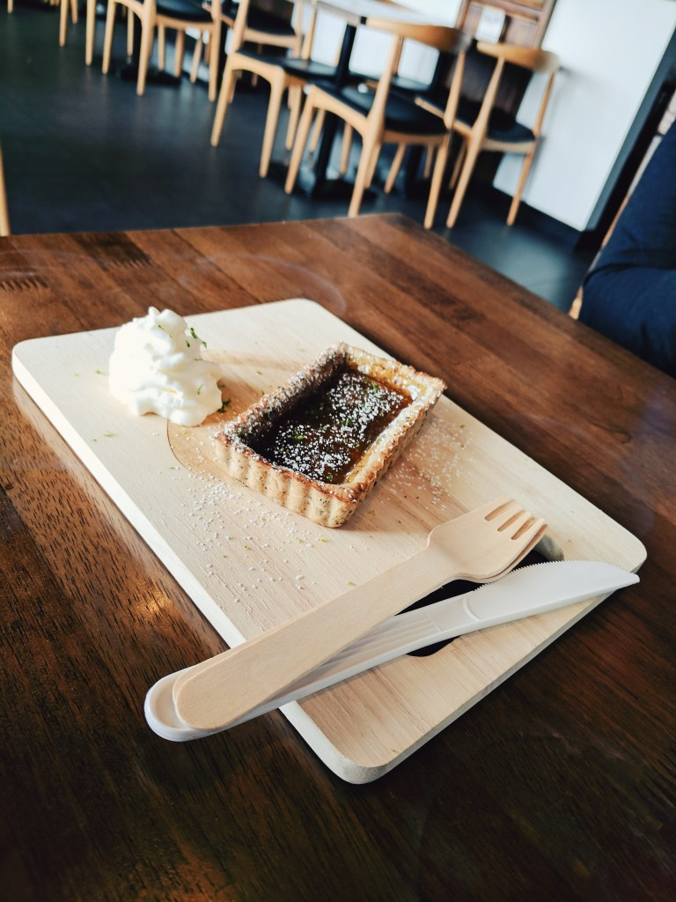
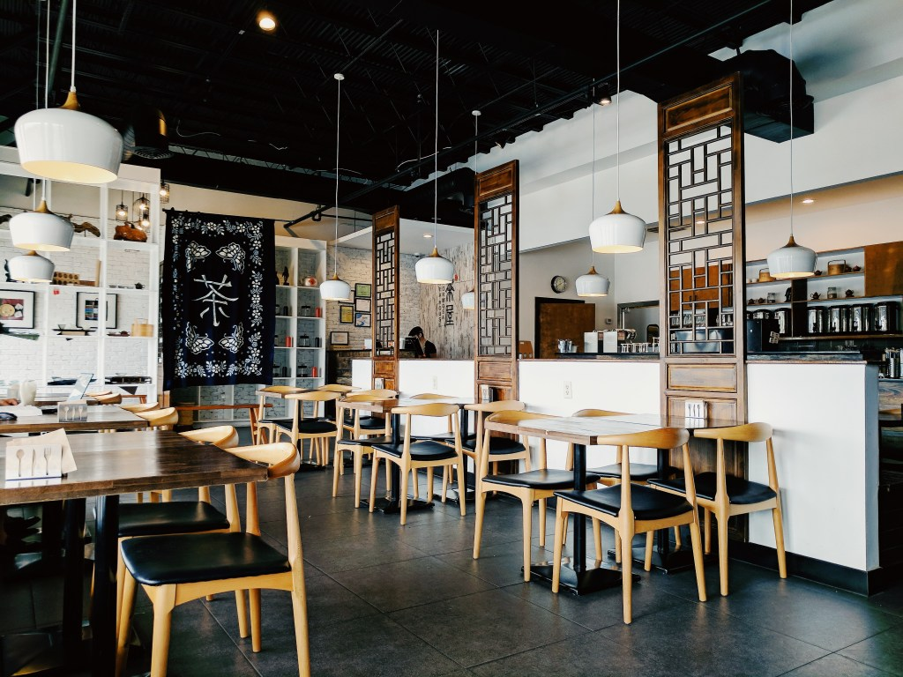
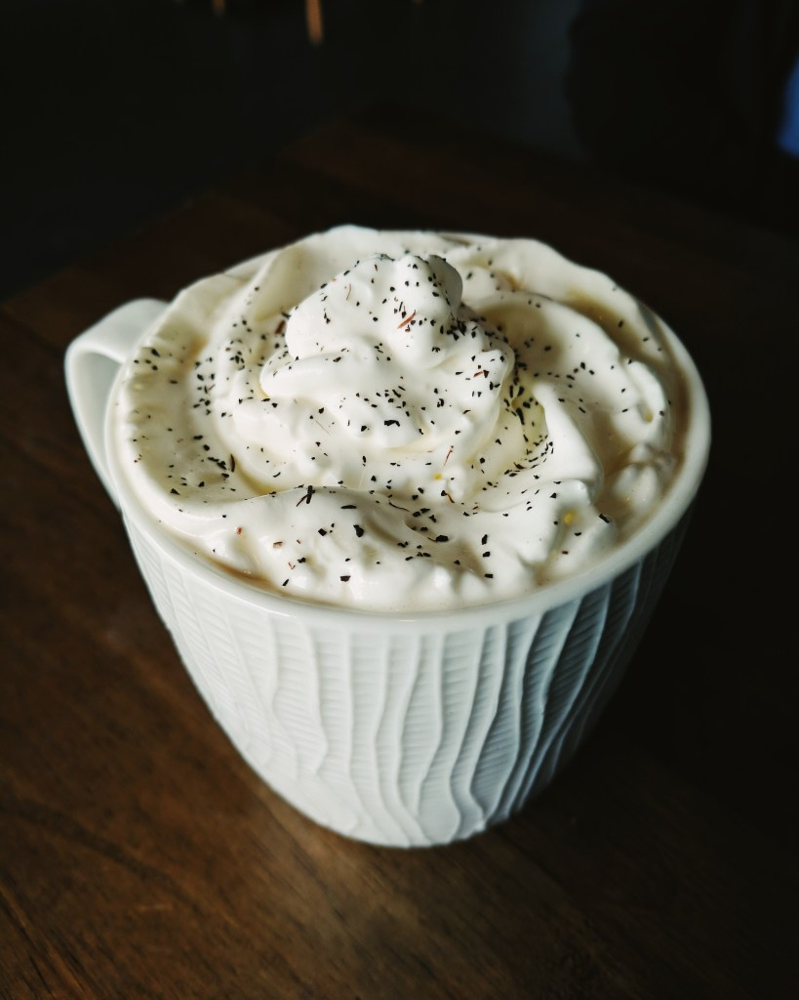
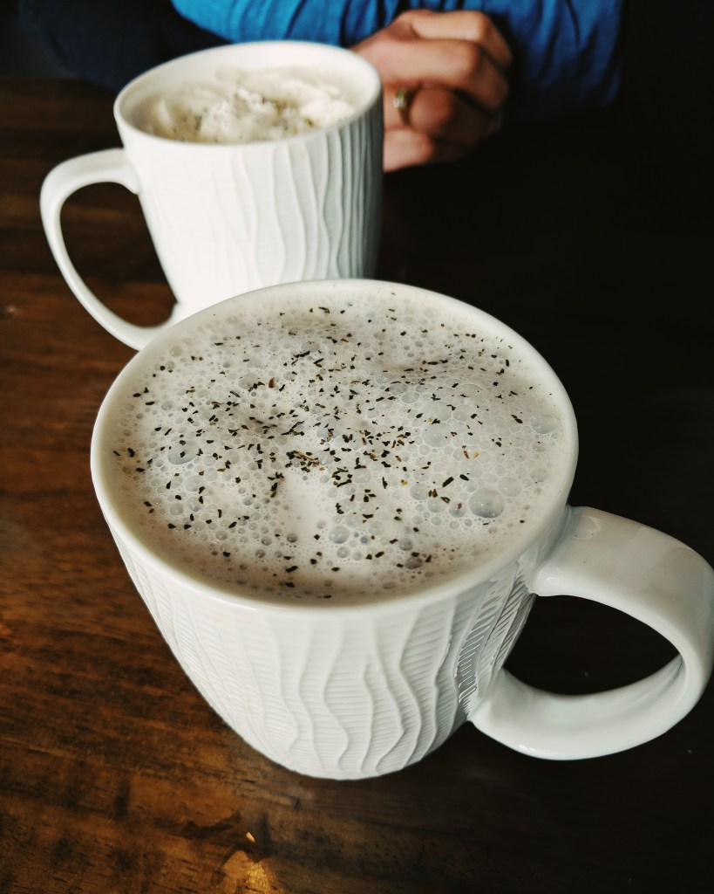
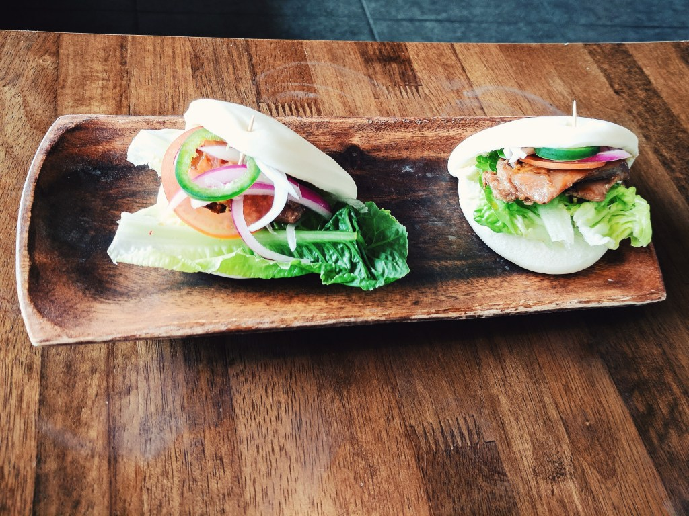

Even though this is extremely late, I wanted to write about a tea house my mom and I visited 5 months ago…bear with me.

Last August, I took my mom out for some tea, as we do. We wanted to try a new place and decided on Tea House Formosa. It’s located on Buford Highway, just inside the perimeter in Atlanta.

We got there a little after they opened, and sat down with the menu. There were so many tea options to choose from! All I knew about Tea House Formosa was from stalking their Instagram. After lots of looking, my mom decided on black tea con panna (whipped cream), and I chose the green tea latte with almond milk. We also decided to get teriyaki chicken bao and a black tea lemon cake. #YOLO

Everything we ordered was amazing. The tea was so good! I feel like tea lattes are hard to make and easy to mess up, especially when using something than regular milk. But this green tea latte was right on point.

The bao was SO GOOD! My mom and I have never had it before, but we were pretty sold.

Now it’s time for you to look at food and tea:

Yelp | Facebook | Instagram | Google Maps
