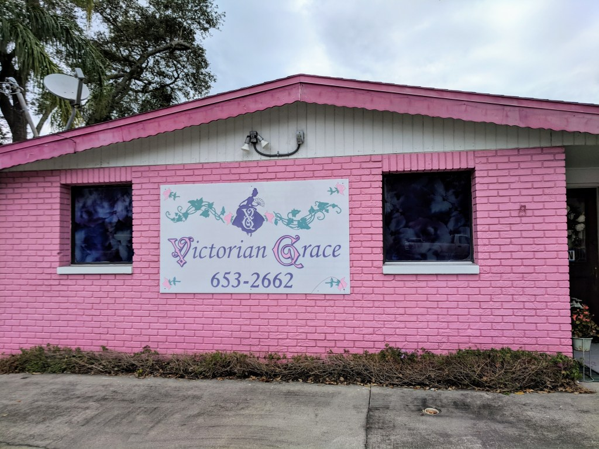
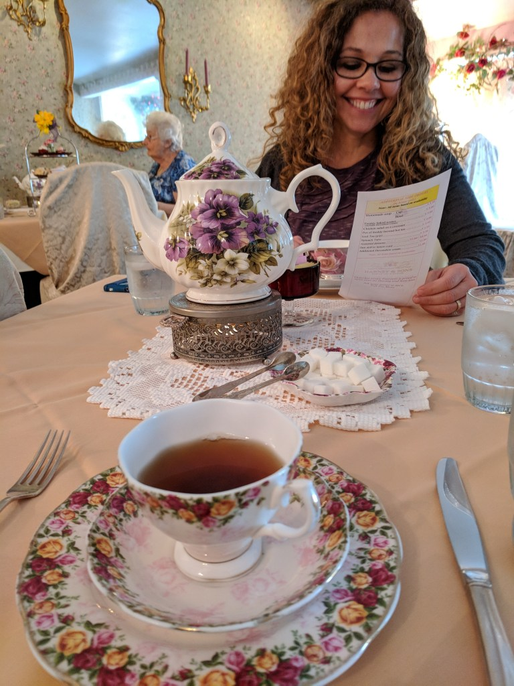
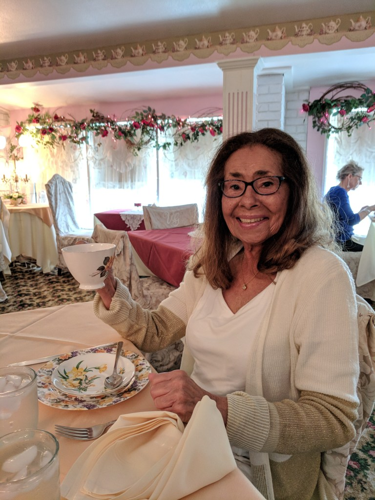
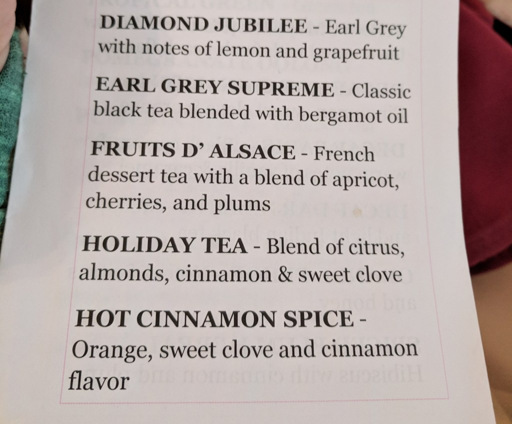
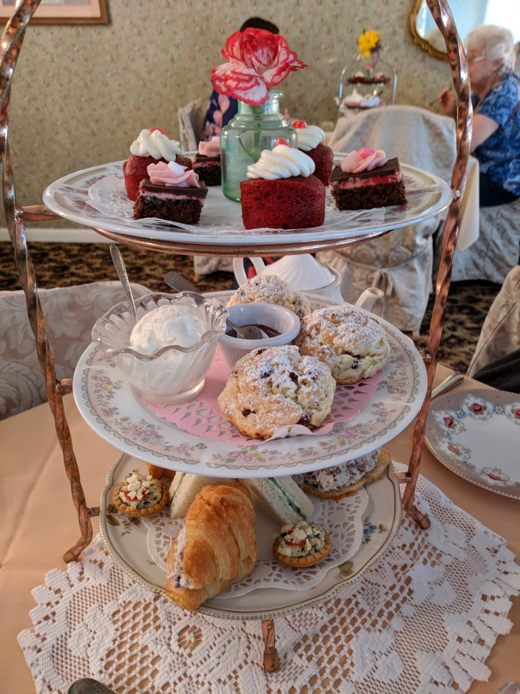
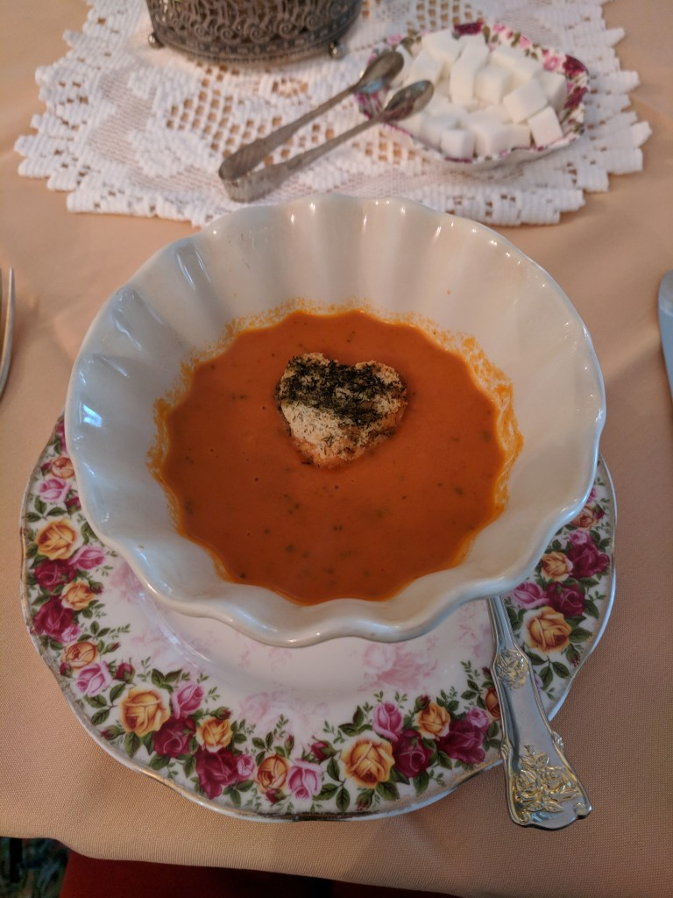
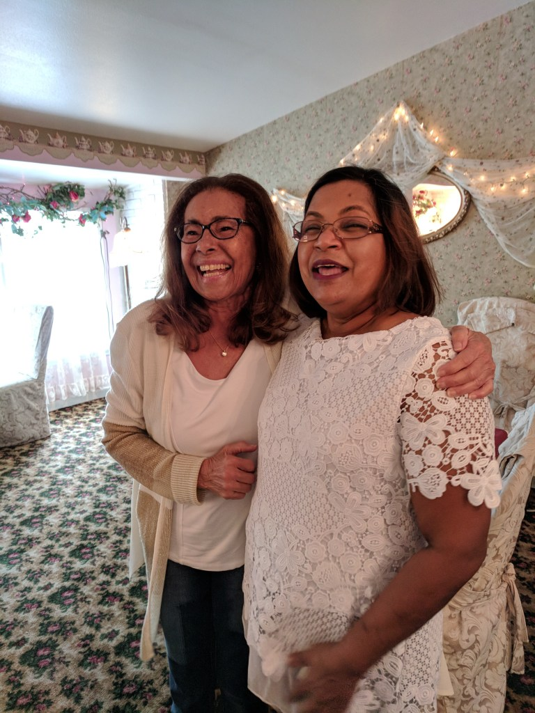
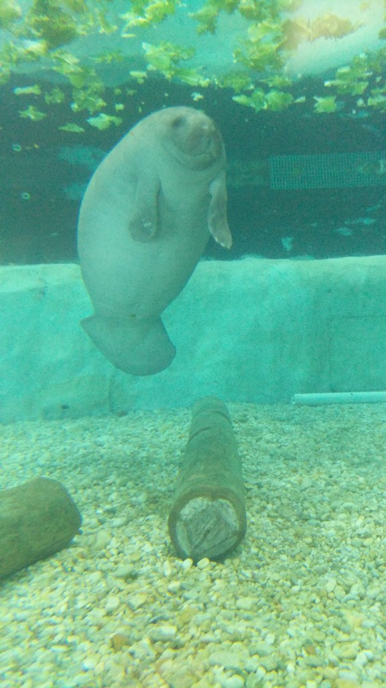
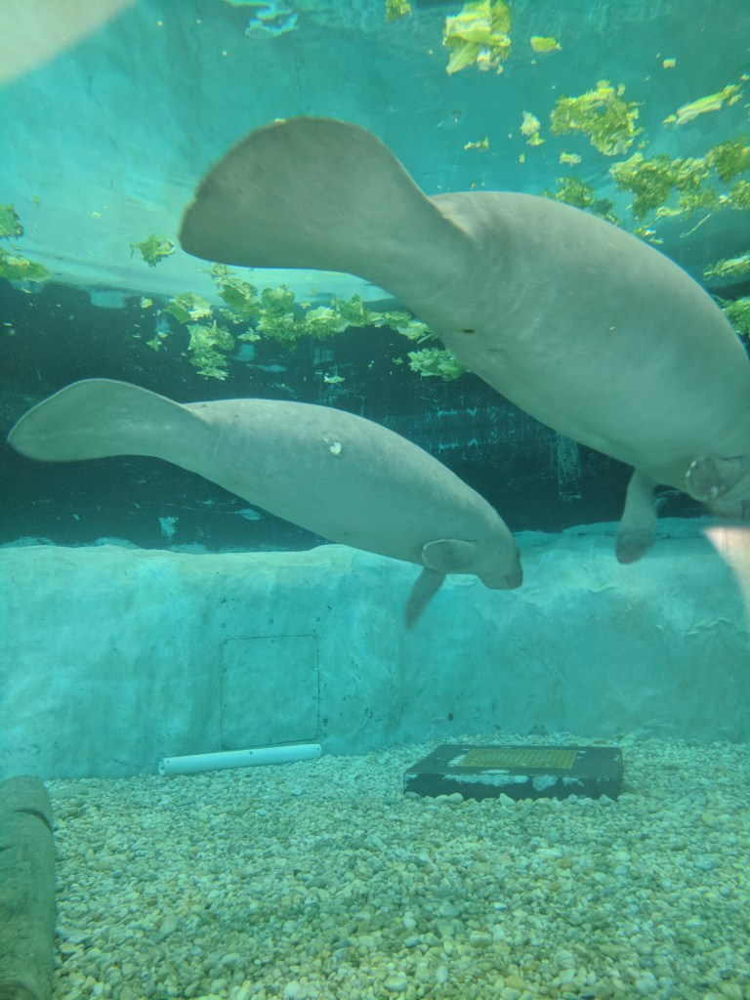
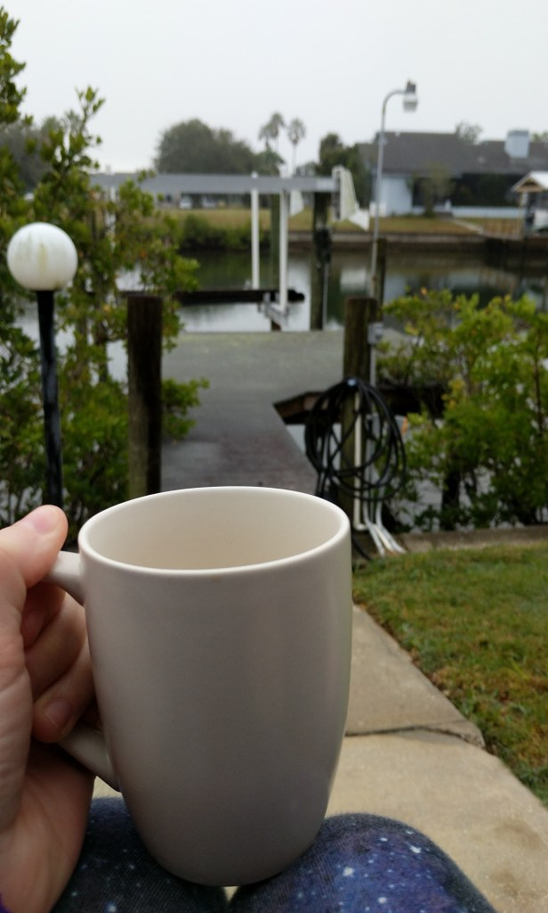

Earlier this month, my mom and I went to Tampa, Florida to visit my grandma and have a girls weekend. We left late Friday afternoon and came back Monday. So it was a short trip, but a great way to spend the weekend.

We were trying to figure out what to do on Saturday and decided to find a place to have tea. We found Victorian Grace Tearoom via Destination Tea and made a reservation.

When going to the Victorian Grace Tearoom, you won’t miss it, it’s the only pink house on the street!

On Saturdays, they only serve their “Afternoon Tea” which is: a choice of soup, chicken salad on a croissant, tea sandwiches, scone with Devonshire cream, and assorted desserts.

First up was to choose our tea. We went with the Fruits D’Alsace tea.

This tea was light and fruity. Here’s the tea menu, we also got the Holiday Tea for our 2nd pot.

Then they brought out the food…We started from the bottom and worked our way to the top.

I think they had the best scones I’ve ever had. They were soft and not super crumbly.

I got the tomato soup, and it came with a little heart shaped crouton!

As we were finishing up, we were talking with the owner of Victorian Grace and asked where she is from…she said she’s from Guyana…where my grandmother is from! We were thinking what a small world! And then to make it an even smaller world, we found out her first name is Lorraine…same as my grandmother! How crazy is that!?

After we left, we went shopping and stopped by a nature preserve park by my Grandma’s house that was recently redone to be more of a beach area.

And keeping up with the “tea” theme, we encountered a different kind on Sunday…Manatees! We went to the South Florida Museum (for free thanks to free weekends with Bank of America), and saw 2 manatees that they are rehabbing.

I love manatees…they’re super fun to watch! That night we watched the Superbowl Justin Timberlake concert and left the next day to catch our flight back to Atlanta. It was a quick trip, but it was nice to hang out with my grandma and mom, and to experience some warmer weather!

Be sure to join my mailing list to be notified of new posts, or subscribe via however you read blogs.

Follow me on [Instagram](https://www.instagram.com/klgh.js/) and [Pinterest](https://www.pinterest.com/klghshaun/)!
