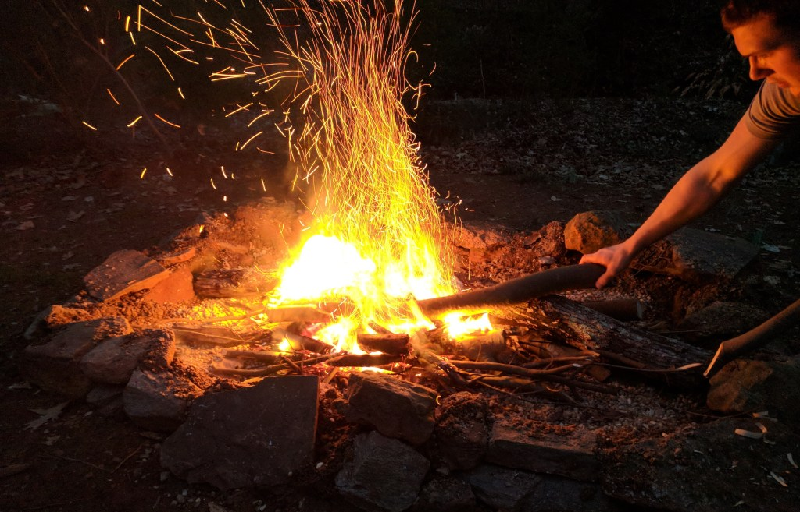
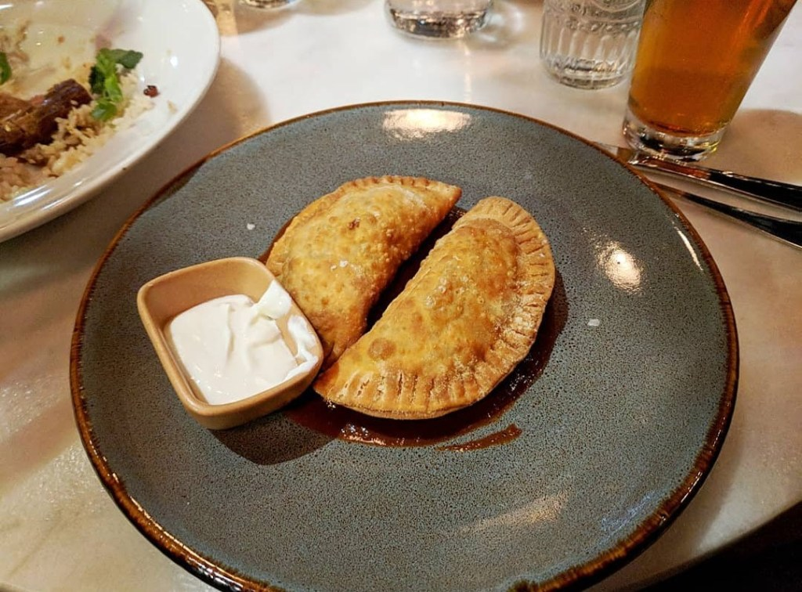

Happy Wednesday! I can’t believe we’re 3 months into my 30 Before 30 countdown! Crazy! So in these 3 months, I’ve checked off a sold 2 items. GREAT! No, it’s okay though because I’ve been working on a lot more, just haven’t gotten to the crossed off part yet.

So what have I been up to? Here’s the update:

**1. Go back to Europe**
I’ve been tracking flights on Google Flights, I obviously want to find a good deal, but also the more Shaun and I talk about what we want to do to the house, we’re not sure if we want to wait until next year. But then I’m scared if we do that, then we’ll just keep saying that and never go.

**2. Get another tattoo!**
Still no idea what I’d get…so that’s cool.

**3. Go camping somewhere with some awesome views**
It’s getting warmer, so hopefully, this will happen before it gets super hot. Or we go somewhere this summer where it’s a tad cooler and won’t be sweating the whole time.

**4. Fully understand my 401k, stocks, and all that stuff they don’t teach you in school**
I’ve been using the app Robinhood to get stocks. It makes it very easy to understand. And I’ve gotten into cryptocurrency, like everyone else and their mom. Literally, anything I buy in Robinhood or cryptocurrency goes down immediately, so I’ve very good luck.

**5. Get a 6-Pack (of abs!!)**
Slowly working on this. We go to the gym at least 5 times a week and have been trying to eat better. Shaun and I are already following the low-fodmap diet, but sometimes even with the things, we can eat we don’t feel good. Like not bloated, but just from eating heavy or a lot of things (which could be related to #25).

**6. Visit Red Hare Brewing**
Not yet…

**7. Spend a weekend in Asheville, NC**
We were thisclose, but then our plans changed.

**8. Get our home office furnished & cozy**
0 work on this. I’m fine with that though, there’s been no time.

**9. Make our backyard look super awesome**
Thanks to the warm weather, we’ve been able to get outside and clean up some tree branches, leaves, and made a firepit! It’s definitely looking better already!

**10. Pay off all our credit cards**
Getting closer! I love watching that number go down in Mint (do you use Mint? if not…get on that!)

**11. Visit Golda Kombucha once they open in Atlanta**
Well, they’re not open yet…so I just continue to buy from the store.

**12. ~~Have tea at Just Add Honey Tea Company~~**

**13. Get cookies at Luna’s Cookie Studio**
Not yet. I am assuming they don’t have gluten-free cookies, so this will definitely have to be a planned out cheat day.

**14. Go on or at least plan for another cruise**
I’ve been stalking websites!

**15. Compete in a Brazilian Jiu-Jitsu tournament**
Shaun and I are thinking about competing in the Fuju BJJ tournament at the end of this month!

**16. Get better at filming GoPro videos and editing**
I finally found an editing software I like better than GoPro’s. I did make this one from our Wisconsin trip this past summer!

**17. Take this blog seriously**
I’m trying my best! I’ve been using a calendar and planning board to figure out what to post, and have lists to check off for each. I’m also going to be switching to a dedicated blog Instagram, just because it would make things easier. So follow along!

**18. Visit some more states I’ve never been to**
Still not sure which states…

**19. Post more videos on YouTube (either GoPro videos or vlog-style)**
Waiting on #16 for that!

**20. Move to a different project at work (I’ve been on the same one for 3 years)**
Trying…

**21. Be more consistent with my stand-up comedy**
I did a few shows earlier this year! That was fun! But that’s slowed down again due to open mic times/locations. They’re so late, and I go to bed so early! _excuse_

**22. Visit more tea rooms in Atlanta**
Not in Atlanta, but I did go to one while I was in Florida!

**23. Be better at drinking water (I feel like I barely have any water!)**
This is…going. Some days are better than others. I’ve been cutting up lemons and infusing water for the week, which helps but I’m still just really slow and bad at this. Any tips are greatly appreciated!

**24. Try more breweries in Atlanta**
We just keep visiting the same ones. I’ve been to Cherry Street, Wild Heaven, and Good Word, but those are all ones I’ve been to multiple times before.

**25. ~~Try different types of food~~**
I’ve been trying Venezuelan food, Korean Barbeque, and Brazilian food!

**26. Visit Monday Night Brewing**
Not yet..

**27. Take an improv class**
I’ve been looking. I really want to do it at Highwire Comedy, but their sessions have been on weekends that I’m out of town and I don’t want to pay for a class that I’d miss multiple weeks of. I think the next session I should be able to do though!

**28. Update my wardrobe**
I’ve started pulling stuff out that I can’t remember the last time I wore it. And also stuff that’s now too big (which is awesome, but also annoying because I have to go shopping and I hate clothes shopping with a fiery passion!).

**29. Learn how to take and edit phone photos like a boss**
I’m loving VSCO and Snapseed. I need to get those angles though!

**30. Figure out what I’m good at**
Hmm…Well I know I love creating websites, and I’m working on my friend Kelundra’s right now and I am loving it. I also bought a social media marketing class on Udemy, I feel like that’s a huge interest of mine that could be turned into something tangible.

With only 2 out of 30 items checked off, I have a lot to do in the next 9 months, but I know I’ll be able to make it happen! This blog is definitely holding me accountable!
