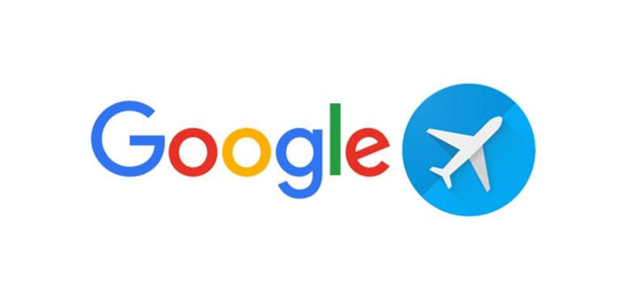
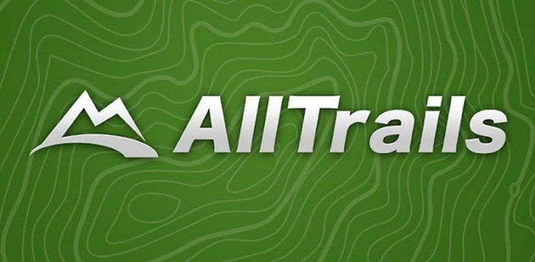
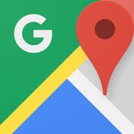

We’re about halfway through June, and since everyone is traveling I thought it would be fun to share my favorite travel apps! I have an Android (#TeamPixel), but I’m pretty sure most of these are available on iPhone as well. Some of the links are invite links, but you do get some type of credit for clicking!

These apps are my favorite travel apps for planning trips. Once I started making this list I realized how many more there are that I use while traveling (like photo editing, videos, etc). So these are more specific to travel-either planning or while on the trip.

So I haven’t technically used Airbnb yet. I made a reservation to stay in one on our trip in July, but obviously, it hasn’t happened yet. But if you’ve never used Airbnb, it’s super easy to figure out, get info and read reviews on each place to stay at. I know a ton of people who have used Airbnb and love it. Also, if you have a Delta credit card, you can earn points by booking with Airbnb. Win!

Hotels.com is another app that’s super easy to search and filter out what you want in a hotel. I like it because they have a map view so you can see where the hotels are in relation to places you want to go. Also if you book 10 nights with Hotels.com, you will earn a free night! A couple years ago I was able to get a free night, and the value is the average of all the combined stays. We were able to get a sweet hotel on the beach in Miami before we went on a cruise (that we paid for with miles). I highly recommend!

I don’t think a lot of people have heard of this one, but momondo is a really awesome flight search app. There are so many filters and you can select which airlines you want, how long the layovers would be, and all sort of things like that. You can also search hotels, cars, trip ideas and more. You can also see if your flight would be cheaper if you went on different days as well. Which brings me to another flight search I love…

Google Flights is, of course, one of my favorite travel apps. They don’t have a native app, so you have to visit it in your browser, but it works great on your phone so why not mention it here! It’s similar to momondo where you can add all sorts of filters, but I like how you can track prices and get email updates when they go up or down. You can also view dates on a calendar to see when the cheapest days to fly are, and view a map if you know where you’re flying from and want to get an idea on where to go.

The Fly Delta app is great when you….fly Delta! Not only can you book and track your flight, but they also give you info about your destination like weather, time, things to do, etc. I also like how if you check a bag, you can track where it is and where you can pick it up. You can also keep track of your account info, cards on file, and view the miles you earn. There are also options to remember where you parked at the airport, view what movies are played on your flight, and find your way around the airport with maps.

All Trails is great for figuring out where to stay based on hiking trails you want to check out. Right now I’m planning a road trip so it’s nice to see where we can stop and go for a quick hike. You can read reviews and save ones you want to check out.

Hopper is a cool app for when you get an idea to go on a trip but not exactly sure on the dates. It lets you know the best dates to fly, when tickets will probably be the cheapest, and when they might go up. You can just set possible dates and destinations and get notifications when you might want to buy.

Lyft is my favorite app for getting rides. It’s super easy to use, and now you can schedule rides ahead of time. I have always had great experiences with Lyft and they always have a coupon code or some sort of deal to make your ride ever better.

Google Maps might be pretty obvious, but I love their features where you can “star” and save places you want to visit, check out reviews, and view photos. I also really love their option to create your own maps, so now when we go on trips, I save potential places we want to go on my personal map and they show up in the native Google Map. This is insanely helpful and you can share it with others going on your trip as well.

Roadtrippers is an app I just discovered and I’m in love with! It takes the stress out of planning a road trip because they help fill in the blanks along the way. You put in where you’re starting and ending the trip and it helps you figure out the rest. You can search for anything like restaurants, breweries, landmarks, hiking, lodging…everything. It’s also super easy to share with your friends! You can add notes, dates, and if you put in your type of car it will estimate the cost of gas. We’re planning a road trip right now and it is saving me a lot of pain!

I discovered Rome2Rio a few years ago while planning our Europe trip. When you’re trying to figure out how to get from one place to another, it’s insanely helpful. It will show you options like if flying, trains or a bus is the best way, and will also show you the cost and travel time as well. It helped us figure out how we were getting around on our trip, which isn’t always easy when going somewhere you’ve never gone before.

I don’t remember how I discovered this app, but I’ve been using it for years. Sit or Squat tells you just that about public restrooms – if it’s clean (sit) or dirty (squat). When you’re traveling you have no idea what bathroom is going to be clean or if you should stop at one gas station versus the other. This app makes it easy to figure out where to go, or if you need to wait until a cleaner place comes up. So far I’ve never had any issues with it being wrong or anything, just sometimes places aren’t listed, but then I add them once I give it a try.

I love Southwest, so of course, this app is super helpful with planning trips, tracking your flight, and pulling up your boarding pass. I like it because it’s easy to check in and check on my family’s flights as well. When we’ve had to cancel and rebook flights before, it is so easy to do it on the app. Everything works so smoothly.

Google Translate is of course insanely helpful when you’re traveling abroad! When we were in Belgium, it was a huge help when we were reading menus and maps. Now they have the feature where it will translate live through your camera for you. I haven’t tested this out in the wild yet, but whenever we get food from Super H Mart or someone brings food in from trips to my office, it’s fun to test it out!

Tripadvisor is definitely my best friend while planning trips. I love looking at other travelers pictures to see more recent, unstaged photos of hotels and restaurants. I also really like reading the reviews (of course with a grain of salt) to get an idea of what places are like. I think Tripadvisor has saved me from booking some really bad hotels!!

TripIt is a really cool travel organizer app. You link it with your email and it automatically sees any reservation confirmations and adds them to your itinerary (sometimes you do have to go in there and fix some things), but for the most part, it is really awesome. It stores all your info- confirmation numbers, addresses, phone numbers, directions, weather – everything! If you pay for the paid version, you get to track more things like flight changes, gates, seats, and a lot more.

wazeWaze is a huge help of course because you never want to sit in traffic while on vacation! We have used Waze so many times to avoid traffic, accidents, or to just take a more scenic route than just a highway the entire way places.

Yelp, like Tripadvisor, helps me figure out where all the must visit places are. I love filtering out things so we can find gluten-free friendly places, craft beer, and more. I just became Yelp Elite, so I love leaving reviews and photos on places I’ve been as well!

Google Pay is good to have just in case you forget your wallet, or don’t want to bring every card with you on a trip. It’s also good for when you don’t want to dig around in a backpack for your wallet, or if you ran into a store and left your things in the car. More and more places are accepting Google Pay which I’m loving!

Instagram actually helps me plan trips, because I like to look up locations and see what’s going on, what things look like, and of course, if people are having a good time. I also use it to find the accounts of places we’re going to keep track of any events that may be going on as well.

Thanks for sticking with me! I know this post was super long and full of a lot of information, but I really hope it helps someone to plan for or during their next trip! These are all my favorites, but let me know what YOUR favorite apps are! I’m always looking for new apps to download and play with!

Be sure to follow me on [Instagram](https://instagram.com/klgh.js), since we’re about to be going on our awesome West Coast Road Trip!!
