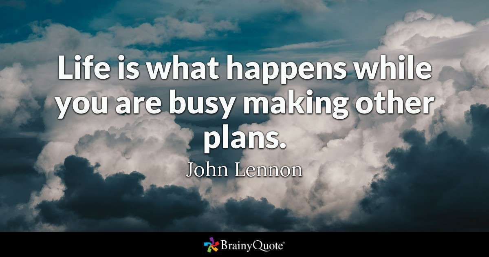
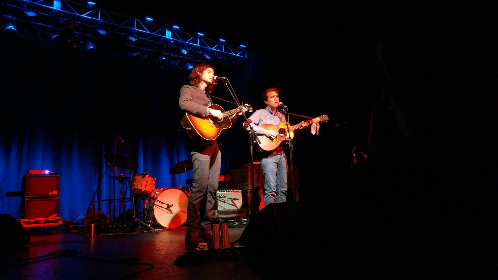
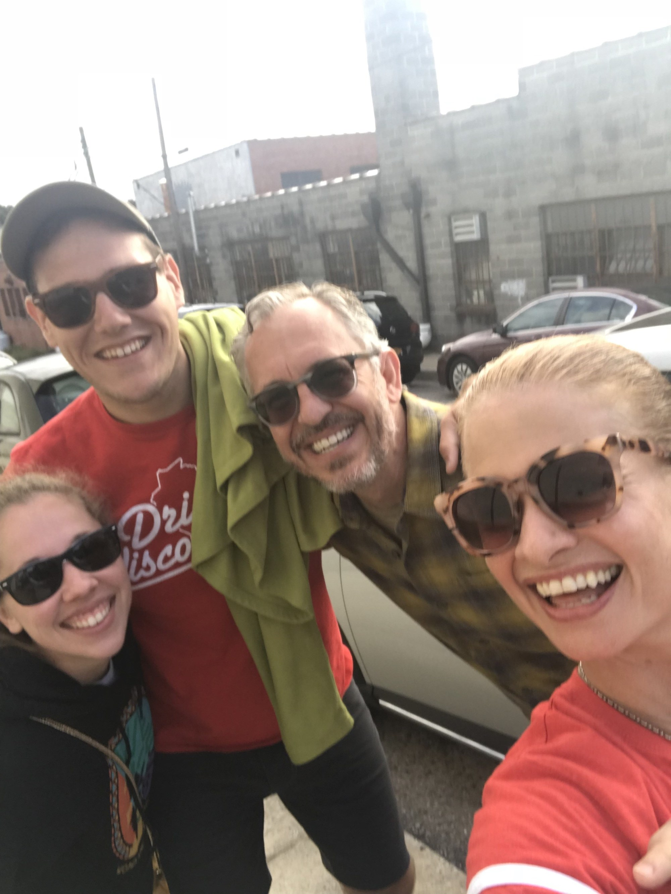
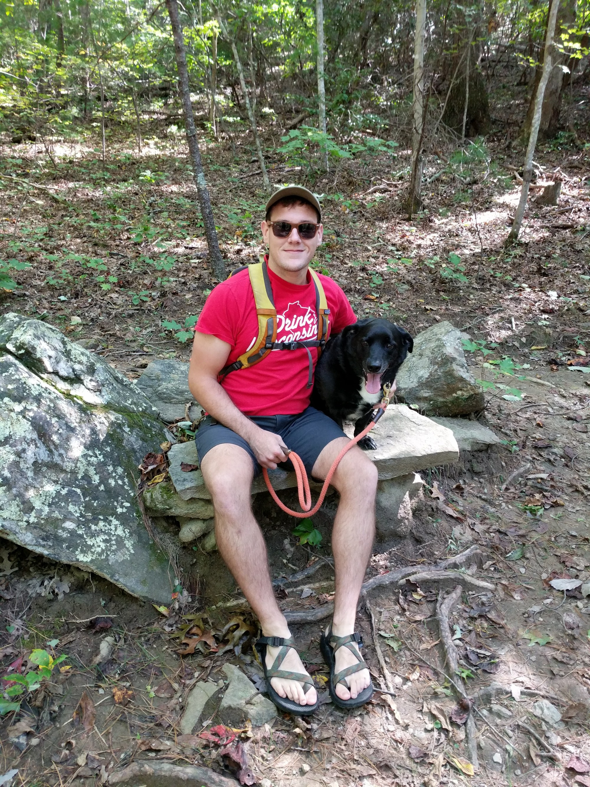
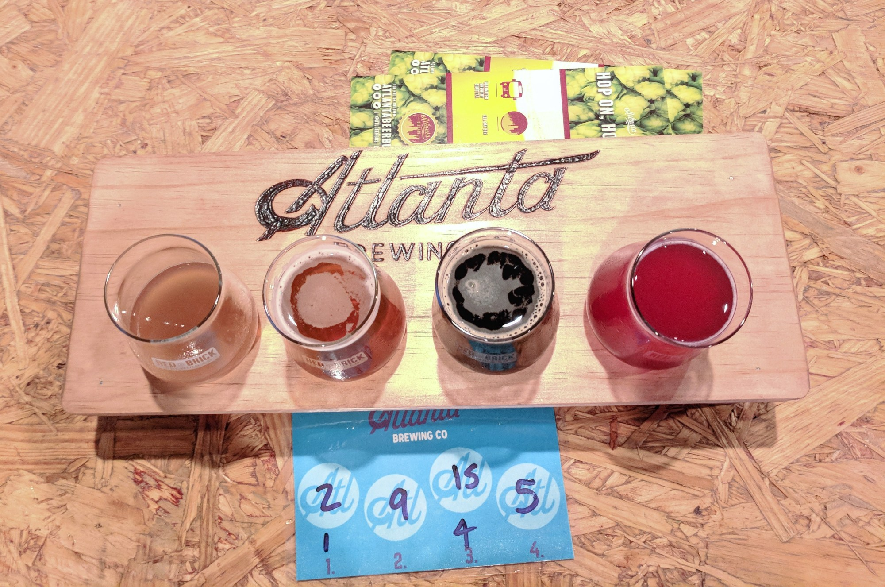

That is just super crazy! 50 days until I’m 30! This year has been flying by. I thought it was time to do a quick update!

For my 30 before 30 list, I’ve done about half of it…as I mentioned in my last update, I know for a fact I won’t be completing it. It sucks, but as I’ve been learning, that’s life-plans change, needs/wants change, and you just have to roll with it. I’m not super bummed about it though, don’t get me wrong. There are parts of it that when I look at now I’m like “meh, ok”. Plus, as John Lennon says,

So, about those updates. We just got back from completing #7 which was to spend a weekend in Asheville, NC. Shaun and I got tickets to see The Milk Carton Kids back in June, and their show was October 11th.

We drove up Thursday afternoon and stayed until Sunday. We finally got to experience some fall weather while we were there! It was in the 60’s! We brought Mac with us (Biscuit stayed with Shaun’s parents, she gets stressed very easy and we didn’t want to make her go with us and have her be miserable the whole time). Mac loves getting out and about, so he loved it as well. A fun surprise was that our Florida cousins also happened to be in town as well!

Even though we went to a million (roughly) breweries in Asheville, I feel like we still haven’t hit up that many here in Atlanta. We did go to the “new” Atlanta Brewing Company (aka Red Brick) recently.

I hope to hit up Red Hare, New Realm, and Slow Pour in the next 50 days or so!

So as far as figuring out what I’m good at? I think I’m good at comedy. After completing my Improv 1 class, I really realized how much fun and how happy comedy makes me-both improvised and doing stand-up. Which leads me to the question “when are you doing another stand-up show?” that everyone has been asking me. I’m not exactly sure, and I know one of my goals was to become more consistent with it. I am trying to write some new stuff, so I hope to start performing it sooner rather than later. And I can’t decide if I want to do Improv 2 (starting this Sunday) or wait until the next round. Decisions.

Oh and a little random side note, I deleted (er, deactivated) my Facebook account. It’s been a week and it’s been quite interesting to lead a Facebook-less life. I had been using it since I was a junior in high school, 13 years ago, so I not only wanted to see how my day-to-day without it would be, but thanks to apps and now Google’s Wellbeing feature, the amount of time I was using it on my phone alone was too much. And also that whole political part of Facebook was just way too annoying. I just want to see dogs.

So now I have been using [Instagram](https://www.instagram.com/klgh.js/) and [Twitter](https://twitter.com/kaleighscruggs). And so far, so good.

But anyways, until next time!
