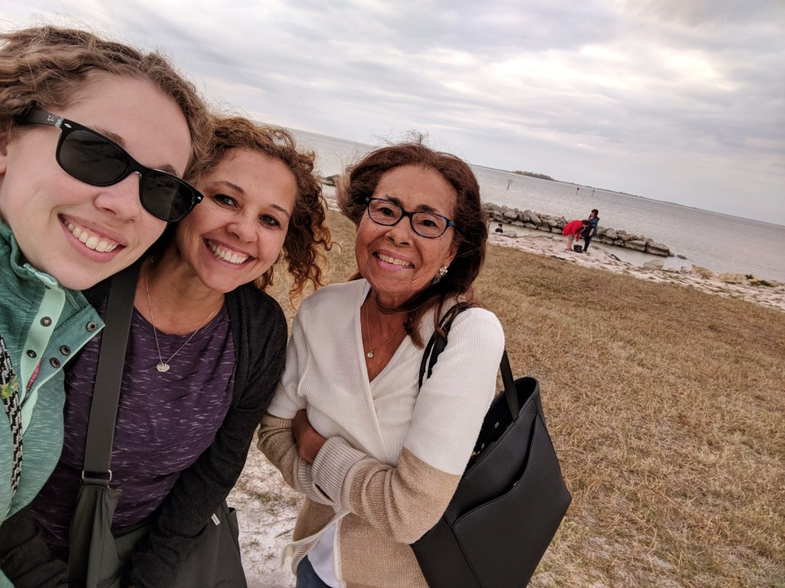

Somehow it's 2019. I'm not sure how that happened since it just became 2018, but ok. I wanted to share a recap of 2018, as it was one wild year. Not a lot of "blog" moments, but maybe hopefully I'll change that in 2019.

First, I was trying to complete my 30 Before 30 list...that didn't really happen. I did complete 50% of it, which to me is better than nothing! 2018 was a pretty wild year so I feel like I did my best - I still got to do things I wanted to do but didn't put in the list, and I got to do things I didn't think I would do. So to me, 50% isn't a failure, it's me saying "you can't follow plans perfectly". Because you can't!

##January

It snowed in Atlanta (again), and I went to California for my nephew's 6th birthday! I celebrated my 3 year anniversary at State Farm, and overall just froze in Atlanta. It was so cold!

##February  
I started the month by going to Tampa with my mom to visit my Grandma. We had a fun girls weekend with tea and face masks!

I also went to Galentine's Day at Wild Heaven with my bestie Becky, Mac got colitis, and I went to my first tech conference in a really long time (courtesy of Women Who Code).

##March

I went back to UGA for a Women in Technology App Day with their group on campus. I also went back a couple weeks later since my cousin was touring UGA to possibly go to for college! We also went to the Suwanee Beer Fest for the 4th year in a row!

I wrote my most popular ever blog post about Jiu-Jitsu Gear for Women! And we finally went to Charleston to see our college friends get married!

##April

I took the dogs to a doggie Easter egg hunt and Biscuit found the golden egg, won the dog race and was overall the star of the (big) dog show! So funny!

We discovered Daiya Vegan/Gluten-Free pizzas...PIZZA IS BACK!

##May  
Shaun turned 27 and then we went to Statesboro for his Masters Graduation! I was more excited about it than him...but we did get to spend the weekend in Savannah. Then the next weekend, I surprised him with a surprise birthday/graduation party at his favorite place to get a beer with all of his friends and family. #WifeOfTheYear

I also bought a new car! I had been leasing an electric Kia Soul for 3 years and was DONE with it. (I do miss having it, but the battery was no longer great so I had to constantly charge and have anxiety). Also, this is the first time I've ever bought instead of leasing.

##June  
I went to another conference- WeRise by Women Who Code Atlanta. So much fun.

I was also really busy with work-planning Women in Technology events, and getting ready to move to a new team. I was also (and had been) actively trying to find a new job, going to the conference did help.

##July  
Not my favorite month in 2018. July 1st we lost my grandfather who I was really close with. I don't know what else to say other than it really really sucked.

After having to change our entire summer trip because of the timing of my grandfather and starting my new position at work, we ended up flying back to San Jose with my brother and went to Yosemite. That was amazing.

Also, I just wanted to mention, Delta gets a lot of hate for their change fees but they were insanely nice to me when I called to tell them why I needed to cancel my flight and then helped me get my miles back faster so I could re-book my new trip. They were so understanding and made it painless.

##August

I competed in my first ever jiu-jitsu tournament and lost my butt off...but had fun and learned so much while getting my a\$\$ handed to me.

I also signed up for improv (finally) and was in my first improv show!

##September

I competed in my 2nd jiu-jitsu tournament and got my butt kicked in all my matches yet again. But it was still fun! Our team won the team trophy for most points.

We also did our annual campout on the Chattahoochee with REI, and I did another improv show! Shaun and I celebrated 8 years together!

##October  
We went to Asheville to see The Milk Carton Kids, and also went to Athens to see The Oh Hellos and Samantha Crane. We also celebrated our 4th wedding anniversary and found out we needed to get the bump on Biscuit's arm, which turned out to be a tumor, removed sooner rather than later. So we scheduled her surgery.

##November
Biscuit had her surgery, and she was a rockstar. She did great and had no issues with anything! We were so worried and slept downstairs with her the first week until we realized she was fine and could come upstairs with us.

I also accepted a position as a senior web developer at a company in Buckhead. I was so stressed out trying to make this decision, and even asking for more money than they originally offered me, but in the end, it all worked out!

We also went to Orlando for Thanksgiving, and finally bought a new TV and a Nintendo Switch!

##December
I turned 30! A TON of my friends came out to Slow Pour Brewing and we had all the fun!

I had my last day at State Farm the day before my birthday (#strategy) and started my new job the Monday after. After 2 weeks of work, it was time for Christmas....which I spent in London with my parents and brother! Shaun wasn't able to come, but he knew I'd have major FOMO if my family was in my favorite city without me.

And boom! That's it. Well, that's not EVERYTHING, but you know what I mean...Some major stuff, the stuff I can remember, and the stuff I want to mention.

Anyways, I promise I am going to be better at blogging this year. At least better than 2018, ok? Let's be friends. Follow me on Instagram and Twitter, and I'll see you soon!
