Last week I attended [REFACTR.TECH](http://refactr.tech/) in Atlanta. REFACTR is all about diversity &amp; inclusion in tech. It was amazing to see all the companies who attended that have huge D&amp;I initiatives looking to hire attendees.

I applied for and received a free ticket, which included a workshop, from [Women Who Code](https://www.womenwhocode.com/). I'm so thankful they offer free tickets to events and conferences, I've been able to attend a few now with the help of Women Who Code. 👩‍💻

## Day 1 - Gatsby Workshop

REFACTR had 6 different workshop options, and I was very excited to see that there would one on [Gatsby](https://www.gatsbyjs.org/) since I've been looking for a new CMS to manage my website projects. A few months ago I stumbled upon Gatsby, but I didn't have time to learn it so this was perfect. From the Gatsby website, it's explained: _"Gatsby is a free and open source framework based on React that helps developers build blazing fast websites and apps"_. Sounds pretty nice!

This was a full day workshop where [Brandon Kearns](https://twitter.com/brandon_kearns) taught us all about Gatsby from the ground up. We did the [tutorials](https://www.gatsbyjs.org/tutorial/) on the Gatsby site as well as one with [Contentful](https://www.contentful.com/) as our headless CMS. Once we did that I was completely sold. Manage the site with Gatsby/React and still have a CMS that would be easy for others to update? Take my money (jk it's all open source).

## Day 2

This was the first full day of sessions, things kicked off a little after 9am with an opening keynote by [Tracy Lee](https://twitter.com/ladyleet) about inclusion and creating a better culture in tech.

The first session I attended was with [Chloe Condon](https://twitter.com/ChloeCondon) "IoT for the Introvert". She showed us how she programmed a [Flic](https://flic.io/) device to get herself out of social situations. I definitely want to do this!

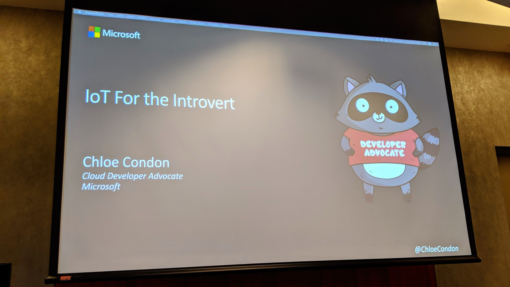

Next up, I attended "Build Accessible UI with React!" with [Taelur Alexis](https://twitter.com/TaelurAlexis). She spoke about her journey into accessibility and best practices.

Before lunch, I learned about how [Alicia Barrett](https://twitter.com/optimistalicia) rewrote the REFACTR.TECH website with Gatsby in "Diving into GatsbyJS". As if I wasn't already obsessed with Gatsby, I learned even more about how fast and mobile friendly it makes websites.

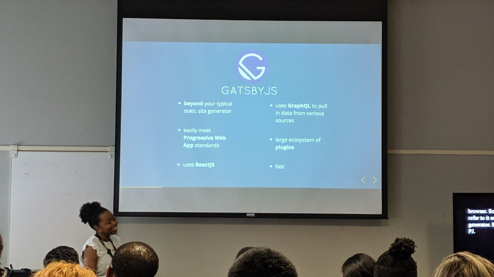

Once everyone settled in with lunch, there was a panel "Forging a Path Through Inclusive Entrepreneurship" with [Jamie Harrell](https://twitter.com/jamieharrellmba),
[Alex Castillo](https://twitter.com/castillo__io), [Lynnette McKissic](https://twitter.com/TheGoodrCo), [Dr. Kortney Ziegler](https://twitter.com/fakerapper), [Stefanie Jewett](https://twitter.com/StefanieJewett), and [Nael Alismail](https://twitter.com/naelyall).

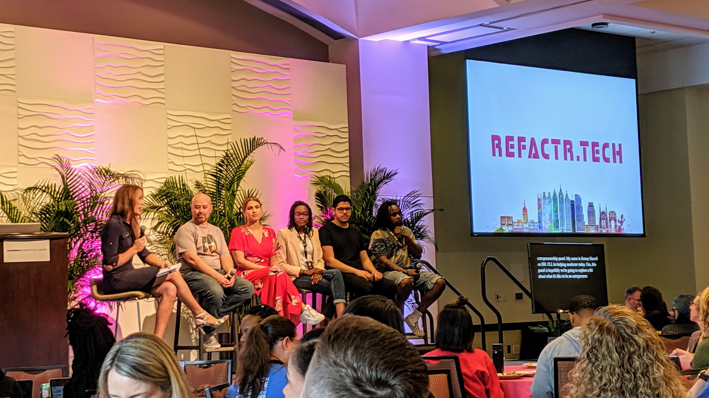

After lunch, I attended a session called "DevOps: A Love Story" with [Valarie Regas](https://twitter.com/ValarieRegas). I haven't gotten into DevOps too much yet, so I was really interested in this one. Valarie was not only hilarious, but she explained all the steps and why each part of DevOps matters.

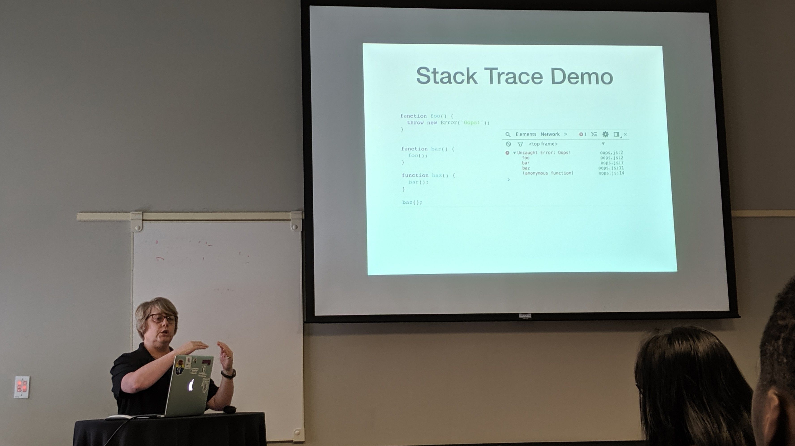

"Don't Be Afraid of the JavaScript Stack Trace" was awesome with [Jennifer Bland](https://twitter.com/ratracegrad). She taught us a bunch of different ways to troubleshoot your project with the stack trace, including one with a table that was really cool.

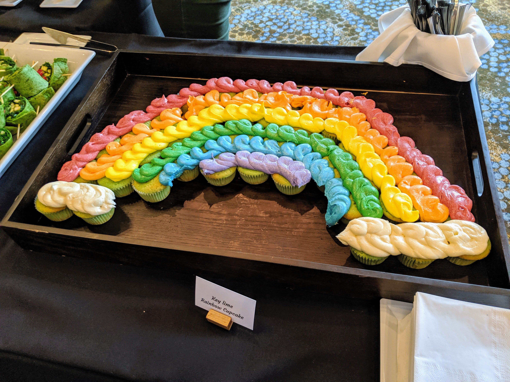

And then that was it for the first day! After the sessions finished, there was a happy hour and game night in the ballroom. Each table had different kinds of games to play, there were food and drinks, and those awesome looking cupcakes!

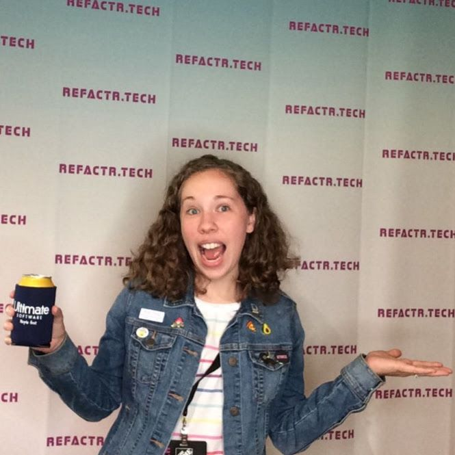

## Day 3

The final day of REFACTR started out with a keynote with [Dr. Kortney Ziegler](https://twitter.com/fakerapper), "Finding Purpose Through The Things We Build". He spoke about his journey in tech and why he's doing what he's doing.

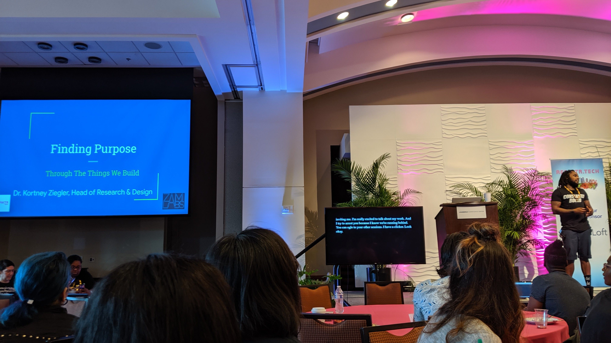

For my first session of the day, I attended "Refactor Your Body For Better Performance" with [J.C. Hiatt](https://twitter.com/jchiatt), founder of [DevLifts](https://devlifts.io/). He highly encourages developers to stay active since we work in a job where if you're on a roll, it could be _hours_ before you get up from your desk.

"Visual Studio Code Sparks Joy" with [Craig Rodrigues](https://twitter.com/CraigRodrigues) was next. I was excited about this session because I recently (within the past year) have gotten into [VSCode](https://code.visualstudio.com/) and haven't looked back. He shared a bunch of tips and favorite extensions.

Next, I attended "WebAssembly: Your Browser is the new OS" with [Jeremy Likness](https://twitter.com/jeremylikness) since I didn't really know much about WebAssembly, but I've heard it talked about a ton. He showed a bunch of examples of high performing web apps.

After lunch, there were only 2 sessions left (so sad!). I learned about
_Reconfiguring Our Mindset from “Self-taught” to “Community-taught”_ with [Ray Gesualdo](https://twitter.com/RayGesualdo). I really enjoyed this one because he really stressed how we all come from different backgrounds with how we got to where we are, and we need to support each other with what we've learned and help each other out.

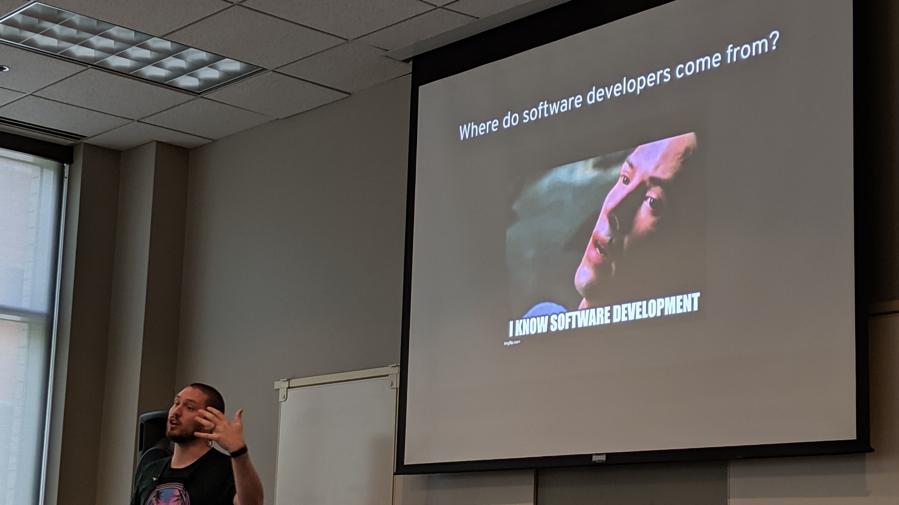

"The challenges in building a social app" was with the amazing [Alicia Carr](https://www.pevo.us/), who built the [Pevo app](https://www.pevo.us/) that helps victims of domestic violence. She spoke about her journey in tech and with building the app. It was one of my favorite sessions!

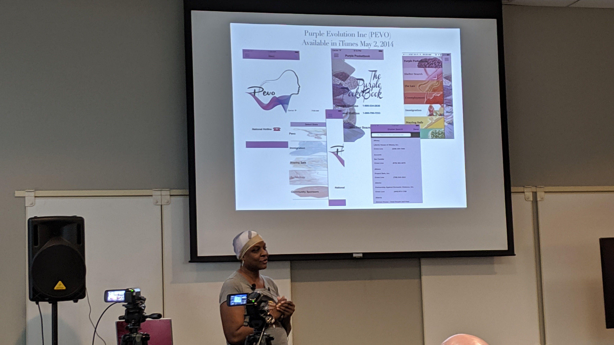

Finally, there was the closing with [Alex Castillo](https://twitter.com/castillo__io) about Empowering the Mind and what his company, [Neurosity](https://www.neurosity.co/) is doing. It was some really cool stuff!

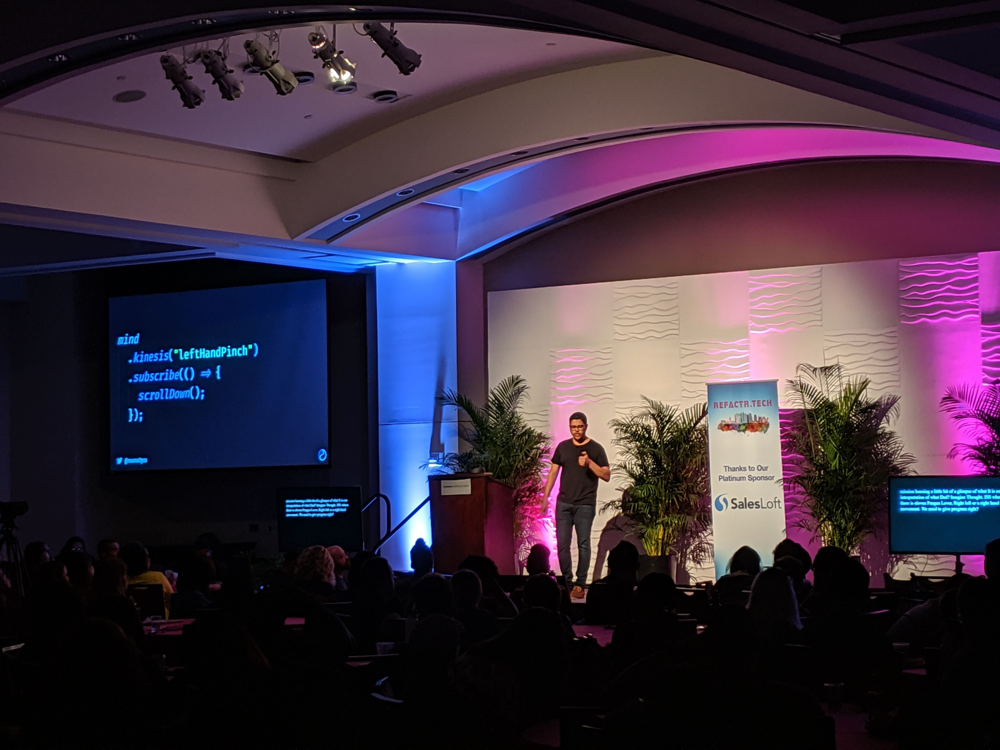

After some giveaways, the conference was over. But not before we all marked our calendars for next year! [Refactr.tech](http://refactr.tech/) will be back April 22 - 24, 2020!

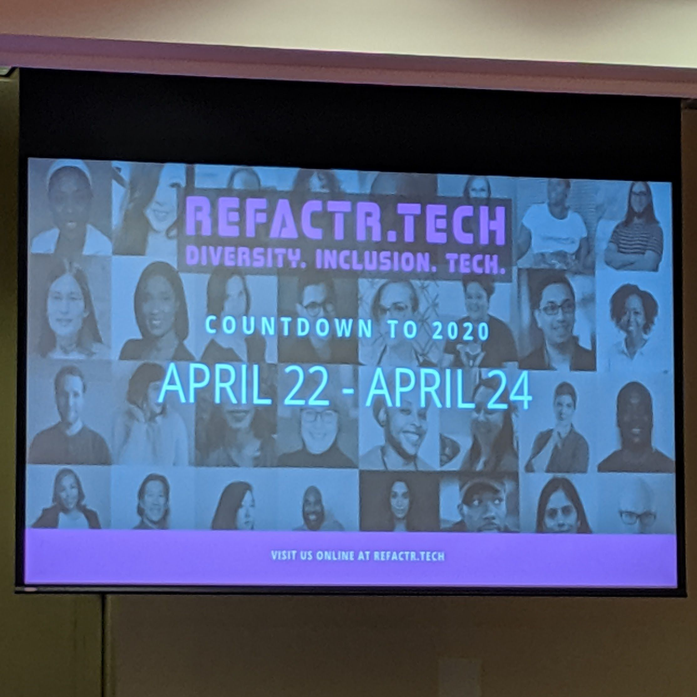

Thanks for reading my first post on my new dev blog (built with Gatsby!) Please excuse any sort of errors and leave a comment letting me know you visited!
